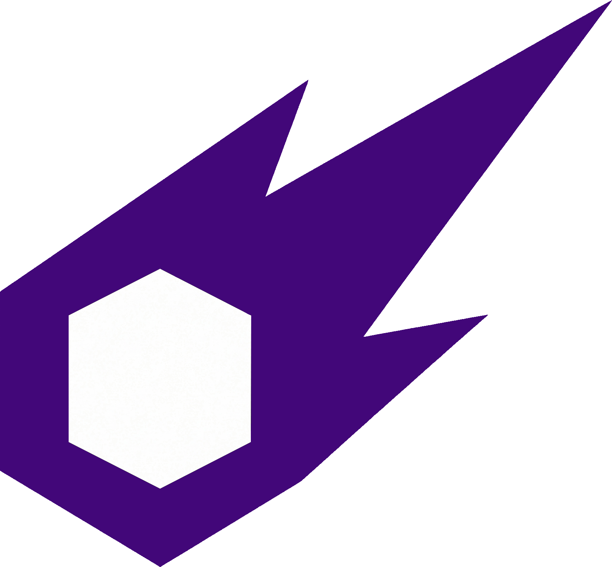

# Comet Engine — Devlog

**Tracking the development, evolution, and documentation of [Comet Engine](https://www.cometengine.org): a free 2D game engine built from scratch with C++, SDL3, OpenGL and AngelScript.**

 

 

---

## 📖 About this blog

This repository holds the **source of the Comet Engine devlog** — the place where the engine's development is documented in public.

Comet Engine is a custom 2D game engine that has been in development since 2020. It's written from scratch in **C++** on top of **SDL3** and **OpenGL**/**Vulkan**, and ships with 2D rendering, a sprite atlas subsystem, physics, 2D lighting, 2D/3D audio, custom shaders, an extensible editor, and exports for Windows, Linux, Web and Android.

The blog covers the *why* behind the engine, not just the *what*:

- 🚀 **Release notes and milestones** — what landed, and what it unlocks.
- 🧩 **Deep dives** — subsystem design and the trade-offs behind each decision (for example, the migration from C# to [AngelScript](https://www.angelcode.com/angelscript/) for better Web and Android support).
- 📚 **Documentation** — features explained from a user's point of view.
- 🔬 **Research posts** — evaluating libraries and languages before committing to them.

> Posts are open to comments through [giscus](https://giscus.app/) — questions and feedback are always welcome.

## 🔗 Useful links

| | Link | What you'll find there |
| :---: | :--- | :--- |
| 🌐 | [**cometengine.org**](https://www.cometengine.org) | Official site: releases, marketplace, CLI, tutorials and documentation. |
| 📝 | [**Devlog**](https://oriolcs2.github.io/CometEngineBlog/) | This blog, live. |
| 💾 | [**CometEngine**](https://github.com/OriolCS2/CometEngine) | Engine repository and all published releases. |
| 🐛 | [**Issue tracker**](https://github.com/OriolCS2/CometEngine/issues) | Report a bug or request a feature. |
| 📺 | [**Presentation trailer**](https://www.youtube.com/watch?v=zLf-vsr-gkk) | See the engine in action. |
| 👤 | [**@OriolCS2**](https://github.com/OriolCS2) | Author's GitHub profile. |
| 💼 | [**LinkedIn**](https://www.linkedin.com/in/oriol-capdevila/) | Get in touch. |

## 🛠️ Built with

## 📄 License

The site scaffolding in this repository is released under the [MIT License](LICENSE), inherited from the [hugo-theme-stack-starter](https://github.com/CaiJimmy/hugo-theme-stack-starter) template.

Blog articles are published under **CC BY-NC-SA 4.0**.

 

Made with 💜 by [**Oriol Capdevila**](https://github.com/OriolCS2) · [cometengine.org](https://www.cometengine.org)

