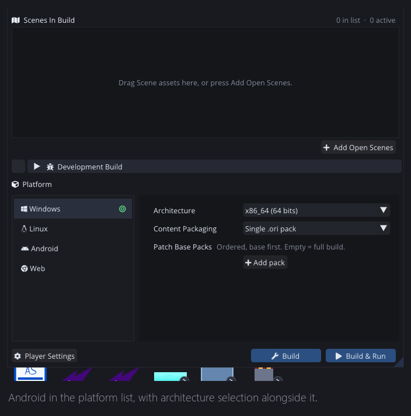
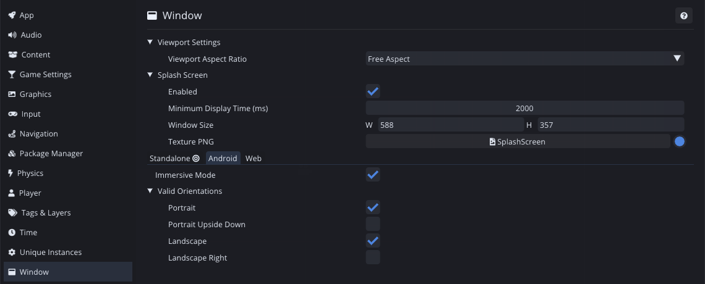
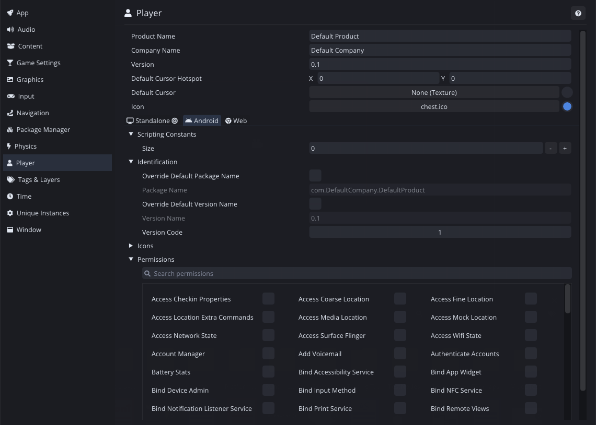
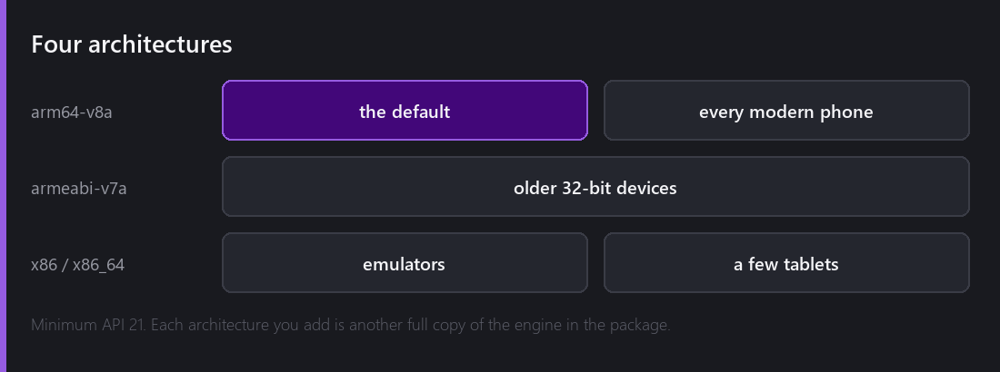
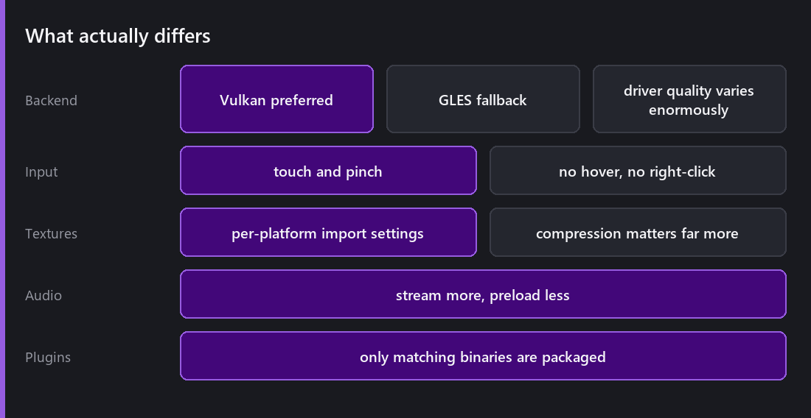

Android is the other platform [the C# migration]() unlocked, and unlike [the web]() it is not a reduced environment. It is a full one with different constraints.

## Setting it up

Comet builds Android through the **NDK**, targeting **API 21** as a minimum. You need `ANDROID_NDK` pointing at your installation; that is the only piece of external setup, and it is also the piece most likely to be the reason a build fails on someone else's machine.

The export itself is the same Build panel as every other platform.

Window settings are per platform, and Android's are a different set entirely: immersive mode, and which orientations the app is allowed to be in.

Player settings are where the store-facing details live (package name, version code, launcher icons), and the **permissions** list, which is the Android manifest expressed as checkboxes. Ticking only what you use matters: every permission is something a user gets asked about, or silently judges you for.

## Four architectures

**arm64-v8a** is the default and covers every modern phone. **armeabi-v7a** is older 32-bit devices. **x86** and **x86_64** exist mainly for emulators.

The decision to be deliberate about: **each architecture is another complete copy of the engine** in your package. Shipping all four roughly quadruples the binary. Most projects should ship arm64 only, add armeabi-v7a if their audience needs it, and use x86_64 locally for emulator testing without shipping it.

The [plugin system]() targets per architecture too, so only the matching native binaries are packaged.

## What actually differs

**The renderer.** Comet prefers [Vulkan on Android]() with a GLES fallback, and the reason is driver quality. OpenGL ES implementations vary enormously between vendors, and "works on my phone" is worth very little. Vulkan is more consistent, and having a second path to fall back to when one misbehaves on a specific device has saved me more than once. Compute is available, so [GPU particles]() work on Vulkan-capable devices and silently fall back on the rest.

**Input.** [Touch and pinch]() instead of a mouse. There is no hover, so any UI relying on it has no mobile equivalent. There is no right-click. Touch targets need to be physically larger than a cursor needs.

**Textures.** Per-platform import settings stop being a nicety. Compression and max size matter far more when memory is a quarter of what a desktop has, and the settings being per platform means one asset serves both without a second copy.

**Audio.** [Preload vs stream]() is a real decision. Preloading a five-minute track on a phone is how you run out of memory before the main menu.

## Profiling on the actual device

This is where the [remote profiler]() earns everything it cost.

Desktop numbers mislead on mobile more than on any other platform, because you are usually bandwidth-bound rather than compute-bound. A [post-process pass]() that costs nothing on a desktop GPU can be the single most expensive thing in your frame on a phone, and nothing about your desktop capture will hint at it.

Export a [development build](), run it on the device, attach the profiler over the network, and you get real flame graphs from real hardware. That is the only measurement that counts.

## Thermal throttling, which nobody plans for

A phone that runs your game at 60 fps for two minutes may run it at 40 fps after ten, because it got hot and the SoC clocked down.

This is really different from desktop and it changes what "fast enough" means. A game sitting at exactly 60 fps on a cool device has no headroom and will visibly degrade. Test after a sustained session, not after thirty seconds.

I do not have tooling to help with this and I am not sure what it would look like. It is on the list mainly as a warning.

## The window settings that matter here

Several Window project settings are per-platform now, grouped into **Standalone / Android / Web** tabs since 2.8. Orientation, resolution handling and aspect behaviour are all things where the mobile answer differs from the desktop one, and having them in the same page with a target indicator beats a wall of platform conditionals.

## What is missing

**No iOS.** Comet does not target it. That is a resourcing decision rather than a technical one, and it is the most common question I get.

**No Play Store packaging pipeline.** Comet produces the build; signing, bundles and store submission are yours.

**No device-specific quality presets.** There is no "detect this phone tier and pick settings". You can build it from the graphics settings API, and out of the box you get one configuration.

---

Next Wednesday: shipping a build that still has its tools inside. Development builds: debug drawing, an on-screen stats HUD, an in-game console you can extend from script, and attaching the editor's profiler and debugger to a running binary.

*Comments and questions welcome ;)*
