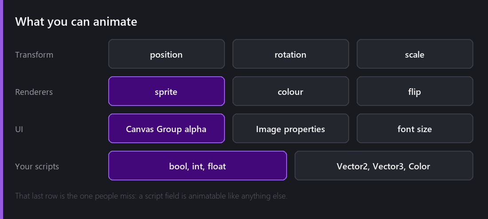
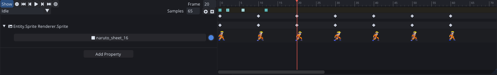
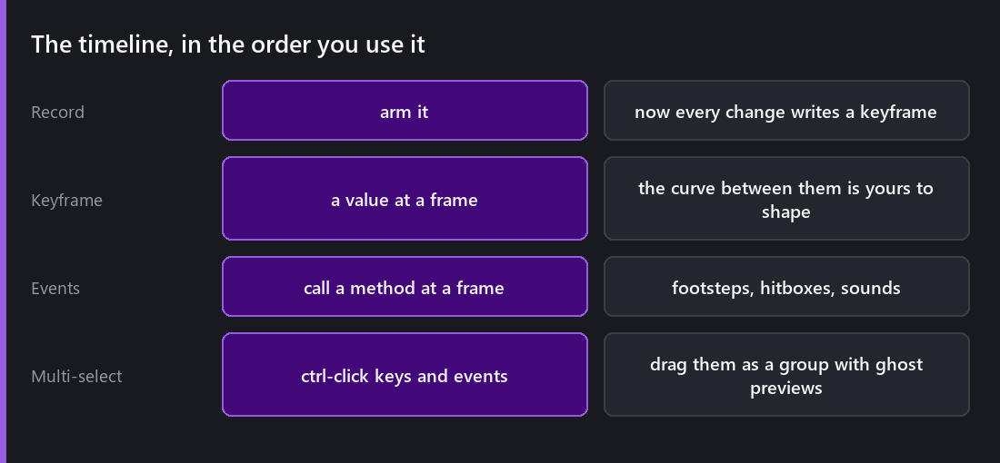
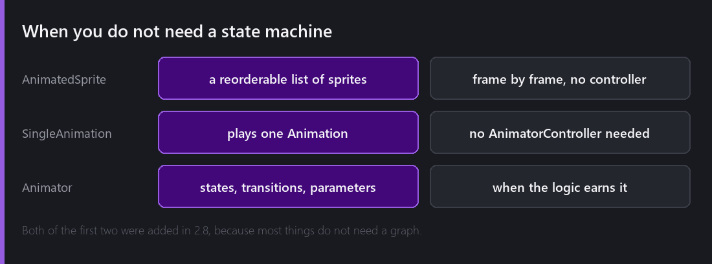

Animation in a 2D engine is really two problems sharing one name. This week is the first one, producing a clip. Next week is deciding which clip should be playing.

## Not just sprite swapping

The obvious thing to animate is which sprite is showing, and Comet does that. But the Animation Timeline animates properties, and the list is longer than people expect: transform position, rotation and scale, renderer colour and flip, Canvas Group alpha, Image properties, font size.

It also animates fields on your own scripts, and that is the part that changes how you use it. A `bool`, `int`, `float`, `Vector2`, `Vector3` or `Color` declared in an AngelScript behaviour can be keyframed like anything else.

That turns the animation system into a general purpose "change these values over time" tool. A screen shake is an animation. A damage flash is an animation. A door that unlocks is an animation on a script's `isLocked` field. You do not have to write a coroutine for any of them.

## Recording

That is a seven-frame run cycle. One property row, `Entity.Sprite Renderer.Sprite`, with a keyframe every ten frames, and the track draws the actual sprite at each key so you can read the cycle without playing it.

Arm **Record** and every change you make writes a keyframe at the current frame. Move the entity and you get a position key. Change a colour and you get a colour key.

The thing to know is that recording captures what you changed, not everything. 0.9.2 fixed a bug where recording a frame and modifying one axis of a multi-value field added keys for every axis. Now it keys only the value you actually touched. That matters because extra keys are not harmless, they pin down values that you wanted free to be interpolated by other clips.

Between keys the curve is yours to shape. The default is smooth, which is right for movement and wrong for anything that should snap.

## Events

An **animation event** calls a method at a specific frame.

This is where animation and gameplay meet, and getting it right is a lot of what makes a game feel responsive. The footstep sound plays on the frame the foot lands and not on a timer. The attack's hitbox turns on at frame 4 and off at frame 7, defined by the artist on the animation itself, not by a programmer guessing at durations.

2.0 added a `+` button that adds an event at the currently selected frame, and made right-clicking an event show options for that specific event rather than only "remove all events at this frame", which was a small trap as it was written.

## Editing at speed

2.3 rewrote multi-selection, and it is the change that made the timeline pleasant to use.

Click selects a keyframe or an event. Ctrl-click toggles individual ones. Clicking the global row selects everything at that frame. Selected keys and events drag together as a group, keeping their relative spacing, with ghost previews showing where they will land. `Supr` deletes the whole selection.

Retiming an animation, meaning "this whole sequence should take 20% longer", went from a per-key chore to a single drag.

Sub-resources can also be assigned to several keyframes at once rather than one at a time, which matters when you are pointing thirty frames at thirty sprites.

## When you do not need any of this

Most animated things in a game are not state machines, they are just a loop.

2.8 added **AnimatedSprite**, a behaviour holding a reorderable list of sprites that plays frame by frame. A coin spinning, a torch flickering, a pickup bobbing. No Animation asset, no controller, no timeline.

There is also **SingleAnimation**, which plays one `Animation` asset without needing an `AnimatorController` at all.

Both exist because the answer to "how do I animate this coin" used to be "create an Animation, create an AnimatorController, assign it, add one state", and three of those four steps were ceremony.

The Animator is for when you have states and decisions, and that is next week.

## Two bugs

Single-frame animations looped forever instead of finishing, right up to 2.2.1. The completion check assumed at least two frames existed, so a one-frame "animation", which people do make as a way of setting a pose, never reported that it had ended, and anything waiting on it waited forever.

Previewing also left values applied. Selecting an entity with an Animator or a Single Animation and scrubbing the timeline previewed the animation, which is correct, but deselecting left those previewed values permanently applied to the scene entity. You would preview a death animation, click away, and your character was now lying down in the saved scene.

In both cases the code was resting on an assumption I had never written down anywhere. "Animations have more than one frame" and "previewing is temporary" were both things I believed without ever checking that the code believed them too.

---

Next Wednesday: which clip should be playing. The Animator, with states, sub-machines, parameters driven from gameplay, transitions with conditions and exit time, controller overrides for a second character, and root motion.

*Comments and questions welcome ;)*
