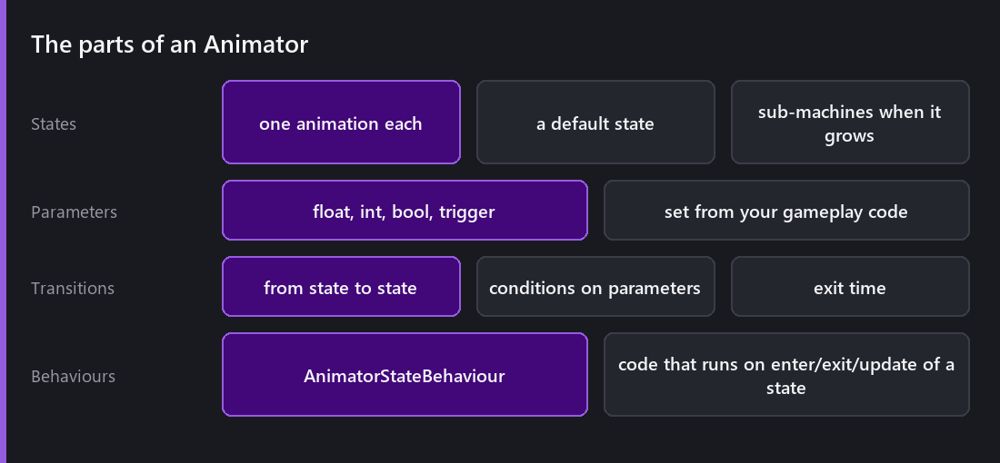
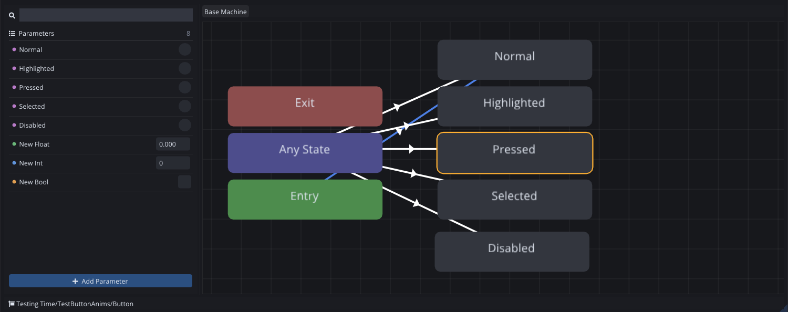
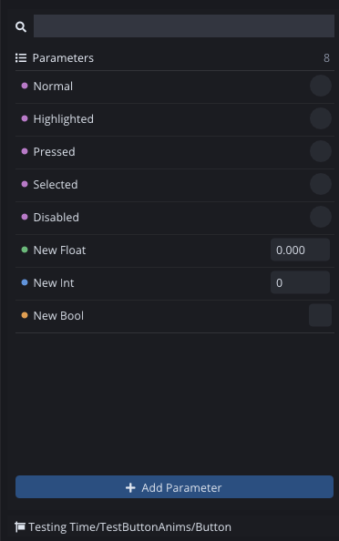
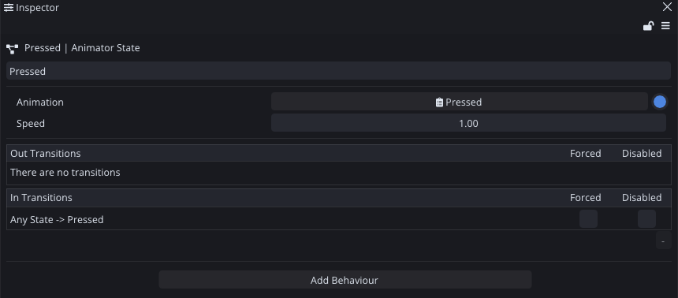
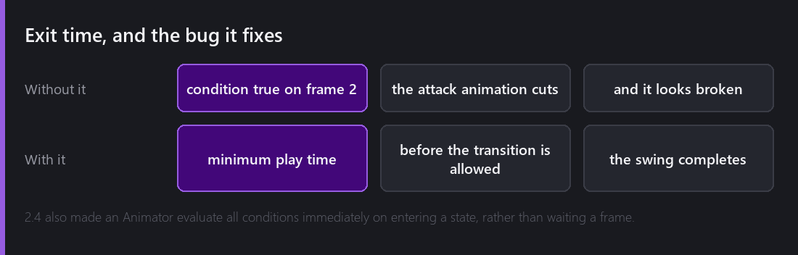
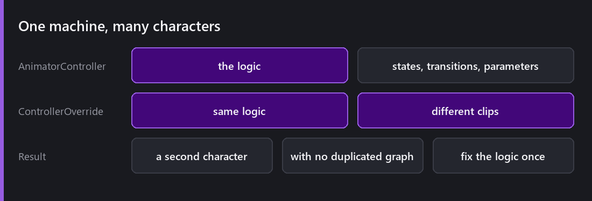
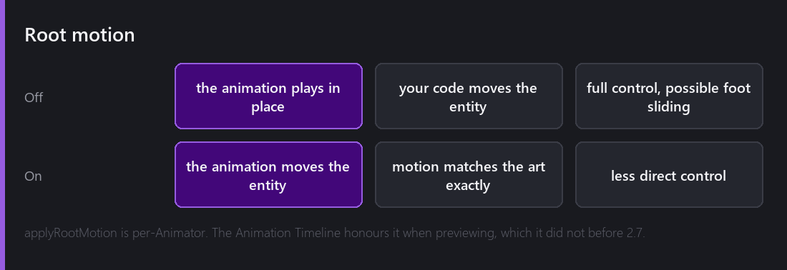

[Last Wednesday]() produced clips. This week decides which one plays, and that turns out to be a design problem more than an animation one.

## Why not just if-statements

You can absolutely write `if (grounded && speed > 0) PlayRun();` and for a character with three animations it works fine.

It stops working at around six. The problem is not that the code gets long, it is that the transitions become implicit. "Can I go from attack to jump?" gets answered by whatever order your `if`s happen to be in, and nobody, including you in three months, can read the file and say what the legal transitions are.

An Animator turns the transitions into data. What can follow what becomes something you can look at.

That is a real one, the five visual states of a UI button. `Entry` picks the starting state, `Any State` is the shortcut for "from wherever you are", and every white line is a legal transition. Nothing about that graph is hidden inside a script.

## Parameters

The Animator does not read your game. It reads **parameters**, which are floats, ints, bools and triggers that your gameplay code sets.

That indirection is the whole design. Your movement script says `animator.SetFloat("speed", velocity.magnitude)` and knows nothing about which animations exist. The Animator decides that run starts at 0.1 and sprint at 6.0, and you can retune those numbers without touching gameplay code.

Each type has its own colour in the list, and the value next to it is the default the controller starts with.

Triggers are the special case, a bool that consumes itself when a transition uses it. 1.0 added `ResetTrigger()` by name or by parameter ID, because a trigger set on a frame where no transition could consume it stays armed and fires later. That produces a genuinely confusing bug, an attack animation that plays half a second after the button, once.

## What a state holds

Not much. A clip, a playback speed, and the two lists of transitions in and out of it, which is the same information as the arrows in the graph but in the form you need when you are editing one specific state.

## Exit time

This is one checkbox, and it makes a large difference to how the animation feels.

Without exit time, a transition fires the instant its conditions are true. Press attack, release the direction key on frame 2, and the attack animation cuts to idle two frames in. The swing never happens. The player pressed attack and nothing visible occurred.

With exit time, the state must play for at least that fraction of its length before it is allowed to leave. The swing completes. The input is still responsive because the next state is already queued, it just does not interrupt the frames that carry the meaning.

2.4 also changed the Animator to evaluate all conditions immediately when it enters a new state rather than waiting for the next frame. That removed a one-frame lag on chained transitions, which is something you feel without being able to say what it is.

## Sub-machines

When a character has fifteen states the graph becomes unreadable, and the answer is grouping.

A sub-machine is a state that contains its own state machine. `Airborne` holds jump, fall and land, and from outside it is one box with transitions in and out. The graph then reads as five states instead of fifteen.

2.4 added a quality of life fix that matters more than it sounds. The Animator panel now automatically switches to the visible state machine when you select an entity whose current state lives in a different one. Before that, selecting a character mid-jump showed you a graph that did not contain the state it was in.

Also from 2.3: copy, paste and duplicate for states and machines (`Ctrl+C`, `Ctrl+V`, `Ctrl+D`), renaming parameters with the rename shortcut, and dragging a transition to empty background to create its target state right there. Building a graph stopped being a right-click marathon.

The state inspector also shows a table of every transition arriving at that state, which is the question I actually ask when I am debugging. Not "where does this go" but "what gets me here".

## One machine, two characters

An **AnimatorControllerOverride** takes an existing controller and swaps only the animation clips.

Your second character gets the same states, the same parameters, the same transitions, and its own art. Fix the logic and both get the fix. It is the same idea as [RuleOverrideTile]() and [InstanciableEntity variants](). The engine keeps arriving at "inherit the structure, override the leaves", and I think that is the right instinct.

## Root motion

With root motion off, the animation plays in place and your code moves the entity. You get full control, and the classic risk of foot sliding when the movement speed and the animation disagree.

With it on, the animation's own motion drives the entity. The art and the movement match exactly, and you give up some directness.

It is set per Animator via `applyRootMotion`. 2.7 fixed the Animation Timeline not honouring that flag when previewing, so a root motion clip previewed as if it were in place, which made it impossible to author against.

## Where state machines go wrong

This last one is a design trap rather than a bug.

State machines grow. Every new ability adds a state and, worse, adds transitions from several existing states. The count of states grows linearly and the count of transitions grows much faster.

The point to stop is when you find yourself adding "can interrupt" transitions from everything to everything. At that stage the machine is not really describing legal sequences any more, and you are better off with a small amount of code deciding intent and a much simpler machine playing it.

I do not have a clean rule for where that line is. What I do know is that every animator graph I have regretted was one I kept adding to past the point where I could see all of it at once.

---

Next Wednesday: things falling over. Physics on Box2D 3, with bodies, colliders, joints, the collision matrix, raycasts, and three bugs that each taught me something about how the pieces fit together.

*Comments and questions welcome ;)*
