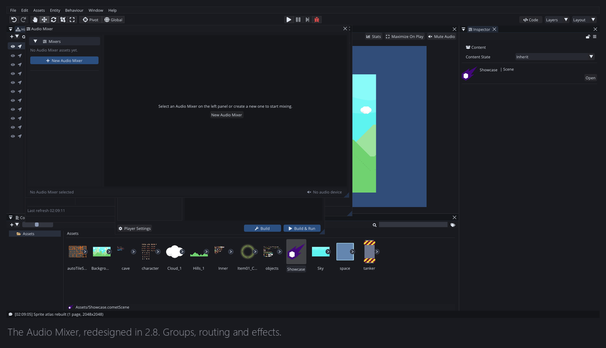
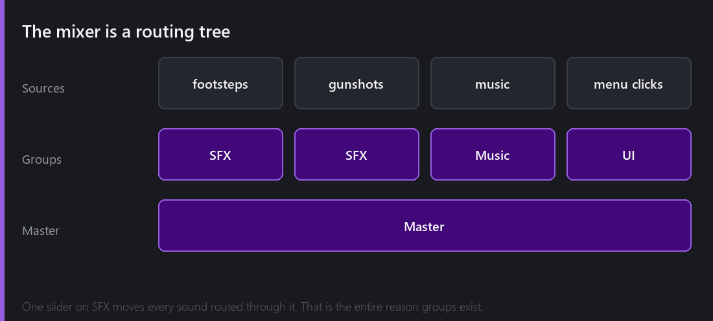
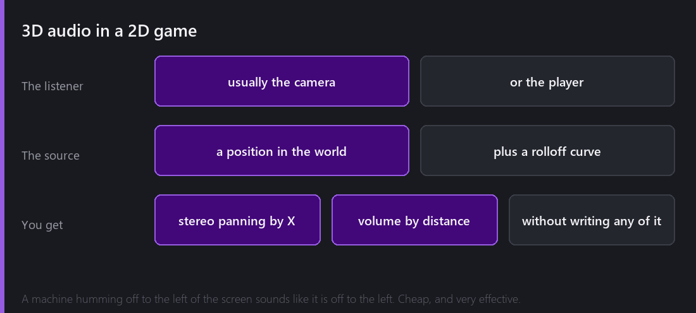
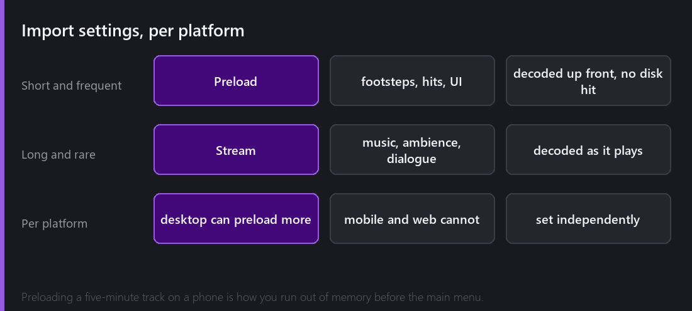

Audio is the system people add last and then wish they had added first. A game with no sound feels broken in a way that is hard to describe and instant to notice — you press a button and nothing acknowledges it, and the whole thing feels like a diagram of a game rather than a game.

Comet's audio runs on **SoLoud**, a small, permissively licensed C++ audio library that does its job and does not try to be an ecosystem.

## Playing something

The minimum is two entities. An **Audio Source** on the thing making the noise, an **Audio Listener** on the thing hearing it — usually the camera.

Point the source at an Audio Clip, tick `Play On Awake`, done. From script it is `Play()`, `Stop()`, `Pause()`, and a `PlayOneShot` for fire-and-forget sounds that should overlap rather than interrupt each other.

That last distinction matters more than it looks. A footstep that *interrupts* the previous footstep sounds wrong immediately, and the fix is a one-word change.

## The mixer

The Audio Mixer got a visual rework in 2.8 — only the visuals, the routing underneath is unchanged. It is the panel that turns a pile of individual sounds into something you can control.

Sources route into **groups**, groups route into other groups, everything ends at **Master**. Put every footstep, impact and explosion into an `SFX` group and one slider controls all of them. That is the entire reason groups exist and it is enough justification on its own.

The bit that goes beyond volume sliders is **layouts** — saved snapshots of the whole mixer state that you can switch between at runtime. A `Underwater` layout that ducks the highs and pushes reverb. A `Paused` layout that drops everything except UI. A `LowHealth` layout that thins the music. Switching layout is one call, and it is the difference between audio that reacts to your game and audio that just plays.

## Effects

Per group: echo, reverb, filters, and a handful of others.

Reverb is the one that earns its cost. The same footstep clip played dry, then through a reverb with a large room size, reads as two completely different environments. You do not need separate cave footsteps; you need one footstep and a room.

2.0 tidied up the effect parameters considerably — `AudioEffectEcho` gained a `filter`, reverb gained `width`, `damp`, `roomSize`, `freeze` and `wetMix`, and a long list of parameters that did nothing useful was removed along with a few effects (Chorus, Compressor, Fader) that were not carrying their weight. Fewer knobs that all do something beats more knobs that mostly do not.

## 3D audio in 2D

This sounds like a contradiction and it is one of the highest-value-per-effort features in the engine.

Mark an Audio Source as 3D and it gets a world position and a rolloff curve. The listener has a world position too. Comet works out the rest: **stereo panning from the horizontal offset, volume from the distance.**

A machine humming off to the left of the screen sounds like it is off to the left. Walk toward it and it gets louder. You wrote none of that.

The rolloff curve is worth tuning rather than leaving at default. Linear rolloff is rarely right — real sound falls off fast up close and slowly far away, and a curve shaped like that reads as much more natural.

Keep UI sounds and music 2D. A menu click that pans because the camera happens to be off-centre is a bug, and it is a bug people find genuinely disorienting.

## Import settings

Every clip has import settings, and they are **per platform** — which matters more than it sounds.

**Preload** decodes the clip up front and keeps it in memory. Right for short, frequent sounds: footsteps, hits, UI. No disk access at play time, no decode hitch.

**Stream** decodes as it plays. Right for long, infrequent things: music, ambience, long dialogue.

Getting this backwards is a classic. Preloading a five-minute music track means decoding several minutes of audio into RAM before the main menu appears. Streaming a footstep means a disk seek every time the player takes a step.

Per-platform is the important part. A desktop build can afford to preload generously. A mobile or web build cannot, and being able to say "preload on desktop, stream on Android" for the same clip without maintaining two assets is exactly the kind of thing that stops platform work from being miserable.

## Small things that took real time

The audio work that took longest was not the interesting parts.

**A volume slider on the clip preview.** When you click an audio asset, the inspector plays it. Until 2.0 it played at full volume, always. Adding a slider is trivial; noticing that it needed one took embarrassingly long, because I always had my system volume set appropriately for whatever I was working on.

**Removing a mixer group from a source.** You could assign one. You could not un-assign it. That shipped, and it is in the 2.0 fixed list under a very short line.

**Making the panel not look like a debug tool.** The 2.8 rework changed no functionality at all. It just stopped looking like something I had built for myself, which is a real category of work even though it produces nothing you can put in a feature list.

## What Comet does not have

No procedural audio or DSP graph — effects are a fixed set on groups, not a node graph you compose.

No occlusion. A sound behind a wall is as loud as a sound in front of it. You can fake it by driving volume from a raycast, and that is a script you write, not a feature you enable.

No built-in music sequencing or adaptive layering. Layouts get you a long way toward the same feeling, but crossfading stems in time with a beat is something you build yourself.

---

Next Wednesday, the week before Christmas, and the most visual post of the year: text. Font rendering, kerning, bitmap fonts, and BBCode — colours, waves, shakes, rainbows and a custom `[snow]` tag written for the occasion.

*Comments and questions welcome ;)*
