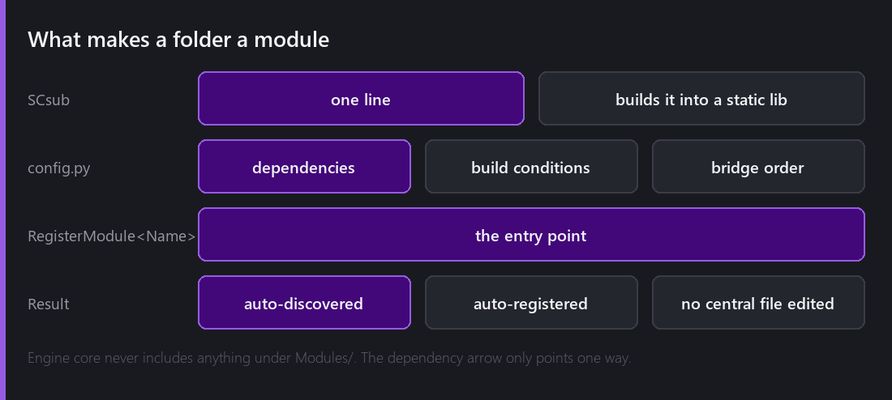
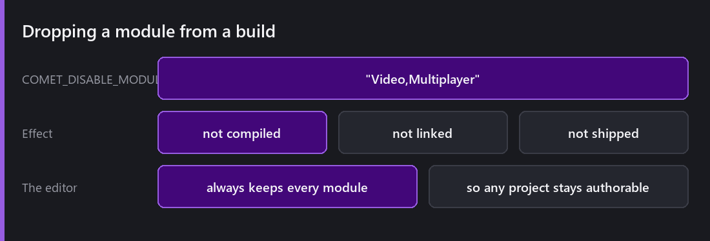
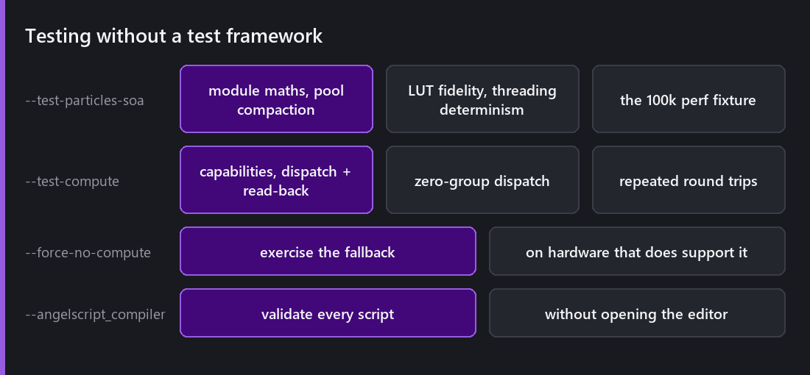
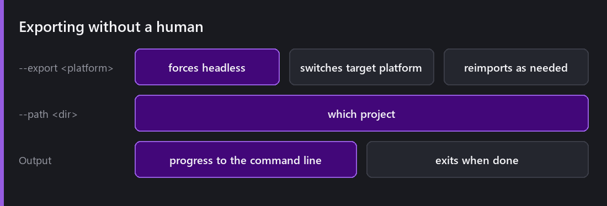

Nobody blogs about their build system, which is odd, because it is the thing that decides how pleasant a codebase is to work in.

Comet builds with **SCons**, driven through a `Build.py` wrapper. One command produces an editor or a game, for a platform and an architecture.

## Modules that wire themselves in

The part I am most pleased with is the module system, and the design rule is one sentence: **no central file is edited to add a module or a feature.**

A folder under `Modules/` becomes a module when it contains three things: an `SCsub` (one line, builds it into a static library), a `config.py` (dependencies and build conditions), and a `RegisterModule<Name>.cpp` (the entry point).

The build discovers it, compiles every source under it recursively, and generates a dispatcher that calls its registration. You never list source files and you never add yourself to a registry.

The dependency rule that keeps this honest: **engine core never includes anything under `Modules/`.** The arrow always points module → engine. The only thing that names modules is a generated file that lives under `Modules/` itself.

Physics, UI, Audio, Animation, Tilemap, Particles, Navigation, Networking, Multiplayer, Video, VisualScript, NodeGraph, NativeInterop, Input, Bezier. All of them are modules, and each one built into its own static library.

## Optional dependencies

A module can depend on another as mandatory (disable the dependency and this one disables too) or optional. Optional dependencies guard their code with `COMET_MODULE_<NAME>`, defined for each enabled module in a generated header.

That is how the Physics module can use tilemap colliders when Tilemap is present and compile fine when it is not.

## Dropping modules

`COMET_DISABLE_MODULES="Video,Multiplayer"` removes them from a **game** build entirely, so it is not compiled, not linked and not shipped.

The editor always keeps every module, so any project stays authorable regardless of what a particular game build excludes. That asymmetry is deliberate and it is the right way round.

## Testing without a test framework

Comet has **no unit test suite**, and I want to be honest that this is a real gap rather than a philosophy.

What it has instead are **headless gates**, where the engine runs itself with no window and checks something specific.

`--test-particles-soa` covers every [property module's]() maths, pool compaction, lookup-table fidelity, threading determinism and the 100k performance fixture. That last one matters most: a performance rewrite without a performance test is a rewrite that quietly regresses six months later.

`--test-compute` exercises [compute]() capabilities, a storage-buffer dispatch with read-back, a zero-group dispatch (the edge case that crashes drivers), and repeated round trips. And `--force-no-compute` makes hardware that *does* support compute pretend it does not, so the fallback path gets tested on my machine rather than only on hardware I do not own. That flag has caught more bugs than the compute tests themselves.

`--angelscript_compiler` validates every script in a project without opening the editor, which is the closest thing to a compile check the scripting layer has.

The honest assessment: these gates cover the systems where I got burned. They do not cover the systems where I have not been burned *yet*, which is the exact definition of inadequate test coverage.

## Building without a human

`--export <platform>` exports a project from the command line. It forces headless, switches the target platform, reimports assets as required, logs progress and exits when done.

That plus `--path` is a complete CI story: check out, build the engine, export the game for four platforms, run the headless gates.

## Gotchas that cost me real time

Two, documented because they are the kind of thing you would never guess.

**Worktree builds hit MAX_PATH.** Building from a git worktree under a deep OneDrive path fails with a `C1083` and an *empty filename* in the message, because the `.obj` path exceeds 260 characters. The fix is to map the worktree to a short drive letter with `subst` first. The error tells you nothing; the cause is the path length.

**`Acceso denegado` at link time** after an editor crash under the debugger, because a zombie process is still pinned by `vsdbg.exe`. Kill the debugger process and relink.

Neither is interesting. Both cost an hour the first time.

## What I would change

**The build is slow from clean.** Twenty-odd static libraries and a large third-party tree. Incremental builds are fine; a clean build is a coffee.

**Shader baking is a separate step.** Change `CometShaders.h` and you must build, run `--bake_shaders`, then build again, because the baked artifacts are compiled in. I got that wrong twice while writing this blog and shipped a build with stale shaders both times.

**No unit tests.** Still the honest answer.

---

Next Wednesday: two players in the same world. The networking stack: low-level sockets, one peer abstraction over ENet, WebSocket and WebRTC, TLS and DTLS, and the web constraint that shaped all of it.

*Comments and questions welcome ;)*
