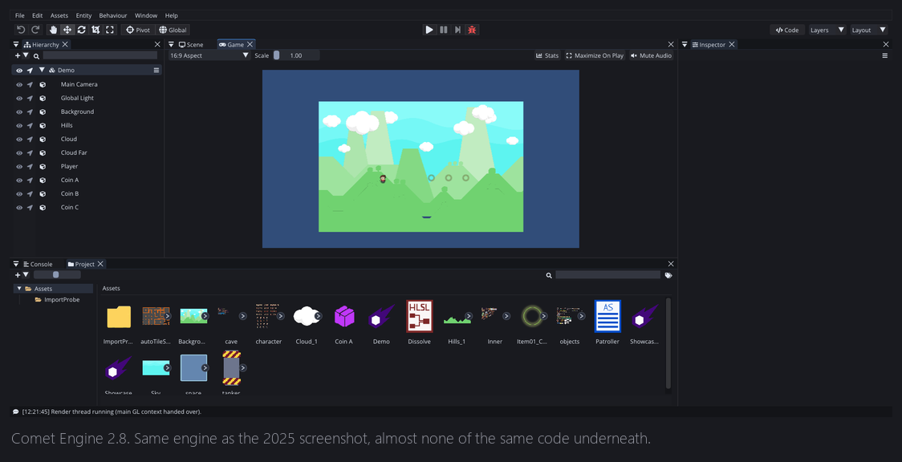
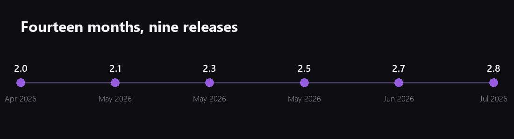
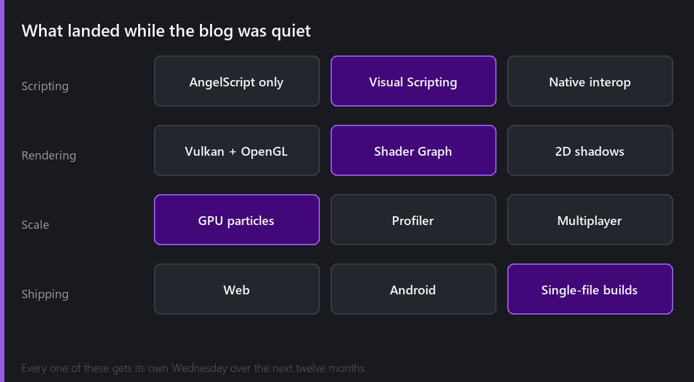
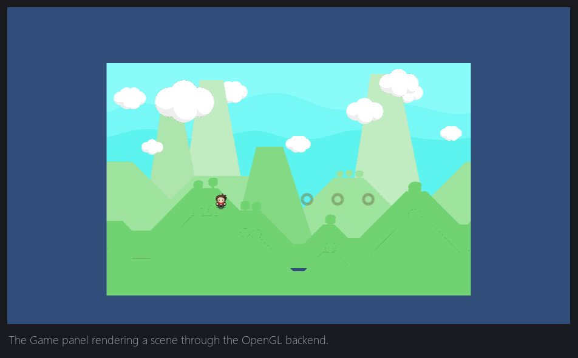

The last time I posted here was May 2025. I had just decided to throw away the C# scripting system, I was three weeks into rewriting 300 script files in AngelScript, and I finished that post with a sentence I have thought about many times since:

> So I expect that just before the ending of 2025 I will be able to release a CometEngine_v2.0_Beta version.

I missed it by about four months. 2.0 shipped in April 2026.

What I did not expect is that once 2.0 was out, everything got faster. Nine releases landed between April and July. The blog stayed quiet the whole time, because every evening went into the engine instead of into writing about the engine. I think that was the right call back then. It is the wrong call now, because there is a year of work in here that nobody has seen.

So this post is the catch up, and at the end of it there is a promise.

## What has changed since then

I want to put the numbers down first, because they surprised me when I collected them.

Since the last post there have been **nine releases**, 2.0 through 2.8. The engine went from "a 2D editor with C# scripting that runs on Windows and Linux" to something I have a hard time describing in one sentence. That is a problem by itself, and part of why this blog is starting again.

The biggest change is the one I was writing about last time. **C# is gone**, completely. AngelScript is the only scripting language now, and 2.0 was a hard break, so projects written for 1.x do not open. That decision made me genuinely uncomfortable and I am going to spend the next two Wednesdays on it, because "I rewrote 300 files" is not really the point. What matters is what I got in exchange, and what it cost me.

The short version of the exchange is that the engine now runs in a browser and on a phone. That was the entire reason for the migration, and it worked.

## Other things that landed

If the story had ended at AngelScript, Web and Android, this would be a shorter post. It did not.

Somewhere around 2.2 the pace changed. Things I had written down as "maybe in a few years" started landing in single releases. A **Shader Graph** with about 115 nodes, so you can build a dissolve effect without writing a line of HLSL. **Visual Scripting**, where the node graph compiles directly into AngelScript bytecode, so it is not interpreted and it is not a slower path, it is the same bytecode a hand written script produces. **2D dynamic shadows**. **A Vulkan backend**, loaded at runtime so machines without a Vulkan driver still boot on OpenGL.

And the one I am still a bit amazed by: the particle system now simulates **a hundred thousand particles in 2.7 milliseconds** on the CPU, or moves the whole simulation onto the GPU with compute shaders if the backend supports it. The old particle system was one object per particle, with a virtual call per property per particle. That rewrite deserves a post of its own, probably two.

There is also a full networking stack now, with ENet, WebSocket and WebRTC transports and high level scene replication on top. There is a package manager with a marketplace. There is a profiler with flame graphs that can attach to a running build over TCP. There is an MCP server inside the editor, so an AI assistant can drive it.

I am listing all this like a changelog, which is exactly what I do not want this blog to be, so I will stop here.

## Why the blog is starting again

Comet has become quite capable and almost completely invisible. When somebody asks me what it does, I either give a two word answer that undersells it, or I talk for twenty minutes and lose them. There is nothing in between, and that is a writing problem, not an engine problem.

There is also a selfish reason. Every time I have written about a system in this blog, I have found a bug in it. Explaining how something works to a stranger is the most reliable code review I know. Fourteen months of not writing is fourteen months of not doing that review.

## A post every Wednesday

That is the promise, and I want to keep it for a year.

Not a changelog and not a tutorial. I want to explain what Comet actually is, one system at a time, in a way that is enjoyable to read whether or not you ever intend to use it. Lots of pictures, and real screenshots from the real editor instead of marketing renders.

Some of them will come in parts, because "2D lighting" is not one post and pretending it is would make it a bad one. When a post belongs to a series I will say so at the bottom and tell you what is coming the following Wednesday.

Roughly, the year looks like this: the scripting migration and the editor first, then the object model, then a long run through rendering, so lighting, shadows, shaders, the Shader Graph and post processing. Then particles and performance. Then scripting tools, the built in code editor and visual scripting. Then tilemaps, animation, physics, UI, audio and navigation. Then the content pipeline and shipping to web and mobile. Then multiplayer. And at the end of it, a proper look back at what is now seven years of this project.

Next Wednesday: the migration. What a Comet script looked like in C#, what the mono bridge was actually doing, which parts of the port were mechanical, and the three things AngelScript flatly does not have that I had to design around.

*See you Wednesday. Feel free to share comments or questions ;)*
