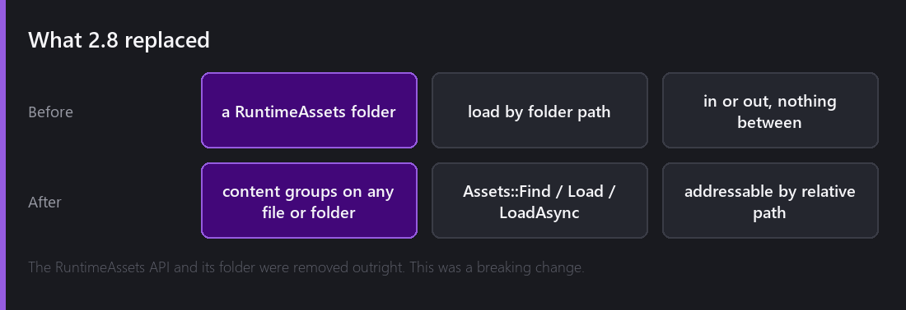
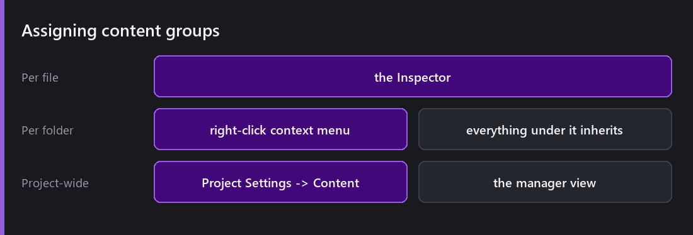
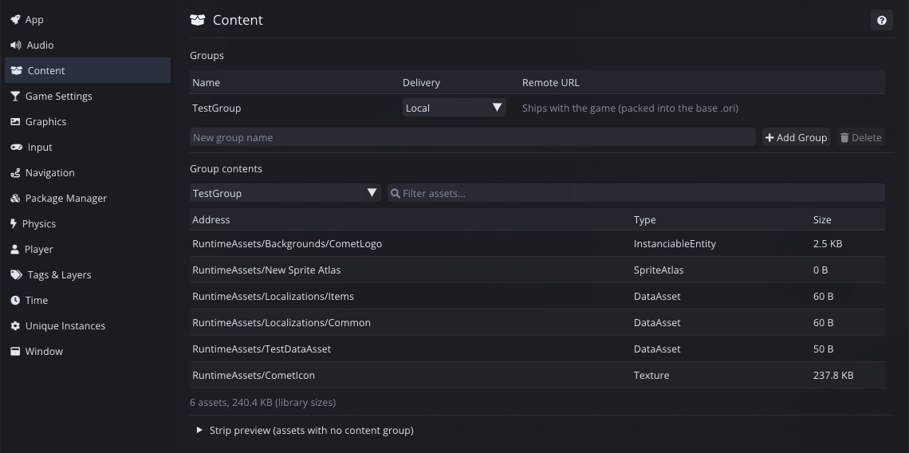
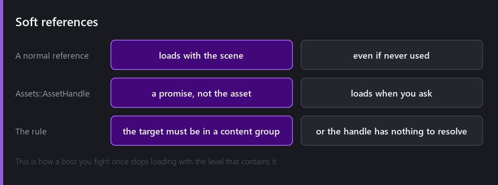
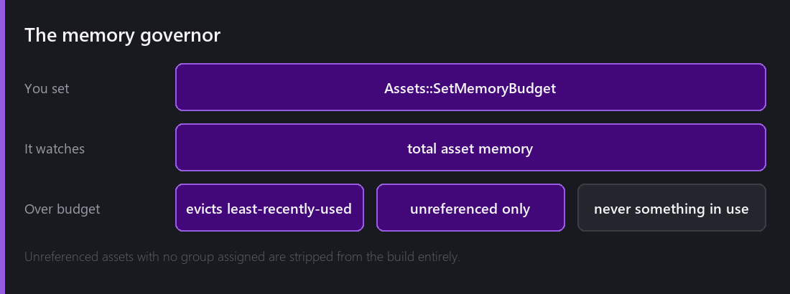

This is the least glamorous system in the engine and one of the most consequential, because it decides two things every player notices: how long your game takes to start, and whether it runs out of memory.

2.8 rebuilt it, and deleted the old one outright.



## What was wrong

The old model was a magic folder. Put an asset in `RuntimeAssets/` and you could load it by path at runtime. Anything else was loaded by being referenced from a scene.

Two problems.

**It was binary.** An asset was either always-loaded-with-its-scene or in the magic folder. There was no way to say "this belongs to the boss fight, load it when the boss fight starts".

**The folder was the grouping.** Organising your project by folder and organising your loading by folder are different jobs, and one folder structure cannot serve both.

`RuntimeAssets` and its API were **removed** in 2.8. That is a breaking change and I am not going to soften it: projects using it had to move.

## Groups



A **content group** is a label you assign to a file or a folder, and it is independent of where the file lives. Assign per file in the Inspector, per folder via right-click so everything under it inherits, or manage the whole set in `Project Settings → Content`.

Now "the boss fight's assets" is a group, and it can contain files from six different folders that are organised however makes sense to a human.



The Content page is where you see a group as a group: its delivery mode, everything addressed into it, and what each entry costs. The **Strip preview** at the bottom lists assets in no group at all, which is how you find the ones that would have silently shipped.

## Addressing

Every grouped asset has an **address** — its relative path, like `Textures/Enemies/orc`.

```
Assets::Find("Textures/Enemies/orc")
Assets::Load("Textures/Enemies/orc")
Assets::LoadAsync("Levels/Boss/arena")
```

The important word is *relative*. An address is not a file system path and it does not change when you reorganise folders inside a group. It is a name.

`LoadAsync` matters more than it looks: loading a large asset synchronously stalls the frame, and on a level transition that is the difference between a hitch and a loading screen that animates.

## Soft references



Here is the feature that changes how you build.

A normal reference — a `Sprite` field on a script pointing at an asset — loads that asset when the scene loads, whether or not it is ever used. That is correct and it is why a scene "just works". It also means a boss you fight once loads with the level every time.

`Assets::AssetHandle` is a **soft** reference. The field holds the address, not the asset. Nothing loads until you ask, and you ask when the fight actually starts.

The rule to know: the target **must be in a content group**, because a handle resolves by address and an ungrouped asset does not have one. That trips people up once and then never again.

## The memory governor



`Assets::SetMemoryBudget` sets a ceiling. When asset memory goes over it, Comet evicts the **least-recently-used, unreferenced** assets.

Both qualifiers matter. Least-recently-used is the sensible heuristic. *Unreferenced* is the safety property: nothing currently in use is ever evicted, so the governor cannot pull a texture out from under a sprite that is drawing it.

This is the system that makes a large project viable on a phone without hand-managing every load. Set a budget appropriate to the device and stop thinking about it — with the honest caveat that a budget which is too tight produces thrashing, loading and evicting the same assets repeatedly, and the profiler is how you find that.

## Stripping

Assets that are **unreferenced and have no group assigned** are stripped from the build automatically.

That is a good default with one sharp edge worth knowing: if you load something purely by string address at runtime and forget to put it in a group, nothing references it, so it does not ship — and you find out in the build rather than the editor. The fix is the same as the rule above: things you load by address belong in a group.

## Local and remote

Groups are marked **local** or **remote**.

Local groups are memory-mapped into the main build pack, so mounting them costs essentially nothing. Remote groups build as separate packs staged for a CDN — the game downloads, verifies by checksum, and updates them on the fly without a full game update.

That is the DLC and live-content story, and it is [next Wednesday]() along with the rest of the packaging.

## What I would do differently

The migration was the right call and I underestimated the documentation cost. The API is better; the change was announced in a changelog line and a lot of people met it as a compile error.

If I were doing it again I would ship the new system one release *before* removing the old one, even knowing that maintaining both briefly is the thing I said [I would not do for shaders](). Shaders had almost no users at that point. Content had all of them.

---

Next Wednesday: what all of this becomes when you press Build. Single-file `.ori` packs, mod support you get almost by accident, differential patches, and mounting content at runtime from script.

*Comments and questions welcome ;)*
