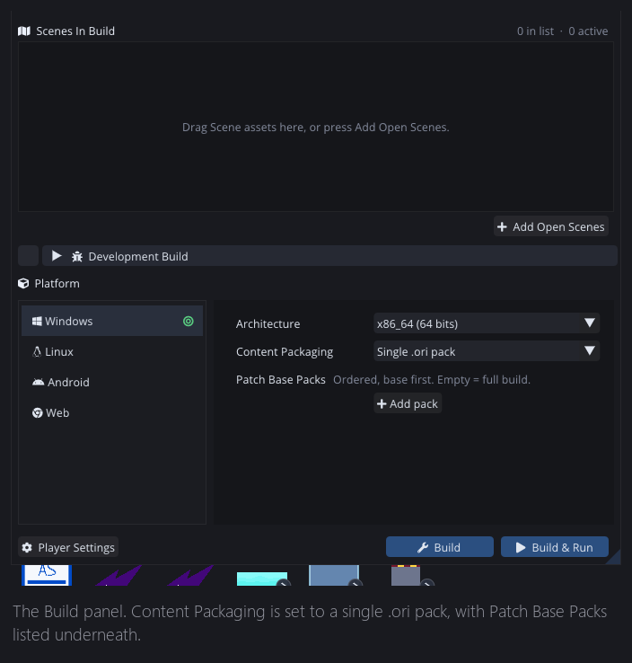
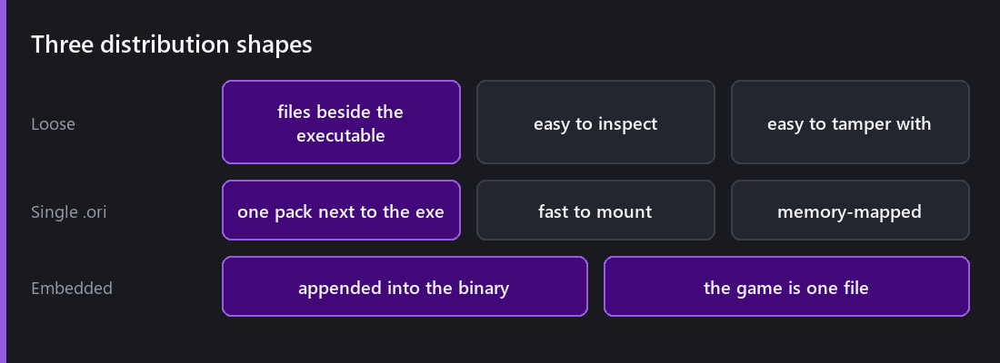
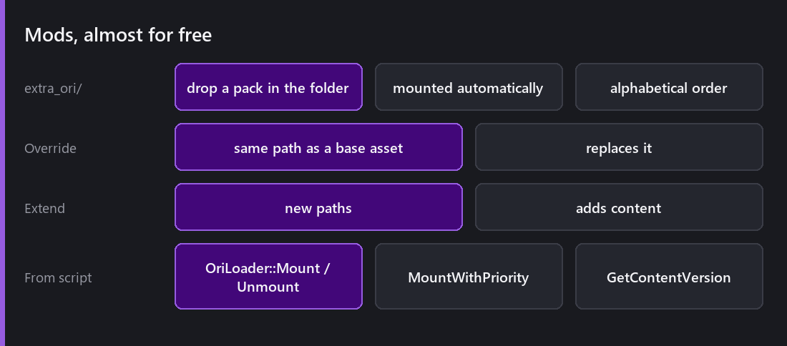
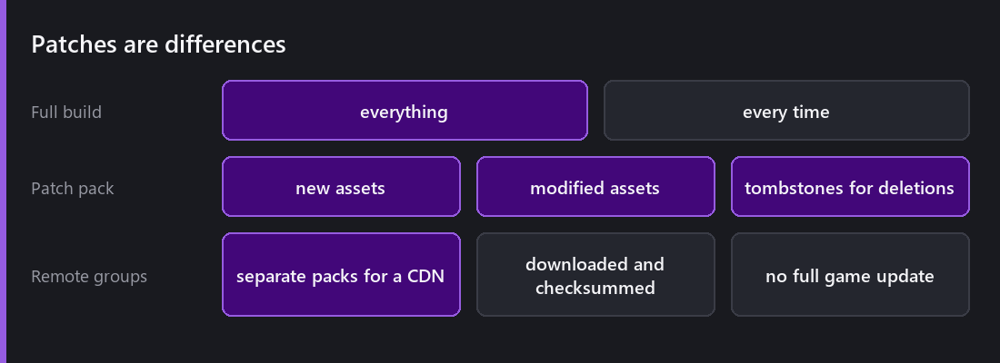

[Last Wednesday]() made every asset addressable. This week is what happens to all of it when you press Build.

## The .ori pack

A standalone build can bundle its runtime content into a single **`.ori` resource pack**, controlled by the Content Packaging setting.

Three shapes. **Loose files** beside the executable, which is easy to inspect, easy for a player to break. A **single `.ori`** next to the exe, which is memory-mapped so mounting costs essentially nothing. Or **embedded in the executable**, and the game is literally one file.

That last one is worth a moment. A game you can hand someone as a single `.exe` with nothing beside it is a distribution property people notice: no "did you copy the whole folder?", nothing to lose, nothing to accidentally edit.

## Mods, almost by accident

Here is my favourite thing about this design.

Extra `.ori` packs placed in an **`extra_ori/`** folder are mounted automatically, in alphabetical order, and they override or extend the base content by address.

That is a complete mod system, and it was not really designed as one. It falls out of "content is addressable and packs mount in priority order". A pack containing `Textures/Player/hero` replaces the base game's hero texture. A pack containing new addresses adds content.

From script, `CometEngine::OriLoader` gives you `Mount`, `MountWithPriority`, `Unmount`, `IsMounted`, `GetMountedPacks` and `GetContentVersion`, with built-in engine version validation so a pack built for an incompatible version is rejected rather than loaded into a crash.

The honest security note: **a mounted pack is content, not code**, so it cannot execute anything by itself, but it can replace any asset, including ones your game trusts. For a single-player game that is the point. For anything competitive, content authority has to live on a server.

## Patches

The **Patch Base Packs** setting takes your previous builds and generates a differential `<ProductName>_patch.ori` containing only what changed: new assets, modified assets, and **tombstones** for deletions.

The tombstones are the part people forget when rolling their own. Adding and changing are easy; a patch also has to be able to say "this asset is gone", or deleted content resurrects itself from the base pack forever.

Together with remote content groups (separate packs staged on a CDN, downloaded and checksum-verified at runtime), this is how a shipped Comet game changes without a full reinstall.

## What this is not

**No asset encryption.** An `.ori` is a container, not a vault. Anyone who wants your textures can get them. That is true of every engine and pretending otherwise wastes your time and theirs.

**No delta compression within an asset.** A patch replaces changed assets whole. Change one pixel in a 4K texture and the patch carries the whole texture. Fine for most projects; if you are shipping gigabyte texture updates weekly you would want something smarter.

**No automatic version negotiation.** The engine validates that a pack is compatible; deciding *which* patch a given client needs is your problem, and it is the part a live game actually spends time on.

## The thing I would tell someone shipping

**Turn on single-file packaging before your first public build, not after.** The loose-files layout works fine in development and then someone zips the wrong folder.

**Test `extra_ori/` early even if you do not plan to support mods**, because it is also the mechanism you will use for a hotfix. Dropping one small pack beside a shipped game is far easier than rebuilding it.

**Generate a patch against a real previous build at least once before launch.** Patch generation is the kind of pipeline step that works perfectly until the first time you need it at speed.

---

Next Wednesday: sharing code rather than content. The Packages folder, the manifest, the creation wizard, export validation, and the marketplace on the other end of it.

*Comments and questions welcome ;)*
