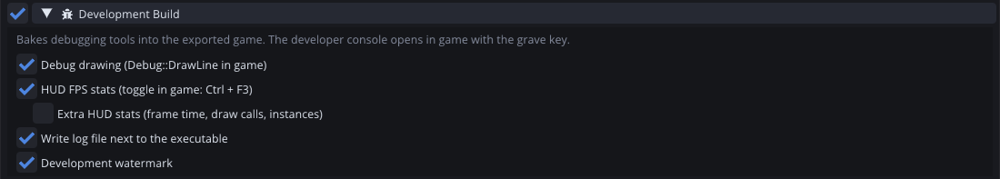
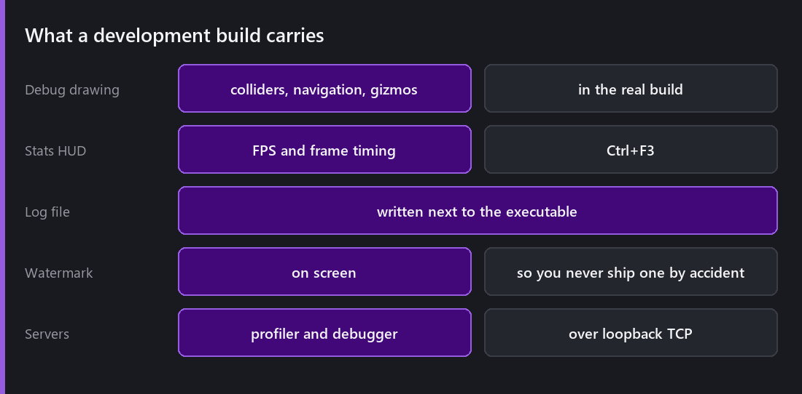
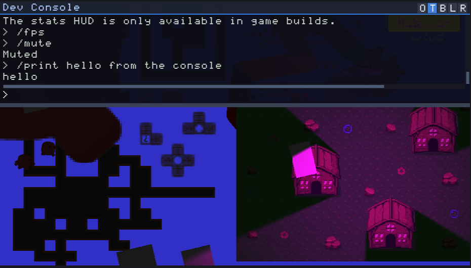
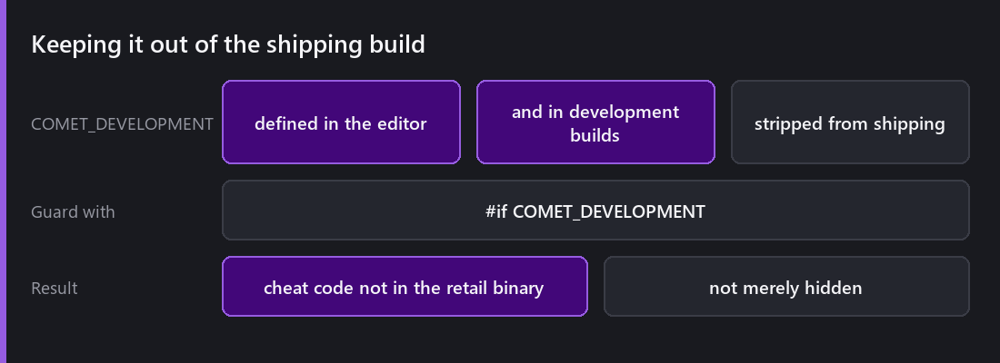

"It only happens in the build" is the worst sentence in game development.

Not because build-only bugs are especially hard. It is because historically, the moment you left the editor you lost every tool you had. No inspector, no profiler, no breakpoints. Just a log file and your imagination.

Development builds are the answer to that.



## What you get



Tick `Development Build` and the export carries a set of things a shipping build does not.

**Debug drawing**: colliders, navigation graphs and gizmos, rendered in the real build, on the real device.

**An on-screen stats HUD** with FPS and frame timing, toggled with `Ctrl+F3`.

**A log file** written next to the executable, so a tester can send you something useful.

**A watermark**, so you cannot ship one by accident. This is the feature I appreciate most and it is the least clever: an unmissable on-screen mark that says this is not a release build.

**The profiler and debugger servers**, listening on loopback TCP.

## The console



Press the tilde key and an in-game console drops down. Live engine logs, and built-in commands: `/help`, `/reload`, `/timescale` and others.

The part that matters is that **you can add your own**, from script, via `DevConsole::onCommand`. Register a listener, parse the command, do the thing.

This is the highest value-per-line feature in the whole list. A console command that spawns you at the boss is worth an hour of walking to the boss, every time you test the boss. `/give`, `/teleport`, `/killall`, `/setflag`. Half an hour of work that pays back for the rest of the project.

The trap worth naming: it is easy to write commands that put the game into states it could never reach legitimately, then spend an afternoon debugging a "bug" that only your console can produce.

## Attaching the editor

This is the part that changes what is possible.

The [profiler]() and the [AngelScript debugger]() both attach to a running development build over loopback TCP. Not the game inside the editor, but the exported binary, running as its own process, on the target machine.

You get live CPU timeline streaming, and breakpoints, stepping and variable inspection **in a shipped binary**. On [Android]() you attach across the network to the phone, which is the only way to get honest numbers from real hardware.

That turns "it only happens in the build" from a dead end into a normal debugging session.

## COMET_DEVELOPMENT



`COMET_DEVELOPMENT` is defined in the editor and in development builds, and **stripped from shipping builds**.

```
#if COMET_DEVELOPMENT
    // console commands, cheats, debug overlays
#endif
```

The word to notice is *stripped*, not hidden. Code inside that guard is not in the shipping binary at all, so it cannot be found by a determined player, because it is not there. That is a meaningfully different guarantee from a disabled flag, and it is the right way to ship debug affordances.

## The cost

A development build is slower and larger. Instrumentation is not free, the servers are running, and the debug drawing has to build its geometry.

So do not benchmark against one. If you want to know whether your game hits 60 fps, that is a shipping build question. A development build tells you *where the time goes*, which is a different and equally important question. You just have to know which one you are asking.

## Automating it

Worth mentioning here because it belongs to the same workflow: `--export <platform>` builds a project from the command line. It forces headless mode, switches the target platform, reimports what it needs, logs progress and exits.

That is what makes nightly builds possible, and combined with [the headless test gates]() it means a machine can build and validate the engine without anyone watching, which is next week.

---

Next Wednesday, the part nobody blogs about: how the engine assembles itself. SCons, modules that wire themselves in without a central file, dropping subsystems from a build, and testing an engine that has no unit test framework.

*Comments and questions welcome ;)*
