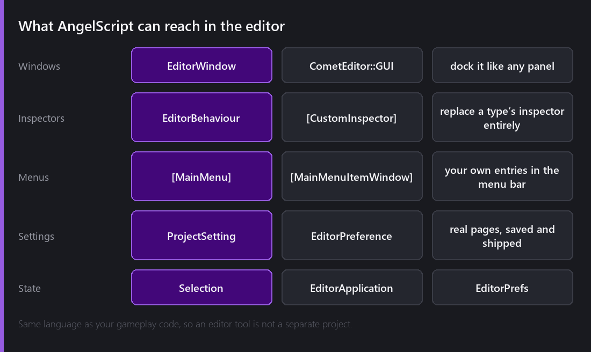
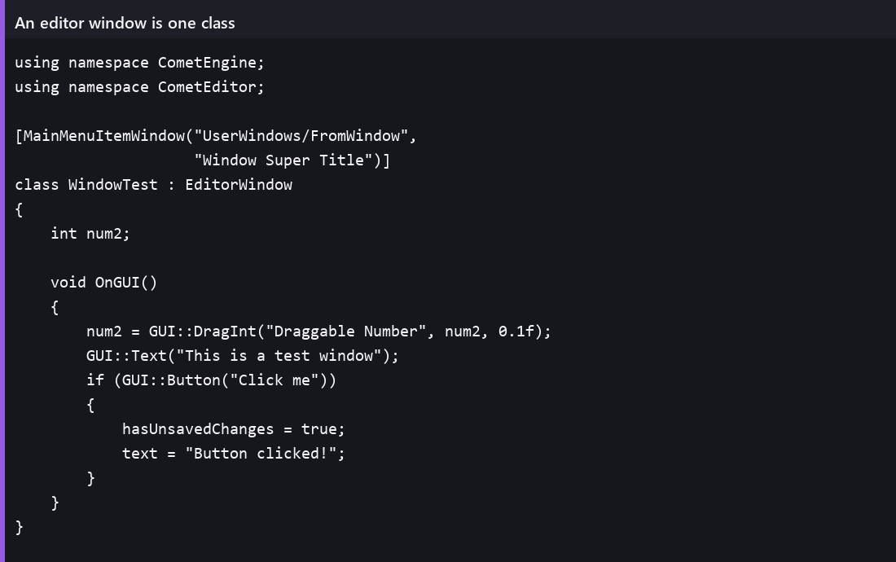
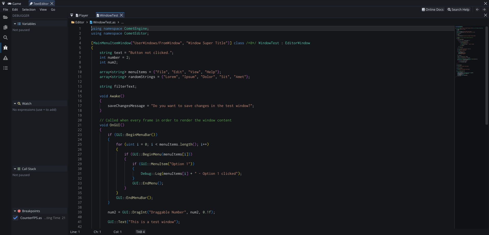
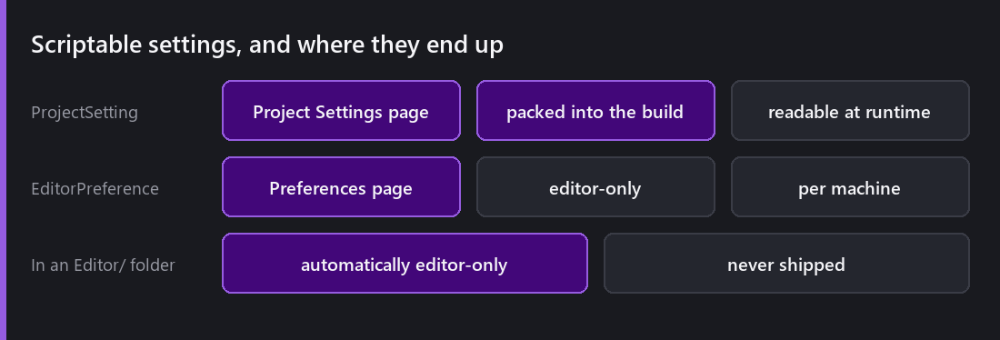
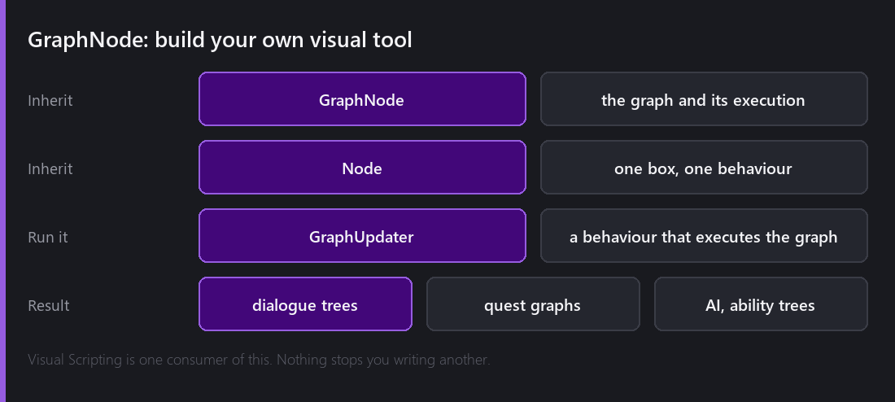

Every engine eventually hits the same wall: the person using it needs a tool the person who wrote it did not think of.

Comet's answer is that the editor is scriptable in **the same language as your game**. Not a plugin API, not a separate SDK — AngelScript, in your project, alongside your gameplay code.

## A window in about thirty lines

Inherit from `EditorWindow`, implement its draw callback, and use the `CometEditor::GUI` API — buttons, fields, trees, tables, tab bars, the lot. Add `[MainMenuItemWindow]` and it appears in the menu bar. It docks like any built-in panel, because as far as the editor is concerned it *is* one.

That is the Code workspace, and it is worth pointing at the attribute on the class: `[MainMenuItemWindow]` is the whole registration. There is no manifest, no install step and no restart — save the file, and the entry is in the menu bar.

The `GUI` namespace has grown a lot in the last few releases: `Selectable` with a custom size, tooltips with flags, `SeparatorText`, clipboard access, `CalcTextSize`, `SetNextItemFullWidth`, and a `ListClipper` for when your window lists ten thousand things and you would rather it did not draw all of them.

## Replacing an inspector

`[CustomInspector]` on a class deriving from `EditorBehaviour` takes over the inspector for a type completely. You draw whatever you want.

This is the escape hatch for the one real limitation of [attribute-driven inspectors](): attributes describe *fields*, and sometimes what you need is not a field, it is a picture. A curve editor. A grid of buttons. A preview of the thing the data describes.

The rule I hold myself to: reach for attributes first, and only write a custom inspector when the default arrangement is actively misleading. A custom inspector is code that has to be maintained forever, and a `[TreeNode]` is not.

## Settings pages that ship

2.8 added something I use constantly. Inherit from `ProjectSetting` and you get a real page in Project Settings — and **that data is packed into the game build**, readable at runtime.

That closes a gap that used to be filled with a hand-rolled config asset in every project. Difficulty curves, feature flags, the URL your game talks to: they belong in Project Settings, they should be editable by someone who is not you, and they should ship.

`EditorPreference` is the same idea for editor-only, per-machine settings, and putting either in an `Editor/` folder makes it editor-only automatically — it never reaches a build.

Underneath both there is `EditorPrefs`, a plain key/value store with a **global** scope shared across every project on the machine and a **local** scope stored in the project. Global for "how I like my tools", local for "how this project is set up".

## Driving the editor from script

Two namespaces make editor scripts able to *act* rather than just draw.

`CometEditor::Selection` reads and writes what is selected — scene entities and Project panel resources — and exposes a change event so a tool can react to what you are looking at.

`CometEditor::EditorApplication` controls play mode: enter, exit, pause, step, plus events for entering and leaving. That is what lets a tool run a scene, sample something, and stop.

Together they are how you write "select every enemy with no patrol path", or "step one frame and dump the physics state".

## Build your own visual tool

This is the part people miss, and it is the most powerful thing in this post.

Comet's node-graph editing is not hard-wired to [Visual Scripting](). Underneath there is a generic **GraphNode** system: inherit `GraphNode` for the graph and its execution, inherit `Node` for each kind of box, and attach a `GraphUpdater` behaviour to run it.

Visual Scripting is one consumer of that system. Nothing stops you writing another.

Dialogue trees are the obvious one — a `Line` node, a `Choice` node, a `SetFlag` node, and now your writer edits conversations in a graph instead of a spreadsheet. Quest chains, ability trees, boss phase machines, procedural generation rules: the same shape.

The reason this matters more than "we added a graph editor" is that the tool is *yours*. It speaks in your game's nouns, not the engine's, and 2.2 added variables with proper inputs and outputs to `GraphNode` so those graphs can pass data around rather than just sequencing.

## Where this leads

The MCP server, which gets [its own post in July](), is built on the same principle from the other direction: the editor's operations are exposed as a tool layer that is deliberately independent of who is calling. An AI assistant, an external client and an in-editor panel all drive the same commands.

Editor scripting is that idea applied to the person using the engine. The tools you build are not second-class citizens; they are made of the same parts the built-in ones are.

---

Next Wednesday: the escape hatch below scripting entirely. Loading a real `.dll`, `.so` or `.dylib` from AngelScript, a portable FFI across x86-64 and arm64, and how the build knows which binaries to ship.

*Comments and questions welcome ;)*
