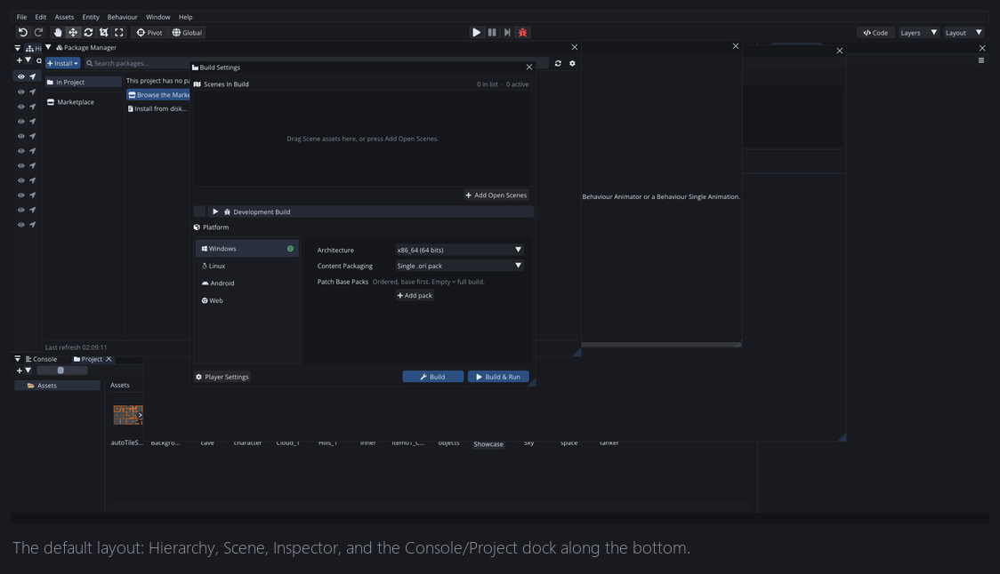
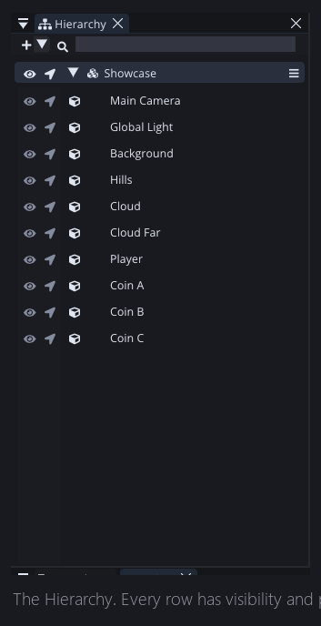
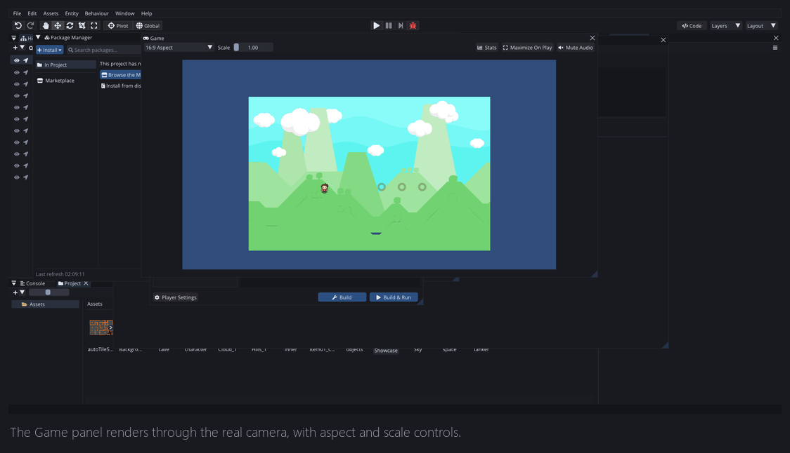
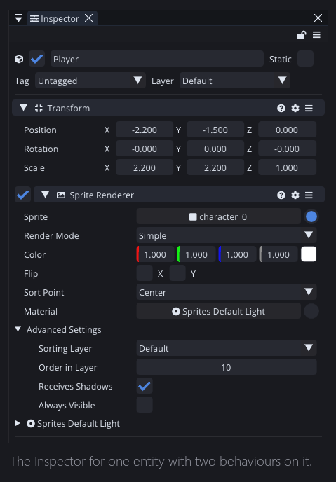
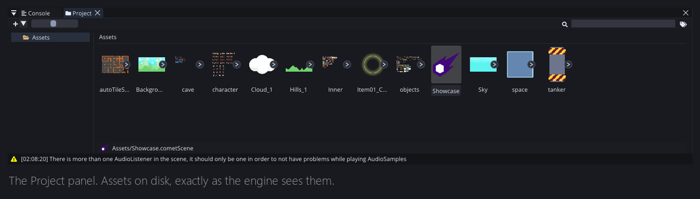
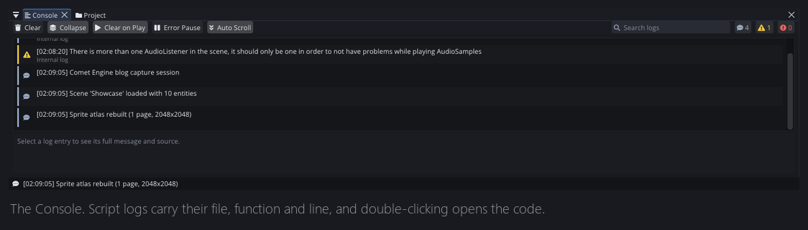

If you have never opened Comet, this is the post that fixes that. No code today — just a walk around the room, pointing at things.

Here is the whole editor, in its default layout, with a small scene open.

Everything in Comet is a **panel**. Panels dock to each other, tear off, resize, and remember where you left them. The default arrangement above is four regions: the hierarchy on the left, the viewport in the middle, the inspector on the right, and a shared dock along the bottom holding the console and the project browser.

That is not an original layout. It is the one most 2D and 3D editors converged on, and I did not try to be clever about it, because an editor is a tool you use for eight hours and novelty wears off in about twenty minutes.

## The Hierarchy

Everything in the open scene, as a tree. Parent an entity to another by dragging it. Rename with a double-click.

The two small icons on the left of every row are the ones people miss, and they are the ones I use most. The **eye** hides an entity in the scene view without disabling it — purely a viewing decision, it does not change what the game does. The **arrow** locks an entity against being picked in the viewport, which sounds like nothing until you have tried to select a small object sitting on top of a full-screen background sprite for the fifth time.

At the top there is a filter box, and the `+` creates entities: empty ones, or ready-made ones like a camera, a light, or a UI element. Right-clicking a UI element there will find the nearest canvas, or make one if there is not one, and put the element inside it. Small thing. Saves a step every single time.

## The Scene and the Game

The middle is two tabs over the same space.

**Scene** is the editable view. Grid, gizmos, the red rectangle showing what the active camera can see, and the manipulation tools in the top-left of the toolbar — pan, move, rotate, scale, rect. The `Pivot`/`Global` toggles next to them decide whether a gizmo works in the object's own space or the world's.

**Game** is what the player would see, rendered through the real camera.

It has an aspect ratio selector, a zoom scale, a `Stats` toggle that overlays live rendering statistics, `Maximize On Play`, and a mute. The aspect list is editable — if you are targeting a specific device resolution you add it once and it stays.

## The Inspector

Select something, and this is where you edit it. An entity's name, its enabled checkbox, its tag and layer, and then one collapsible block per behaviour attached to it.

Two details worth knowing. The **padlock** at the top pins the inspector to whatever is currently selected, so you can go click other things without losing it — essential when you are dragging a reference from one object into another's field. And you can open a **second** inspector; they are independent, so you can pin one and browse with the other.

Numeric fields are draggable. Grab the label and pull sideways to scrub the value. In 2.8 that drag became unbounded — the cursor hides and locks in place, so you can keep dragging past the edge of the screen and it comes back where it started when you let go. That is a stupid amount of engineering for something nobody will consciously notice, and I would do it again.

## The Project panel

Your `Assets/` folder, as the engine understands it. Folder tree on the left, contents on the right, filter and tag search along the top.

The important idea here is that this is not a file browser. Every asset the editor knows about has an identity that survives being renamed or moved *inside the editor*. Move a texture in the Project panel and every material still points at it. Move the same file in Windows Explorer while the editor is closed, and you find out what a broken reference looks like. There is a whole post about why later in the year.

## The Console

Logs, with counts per severity, a collapse button that folds repeated messages, and a filter.

The part that matters is what a *script* log carries. When AngelScript code logs something, the entry knows the script path, the function name and the line number — and double-clicking it opens that file at that line in the built-in code editor. Error messages became a navigation tool rather than something to read and then go hunting for.

## The rest of the room

There is a lot more than fits in one post. The **Profiler** with CPU and GPU flame graphs. The **Package Manager** and its marketplace. The **Build** panel. The **Animator** and **Animation Timeline**. The **Tile Palette**. The **Audio Mixer**. The **Sprite Editor**. The **Shader Graph**. A full **code editor**, inside the engine, with autocomplete and a debugger.

Each of those has its own Wednesday coming.

## Two things about how it looks

**It is immediate-mode.** The whole interface is built on Dear ImGui, which means it is rebuilt from scratch every frame. That has one enormous advantage — adding a field to an inspector is one line, so there is almost no friction to exposing something — and some real costs around layout and animation. That trade-off is a whole post in itself.

**Panels are real OS windows.** Drag a panel out of the main window and it becomes an actual window you can throw onto a second monitor. The code editor in particular has a preference to always live in its own window, which is how I use it.

Finally, `Layout` in the top right saves and restores arrangements. Make one that suits what you are doing — a cramped one for scripting, a wide one for level building — and switch between them. Preferences and keyboard shortcuts are both fully customisable, and both persist per machine.

---

Next Wednesday we stop looking at the furniture and start on the actual object model: what an Entity is, what a Behaviour is, why Comet chose composition, and the order things happen in when the game starts.

*Comments and questions welcome ;)*
