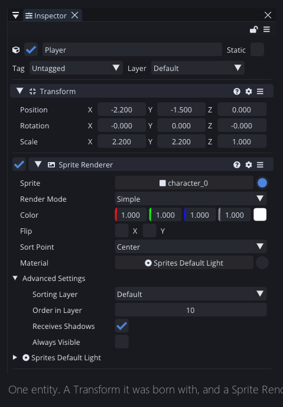
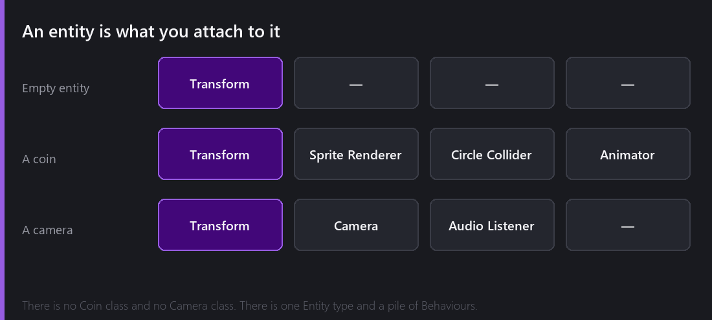
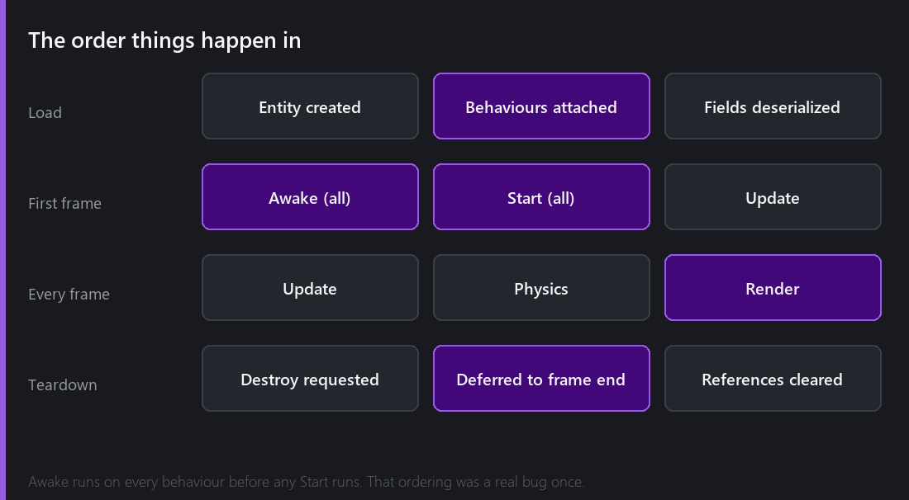

Every engine has to answer the same question: what is a *thing* in your game, and how does it get its behaviour?

Comet's answer is two words, and the rest of this post is what they mean.

An **Entity** is a thing in the world. A **Behaviour** is something it can do.

## The empty entity

Make a new entity and it arrives with exactly one behaviour already attached: a **Transform**. Position, rotation, scale. You cannot remove it, because "a thing in the world" without a place in the world is not a useful concept.

That is all an entity is. A name, an enabled flag, a tag, a layer, an identity, and a list of behaviours. It has no idea whether it is a player, a bullet or a cloud.

Everything the entity above can do comes from the second block: I added a **Sprite Renderer**, and now it draws. Remove it and the entity still exists, still has a position, still has children — it just stops being visible.

## Why composition, and what it costs

The alternative is inheritance: a `GameEntity` base class, then `MovingEntity`, then `Enemy`, then `FlyingEnemy`. It works right up until you need a flying enemy that is also destructible and also a light source, at which point your inheritance tree needs to be a graph and everything gets unpleasant.

Composition sidesteps that. A flying destructible light is an entity with four behaviours on it.

There is no `Coin` class in Comet. A coin is an entity with a Transform, a Sprite Renderer, a Circle Collider set to trigger, and a script that says what happens when something walks into it. If you decide coins should also glow, you add a light behaviour, and nothing about the coin's "type" had to change — because it never had one.

The honest cost of this approach is discoverability. With inheritance, you read a class name and know roughly what something is. With composition, you have to look at the list. In practice the Hierarchy plus the Inspector *is* that documentation, which is part of why the Inspector matters so much.

The other cost is that behaviours have to find each other, and "find the Rigid Body on my own entity" is a lookup rather than a field access. That is real, and it is why Comet caches those lookups aggressively.

## Identity, and why it is a real question

Here is something that sounds like an implementation detail and is not.

Every object in Comet — every entity, every behaviour, every resource — has a **unique 64-bit ID**. Not a pointer, not an index into an array, not a name. An ID that is allocated once and never reused.

That ID is what makes almost everything else in the engine work. It survives saving and loading, so a scene can say "the camera field of this script points at object 8173077113600595134" and mean it after a restart. It survives duplication correctly, because a copy gets a new one. It is how references between entities in different scenes resolve. It is how the undo system knows what to put back.

The reason this deserves attention: it means "is this thing still there?" is a genuine question with a non-obvious answer, and Comet gives you three functions for it — `IsValid()`, `IsNull()` and `Is()`. You use those instead of `== null` or `is`, because during teardown a plain null check can lie to you. An object can be destroyed but not yet gone, and a raw comparison does not know the difference.

That surprises people, so it gets its own post later in the year.

## Parents and children

Entities form a tree. Parenting is a drag in the Hierarchy, and the effect is what you would expect: a child's transform is relative to its parent, so moving the parent moves everything under it.

Two things that are less obvious.

Disabling a parent disables everything under it, but it does not *change* the children's own enabled flags. Re-enable the parent and whatever was individually disabled stays disabled. The state you set by hand is never silently overwritten.

And deleting is deferred. Destroying an entity does not tear it out of memory in the middle of the frame while other behaviours might still be iterating over it — it is marked, the frame finishes cleanly, and the teardown happens at a safe point. This is the single most common source of "wait, it still exists?" confusion, and also the reason the engine is not full of crashes.

## The order things happen in

When a scene loads, entities are created, behaviours are attached, and serialized field values are restored. Nothing of yours has run yet.

Then, on the first frame: **every** `Awake` runs, across every behaviour in the scene, and only then does any `Start` run. That ordering is the guarantee that makes `Start` useful — by the time your `Start` executes, every other object has finished its own initialisation, so it is safe to go looking for them.

This was a real bug, incidentally. Until 2.3 there were situations where some `Start` methods ran before other behaviours' `Awake`, which produced exactly the class of intermittent, ordering-dependent failure that eats an evening. It is in the changelog under "Inconsistent execution order", which is a very calm way of describing how it felt to find.

After that it is the normal loop — `Update` for your logic, physics, then rendering — until something asks to be destroyed, and that gets deferred to a safe point.

## Behaviours you did not write

Most of what makes a game is behaviours that ship with the engine: Sprite Renderer, Camera, Rigid Body, colliders, joints, Animator, Tilemap, the whole UI set, particles, audio sources, lights, navigation agents.

Your scripts are behaviours too. A class inheriting `CometBehaviour` shows up in the Add Behaviour menu next to the built-in ones, its fields appear in the Inspector as real editable widgets, and it gets the same lifecycle callbacks. There is no second-class citizenship for user code, and that was deliberate — if scripting feels bolted on, people write less of it.

---

Next Wednesday: what happens when you want a hundred of the same entity and the ability to change all hundred at once. That is the **InstanciableEntity** system, and it is the part of Comet I have rewritten the most times.

*Comments and questions welcome ;)*
