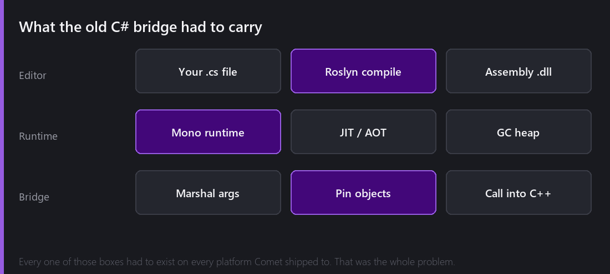
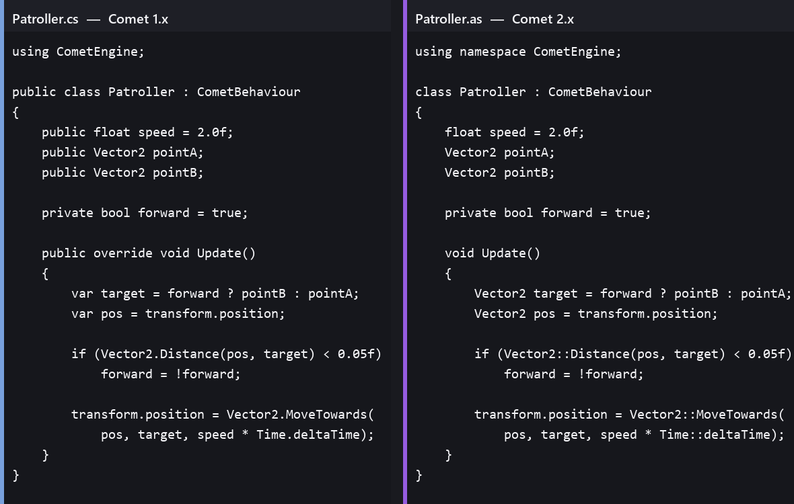
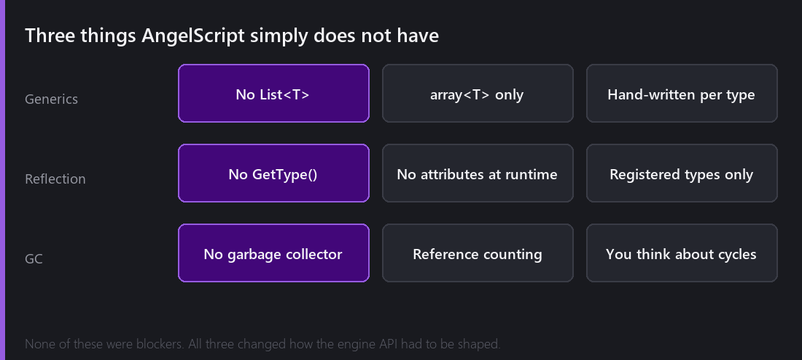

In May 2025 I wrote a post about picking a new scripting language. I tried Lua, I tried ChaiScript, I ended up with AngelScript, and I closed that post with a confident estimate: about six months to convert 300 C# files.

The conversion took closer to nine. The file count was never the hard part though, and I want to be honest about what was.

## Why I did this at all

Comet used C# through Mono. If you have never had to ship a Mono runtime to four platforms, this is the shape of the problem.

The editor compiled your scripts with Roslyn into a real .NET assembly. At runtime, Comet embedded the Mono runtime, loaded that assembly, and every single call between your script and the engine went across a bridge: marshal the arguments, pin the managed objects so the garbage collector could not move them mid call, call into C++, unpin, marshal the result back.

On Windows and Linux this worked fine. I shipped 1.0 with it and it was really pleasant to write games in.

Then I tried to export to the web.

Mono can technically target WebAssembly. Getting it to do that inside an engine that also wants SDL3, OpenGL ES and Emscripten's own threading model, at a binary size that a browser will actually download, turned out to be a project roughly the size of the engine itself. Android was less bad and still bad. I spent a long time on both of them before I admitted that the problem was not my build configuration. The problem was that I had chosen a scripting language that brings its own runtime, and I needed one that compiles into mine.

So the reason for all of this was **portability**, not performance and not language taste.

## What a Comet script looks like

Here is the same Behaviour, before and after. It is a real one, a patrolling enemy that walks between two points.

If your reaction is "those are nearly the same file", good. That is exactly the bet I made when I chose AngelScript over Lua. Lua would have been easier to embed and it would have forced me to redesign the whole scripting API around tables and closures. AngelScript is statically typed, class based, compiles to bytecode, and looks enough like C# that most of my engine's API surface could survive the move.

The mechanical differences you can see:

- `using CometEngine` becomes `using namespace CometEngine`
- Static access uses `::` instead of `.`, so `Time::deltaTime` and `Vector2::Distance`
- No `public` on members. In AngelScript everything is public by default and you write `private` when you mean it
- No `override`. Engine callbacks like `Start` and `Update` are found by name, not by virtual dispatch
- `var` is gone. Types are written out

For maybe 70% of the 300 files that was the whole change. I wrote a script that did the obvious substitutions, ran it over everything, and then went through the results by hand.

## The other 30%

This is where the months went.

**Generics.** AngelScript has `array<T>`, and that is essentially it. There is no `List<T>`, no `Dictionary<TKey, TValue>` in the general case, and no way to write your own generic container. Every place where the C# API had exposed a generic helper, I had to either pick a concrete type or register a new template type from C++ by hand. This is the single biggest reason the port took longer than I estimated. It is also why 2.8 added `list<T>`, `stack<T>`, `queue<T>` and `set<T>`, because I kept hitting the same wall while porting.

**Reflection.** The C# editor integration leaned on reflection constantly. Draw an inspector for an arbitrary class? Walk its fields. Find every class inheriting `CometBehaviour`? Ask the assembly. Read an attribute to decide how a field should be drawn? Reflection again.

AngelScript has type information, but it is type information that somebody registered. The engine knows about a type because something told it, not because it can interrogate the language at runtime. Rebuilding the inspector on top of that meant the script compiler now has to hand the editor a description of every user class it compiled. That subsystem did not exist at all in the C# version. It is now one of the parts of Comet I am most happy with, and it only exists because reflection was taken away from me.

**Garbage collection.** C# scripts could allocate freely and then forget about it. AngelScript reference counts, and reference counting means cycles leak. An Entity holding a script that holds a reference back to the Entity is not a hypothetical, it is the most natural thing a gameplay programmer writes. Comet's object model already used reference counting on the C++ side, so the two systems had to be taught about each other properly rather than approximately.

That work is also the reason `IsValid()`, `IsNull()` and `Is()` exist as global functions instead of you just writing `== null`. A plain null check really does lie in some situations during teardown. I will write a whole post about that later in the year.

## The day it compiled

The part I remember most clearly is not finishing, it is the console.

For about five months the script console was a wall of red. Not a few errors but hundreds of them, because a missing type near the bottom of the dependency graph fails every file above it. You fix one thing and the count goes up, because now the compiler can get far enough into a file to find the next problem. There is no partial credit and no way to test anything, because nothing runs until all of it compiles.

Then one evening in February 2026 I fixed what I assumed was another one of the several hundred errors that were left, and the console printed nothing.

I really thought it had crashed.

It had not. It had compiled. Then of course nothing worked, the game booted and every script did the wrong thing, which is a completely different and much more enjoyable kind of problem, because at that point you can actually run something and look at it.

---

That is the cost side. Next Wednesday is the other half, what I got in exchange. One binary instead of a runtime, type safety that caught things I did not expect, compile times that changed how I work, and the thing that started all of this, a Comet game running in a browser tab and on a phone.

*Part 2 is next Wednesday. Comments and questions welcome ;)*
