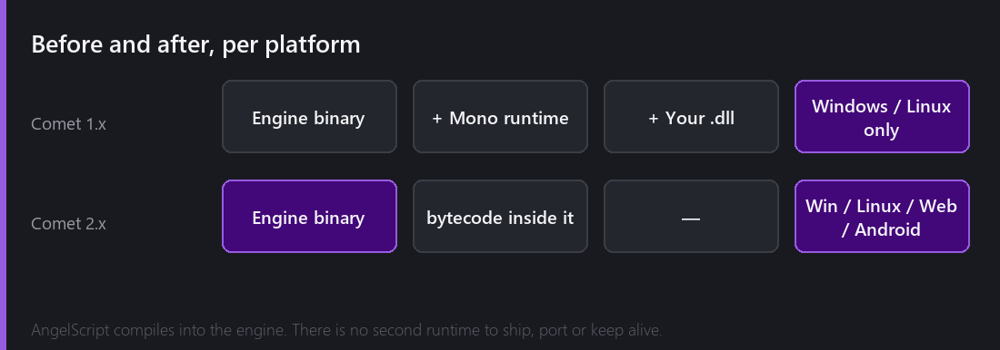
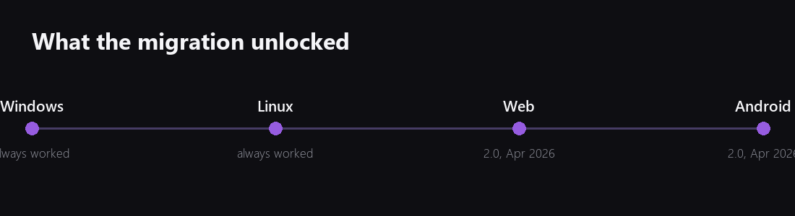
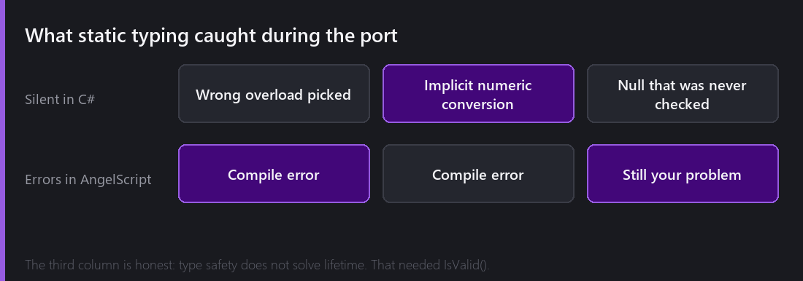

[Last Wednesday]() was the bill. Nine months, 300 files, no generics, no reflection, no garbage collector, and five months of a console that was nothing but red.

This is the part where I explain why I would do it again.

## One binary

This is the whole thing, really. Everything else in this post is a consequence of it.

With Mono, a Comet game was three things that had to agree with each other: the engine, the Mono runtime, and your compiled assembly. Shipping to a platform meant getting all three onto it, in versions that were compatible, at a size that was acceptable.

With AngelScript there is no second runtime. The compiler and the virtual machine are a C++ library that builds as part of the engine, the same way Box2D or SoLoud does. Your scripts compile to bytecode that lives inside the project. When Comet builds for Android, the scripting system is simply *already there*, because it was compiled into the engine binary along with everything else.

The practical consequence is that adding a platform stopped being a scripting problem. Web and Android landed in 2.0 — the same release that removed C# — and that is not a coincidence, it is cause and effect.

## Compile times, and how they changed my evenings

I did not expect this one to matter as much as it does.

Compiling the C# layer meant invoking Roslyn, producing an assembly, and reloading it. It was not slow in absolute terms — a few seconds — but a few seconds is exactly the length of time that makes you stop and check something else, and then you have lost the thread.

AngelScript compiles the whole script project in well under a second on this machine. That sounds like a minor quality-of-life detail. It is not. It changed the way I write gameplay code, because the loop is now short enough that "just try it" beats "reason about it". I make more small changes and fewer big ones.

## What the compiler started catching

C# is statically typed too, so I was not expecting a difference here. There was one anyway, and it comes from AngelScript being stricter about the things C# is relaxed about.

Implicit numeric conversion is the big one. C# will quietly widen an `int` to a `float` and let you carry on. AngelScript is far less willing, and while porting I found a genuine bug in the animation system that had been sitting there for over a year: a frame index doing integer division where it should have been float, producing a value that was correct for most frame counts and subtly wrong for others. It had shipped. Nobody had reported it, because it looked like an animation being slightly off rather than a number being wrong.

The honest limit, and I want to be clear about it: **type safety does not solve object lifetime.** A reference to a destroyed entity is still type-correct. That problem needed its own answer, which is why Comet has `IsValid()` rather than letting you write `!= null` — a plain null check genuinely returns the wrong answer in some teardown situations. There is a whole post about object lifetime later in the year.

## What I actually miss

Three things, and I would take the trade again knowing all three.

**LINQ.** Not the clever parts — just `.Where()` and `.Select()` on a collection. I write more loops now than I used to.

**Real generics.** Covered last week. `array<T>` plus hand-registered container types is a workable answer, and 2.8 filling in `list`, `stack`, `queue` and `set` closed most of the gap, but "I need a generic helper" is still a conversation with the engine rather than something I just write.

**The tooling ecosystem.** When you write C#, an enormous amount of editor intelligence comes for free from tools other people built. With AngelScript, if I want autocomplete that understands my project, find-all-references, rename-symbol, or a debugger, **I have to write it.**

So I did. That turned out to be one of the better things to come out of this whole migration, and it gets two posts of its own in January.

## Was it worth it?

Here is the clean version of the answer.

The migration cost about nine months of evenings and broke every existing project. In exchange, Comet gained two platforms it could not otherwise have had, a script compile loop fast enough to change how I work, a type system strict enough to find a shipped bug, and a scripting layer with no external runtime to keep alive for the rest of the engine's life.

The thing I did not appreciate in May 2025 is that the last one is the real prize. Mono was not just a portability problem, it was a *permanent* portability problem — every new platform, every runtime update, forever. Removing it did not just unlock web and Android. It removed an entire category of future work.

---

Next Wednesday, something much lighter and a lot more visual: a proper tour of the editor. What every panel is for, why the layout is shaped the way it is, and a few small touches that took far longer to build than they look.

*Comments and questions welcome ;)*
