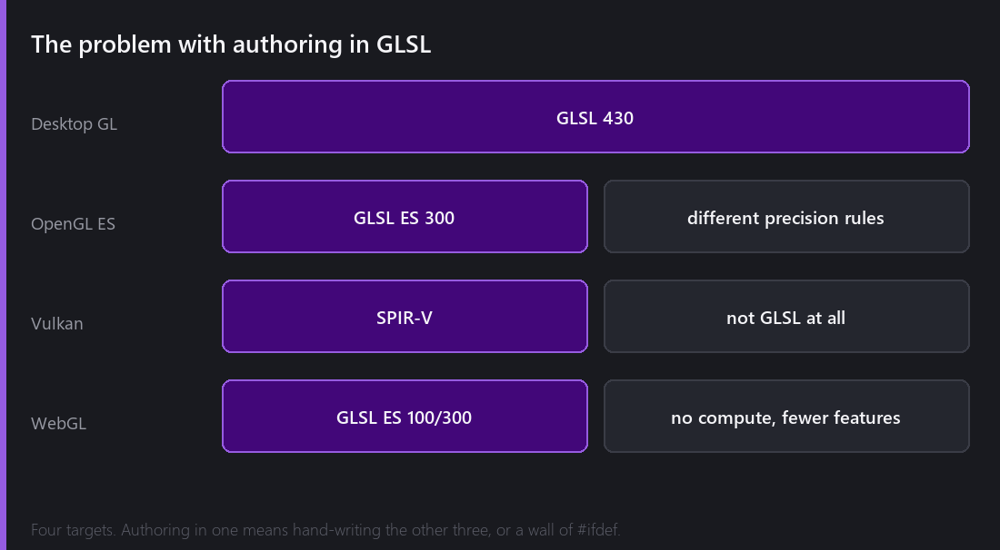
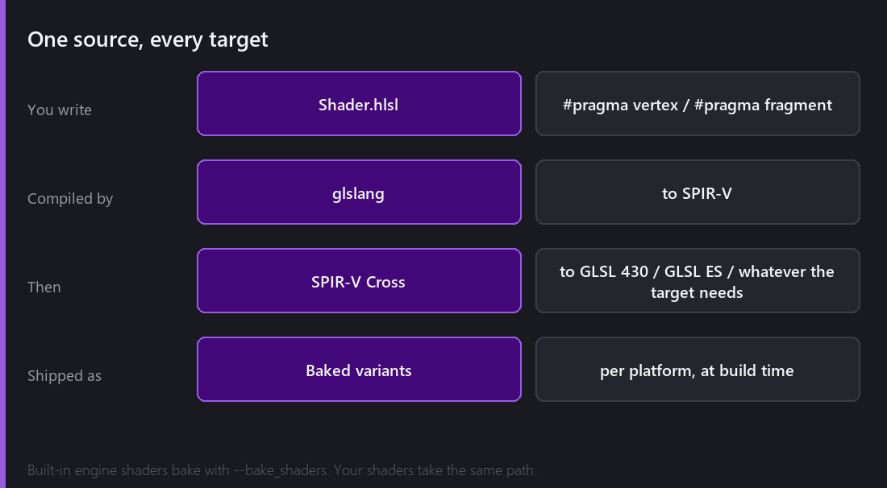
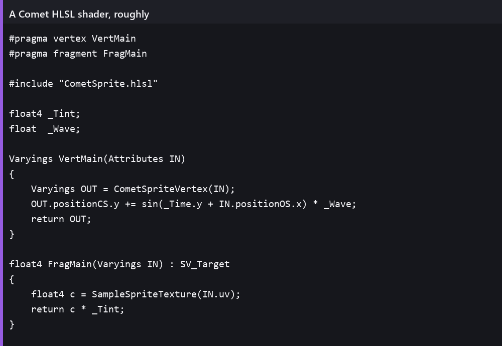

There is a line in the 2.8 changelog that I suspect cost some people an evening:

> **GLSL Deprecation:** Replaced the GLSL shader authoring workflow entirely with the HLSL pipeline. Existing GLSL shaders must be rewritten in HLSL.

No deprecation period. No compatibility shim. Every custom shader in every project had to be rewritten.

I want to explain why that was the right call, because "we changed shader languages" sounds like taste and it was not.

## The problem

Comet targets Windows, Linux, Android and the web, and it renders through [either OpenGL or Vulkan](). Add those up and you get this:

Desktop OpenGL wants GLSL 430. OpenGL ES on Android wants GLSL ES 300, with different precision rules and a smaller feature set. Vulkan does not want GLSL at all — it wants SPIR-V, a binary intermediate format. WebGL wants GLSL ES too, but an older dialect with fewer capabilities again.

So if you author in GLSL, which GLSL?

The honest answer under the old system was: desktop GLSL, plus a growing pile of `#ifdef` for the platforms where that was not true, plus a set of hand-maintained variants for the ones where the differences were too large to patch over. Every new shader feature meant checking it against four targets. Every platform bug meant working out which of the four variants had drifted.

That is not a language problem. It is an *authoring source of truth* problem, and it gets worse with every platform you add.

## The fix

Pick one language nobody's runtime speaks natively, and compile it to all of them.

You write HLSL. **glslang** compiles it to SPIR-V. Vulkan takes the SPIR-V directly. For the OpenGL family, **SPIR-V Cross** translates it into whatever flavour of GLSL that target needs.

One source file. Four outputs. Generated at build time, not at runtime, so the player's machine never compiles anything.

## Why HLSL specifically

Three reasons, none of them "HLSL is a nicer language".

**The toolchain exists and is excellent.** glslang and SPIR-V Cross are mature, widely used, and maintained by people who care a great deal about correctness. Going HLSL → SPIR-V → GLSL is a well-trodden path. Going GLSL → SPIR-V → other-GLSL is possible but far less common, and you hit rough edges nobody else has hit.

**It is the industry default for this job.** Anyone who has written shaders for a modern engine has written something HLSL-shaped. That is a real advantage for a small engine — I do not have to teach the language, only the specifics.

**Explicit is better here.** HLSL's explicit semantics and register bindings map onto Vulkan's descriptor model much more directly than GLSL's implicit conventions do. Less guessing in the middle of the pipeline.

## What a shader looks like now

`#pragma vertex` and `#pragma fragment` name your entry points. Both stages are fully yours — this was a real gain over the old system, where vertex-stage customisation was limited and vertex animation meant working around the engine rather than with it.

You include a Comet header that provides the standard structures and helpers, declare your parameters as plain globals, and write two functions. Parameters declared at the top surface automatically as material properties, so they appear in the material inspector and are settable from AngelScript via `Material.SetFloat` and friends.

There are template shaders under `Create → Shader` for the common starting points, including a post-process one, which is [three weeks from now]().

## Was the hard break necessary?

I have thought about this a lot, and I think yes — though not comfortably.

The alternative was supporting both: keep GLSL authoring working, add HLSL alongside, deprecate GLSL over a few releases. That is friendlier. It is also two shader front-ends, two sets of bugs, two sets of platform quirks, and every new feature has to be built twice or explicitly marked HLSL-only. For a one-person engine, that is not a transition period, it is a permanent tax.

The mitigating facts, honestly stated: Comet 2.x was a few months old, the number of projects with custom GLSL shaders was small, and 2.0 had already broken everything anyway by [removing C#](). If there was ever a moment to do it, it was that one.

If Comet had a large user base with years of shaders, I do not think I would have had the right to make that call.

## The part that makes this mostly not matter

Here is the thing that made the decision much easier: **most people will never write one.**

2.8 shipped HLSL authoring and the **Shader Graph** in the same release, and that was not a coincidence. If you can build a dissolve, a hologram or a water surface by wiring nodes together with a live preview, the number of times you need to open a text file and write shader code drops enormously.

The graph compiles down the same pipeline. It is not a slower path or a limited subset — it produces the same kind of output the HLSL front-end does.

So the honest framing of 2.8's shader story is: writing shaders got harder for the small number of people who write them by hand, and got dramatically easier for everyone else.

---

Next Wednesday, that Shader Graph. The canvas, the node palette, the live preview, and a dissolve effect built from nothing, one node at a time.

*Comments and questions welcome ;)*
