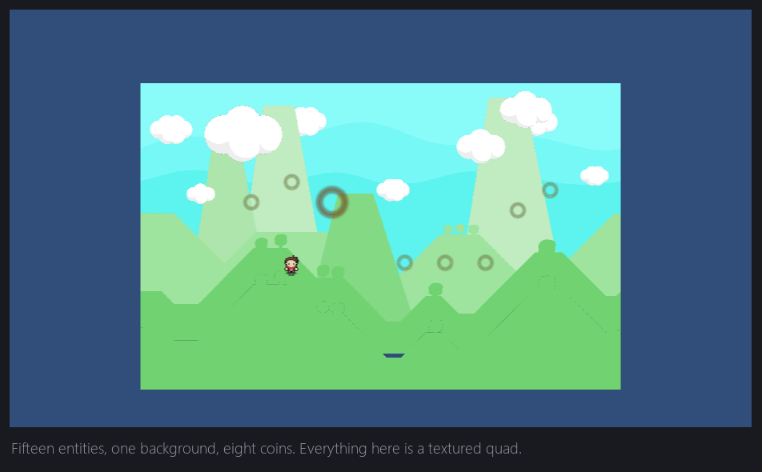
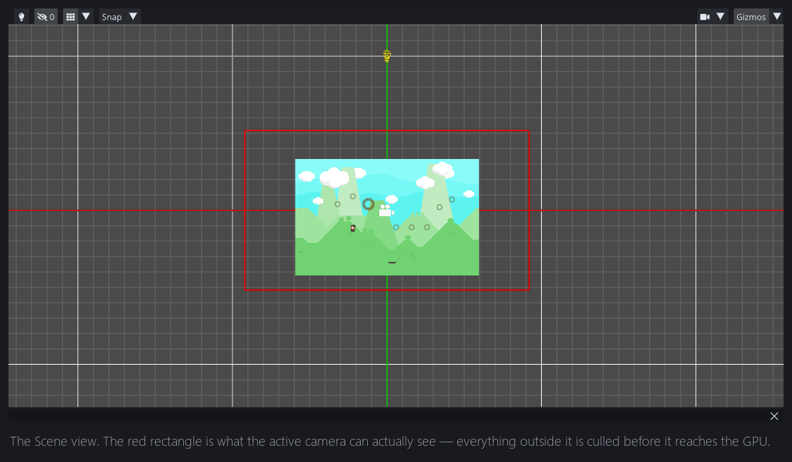
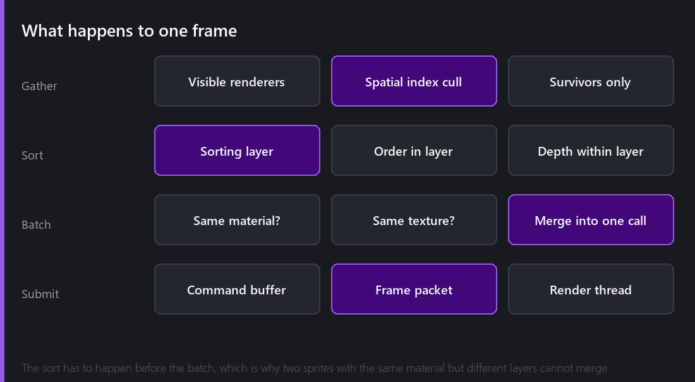
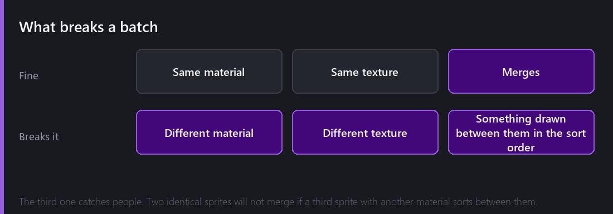

Everything in a 2D scene is a textured rectangle. Every sprite, every tile, every letter of text, every particle. That sounds like it should make rendering easy, and in a sense it does — the hard part is not *how* to draw a rectangle, it is how to avoid asking the GPU four thousand separate times.

This post follows one frame from "here is a scene" to "here are the pixels".

## Step one: stop drawing things nobody can see

That red rectangle in the Scene view is what the active camera can actually see. Everything outside it is thrown away before it reaches the GPU at all.

Comet keeps a **spatial index** of renderers — a structure that can answer "what overlaps this rectangle?" without testing every object in the scene. On a small scene this is irrelevant. On a level with fifteen thousand tiles and a camera showing two hundred of them, it is the difference between a game and a slideshow.

The important property is that culling cost scales with what is *visible*, not with what *exists*. That is why a big Comet level does not get slower as you add more level further away.

There is a matching bug worth mentioning because it shows what happens when the index goes stale: until 2.8, tiles you painted in the editor could vanish once their tilemap stopped being the active paint target. The tiles were there; the culling tree had not been rebuilt after the stroke, so the renderer sincerely believed there was nothing to draw.

## Step two: decide the order

2D rendering is fundamentally about order. There is no depth buffer sorting this out for you — what is drawn last is on top.

Comet uses a three-level system:

1. **Sorting layer** — a named, project-wide list you define in order. `Background`, `Terrain`, `Characters`, `Effects`, `UI`. This is the coarse control and it is the one you should be using.
2. **Order in layer** — an integer within a layer, for "this specific thing goes in front of that specific thing".
3. **Depth** — position along Z, resolving anything still tied.

The reason to reach for sorting layers rather than nudging Z values is that layers are *named intent*. Six months later, `Characters` still means something. `z = -0.03` does not.

## Step three: batch

Now the interesting bit. Comet walks the sorted list and merges consecutive renderers that can share a draw call into one — one vertex buffer, one texture bind, one submission.

Fifty coins with the same sprite become **one** draw call. A tilemap of two thousand tiles from one tileset becomes a handful. This is where a 2D renderer wins or loses.

Three things break the merge:

- **A different material.** Different shader or different parameters means a different GPU state.
- **A different texture.** Which is exactly what sprite atlases exist to fix — pack twenty sprites onto one page and they can all batch together. That gets its own post in March.
- **Something drawn between them in the sort order.** This one catches everyone. Two sprites using the same material will *not* merge if a third sprite with a different material sorts between them, because merging would move it behind or in front of something it should not be.

That last rule is why the practical advice is "keep things that look alike in the same sorting layer". You are not just organising, you are giving the batcher a chance.

## Step four: hand it over

The batched result becomes a **command buffer** — a backend-agnostic list of "bind this, set that, draw this many". Nothing in it mentions OpenGL or Vulkan.

That buffer is packed into a **frame packet** and handed to the render thread, which translates it into actual API calls while the game thread has already moved on to the next frame. On every platform except the web — which has no threads at all — those two things are genuinely running at the same time.

That is next week's post in its entirety, so I will leave it there.

## Watching it happen

The Game panel has a **Stats** toggle. Turn it on and you get live rendering statistics: draw calls, batches, vertices, triangles, and the frame time.

This is the number to watch when you are optimising, and it is far more useful than frame rate, because frame rate is capped and noisy while draw calls are exact. Add an atlas and watch the count fall. Add one sprite with a different material into the middle of a batched group and watch it jump.

Some rough numbers from this project: the fifteen-entity scene above sits in single-digit draw calls. A test level with about four thousand sprites drawn from three atlases lands around twelve. A deliberately hostile version of the same level, where every sprite has its own material, gets you four thousand — and a frame time you can feel.

Same scene. Same pixels. Same GPU. The only difference is whether the renderer was allowed to group the work.

## What Comet deliberately does not do

Some honest limits.

There is no automatic atlasing at build time. If you want sprites to batch, you put them in a Sprite Atlas yourself. I have gone back and forth on this and currently think the explicit version is right — automatic packing makes the batching behaviour of your game an emergent property of an algorithm you cannot see.

There is no draw-call budget warning. Nothing tells you that you have made it worse. The Stats panel will show you, if you look.

And sorting is per-camera, per-frame, on the CPU. For the object counts a 2D game realistically has, that is comfortably the right trade. It is also why the GPU particle path, which can have a hundred thousand particles in one system, does its sorting entirely differently — it has to.

---

Next Wednesday: the same frame, drawn twice. Comet renders through an abstraction with an OpenGL backend and a Vulkan backend, picks between them at runtime, and hands the result to a render thread. Why I put Vulkan in a 2D engine, and what happens on the one platform that has no threads.

*Comments and questions welcome ;)*
