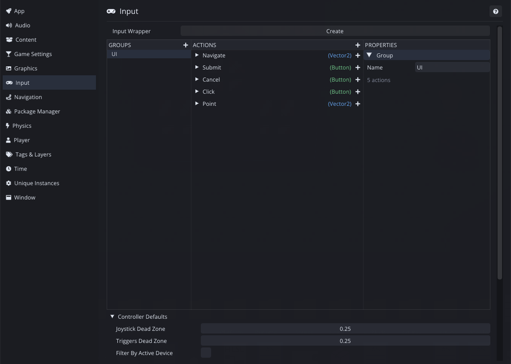

Input is one of those systems where the naive approach works perfectly, right up until your game has more than one player on more than one keyboard.

## Actions instead of keys

The naive version is `if (Input.GetKey(Key.W))`. It works. Then you add a gamepad and every check needs a second branch. Then you add rebinding and every check has to look at a settings table. Then a second control scheme, and the `if` has four arms.

Comet works with **input actions** instead. You define an action in Project Settings, something like `Move`, `Jump` or `Attack`, and you give it bindings: a key, a gamepad button, an axis, a touch region. Your code asks about the action and never about the device.

Actions live in groups. Each action has a type, so a button is a bool and a stick is a `Vector2`, and the bindings hang underneath it. The controller dead zones at the bottom are project-wide defaults, so you set them once instead of once per action.

Rebinding is then only a matter of changing data. Adding gamepad support is a matter of adding bindings. Neither of them touches gameplay code, because gameplay code never knew which device it was reading.

Actions are grouped into **input groups**, which is how you get one scheme per context. Gameplay bindings and menu bindings can be active independently.

Every action has three events: `onStarted` when it begins, `onPerformed`, and `onCancelled` when it ends. I added the first and the last in 2.0. It sounds like a small thing, but it is what makes hold and release inputs expressible without polling.

## The generated wrapper

Asking for actions by string, `Input.GetAction("Jump")`, is how most systems do it, and it has the two problems that every string API has. A typo is a runtime bug, and renaming something means searching the whole project.

Comet generates an **InputWrapper** script from your action definitions, with typed accessors. You write `Input.Jump` instead of doing a lookup. A typo is now a compile error, and renaming an action in Project Settings regenerates the wrapper, so the compiler points you at every call site.

In 2.3 I changed the generator so it asks where to save the wrapper instead of deciding for you. That matters once your project has an opinion about where generated code should live.

## Controllers

Comet reads gamepads through SDL3, which takes care of the mapping database, so I am not writing quirks for every controller.

In 1.0 I added eleven controller buttons that were missing: `MISC1`, the four paddles, `TOUCHPAD`, and `MISC2` to `MISC6`. Nobody binds a jump to a paddle, but if you want to support an Elite or a DualSense properly they have to exist.

My favourite bug in this whole system is that the left stick's Y axis was reading the right stick's Y axis. I fixed it in 1.0. It survived for a long time because the usual way to test a stick is to push it sideways.

## Touch and pinch

Mobile needs more than treating a finger like a mouse, because there can be several fingers and each one has an identity.

`GetTouchCount`, `GetTouchById` and `GetTouchByIndex` give you the active touches. The ID version is the one you want, because a touch keeps its ID for its whole lifetime while indices shuffle around as fingers lift. Tracking a drag by index breaks the moment a second finger arrives.

For events there are `onTouchStarted`, `onTouchMoved` and `onTouchEnded`, and pinch is recognised for you: `IsPinching`, `GetPinchZoom`, and started, moved and ended events. You do not have to implement two finger distance tracking yourself.

On the web, tapping a `BehaviourInputField` on a touch device raises the **native on-screen keyboard**. I added that in 2.8. Without it, a web build on a phone has text fields you cannot type into, and one missing hook makes the whole build feel broken.

## The debugger

There is an input debugger that shows live action states and the raw device input.

It answers the question you actually have, which is never "what is my code doing" but "did the input arrive at all". Seeing that the device is producing nothing, or that the action is firing and your code is ignoring it, cuts the problem in half straight away.

## What I would tell someone setting this up

Define your actions before you write movement code. Retrofitting them later is mechanical but tedious, and you will be tempted to leave it.

Use `onStarted` and `onCancelled` rather than polling for anything that is not continuous. Jump is an event and movement is a poll. If you mix them up you get missed inputs on frame rate spikes, because a button that is pressed and released inside one long frame never registers as down.

Test with the device unplugged. Half of the input bugs are about what happens when a controller disconnects in the middle of the game, and nobody goes looking for them on purpose.

---

Next Wednesday we start on the content pipeline. It is the least glamorous system in the engine and quietly one of the most important. Every asset becomes addressable, soft references let a script hold something it has not loaded, and a memory governor evicts what you are not using.

*Comments and questions welcome ;)*
