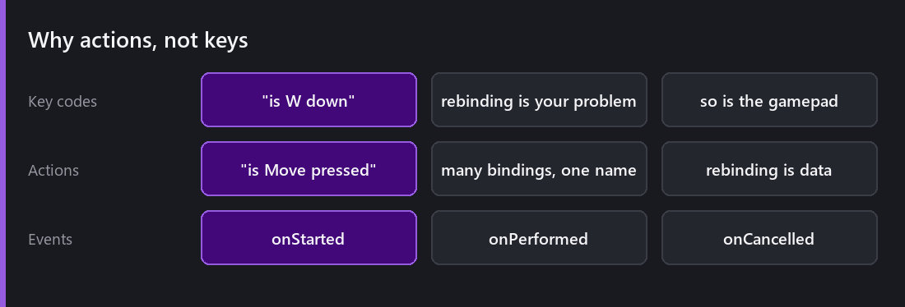
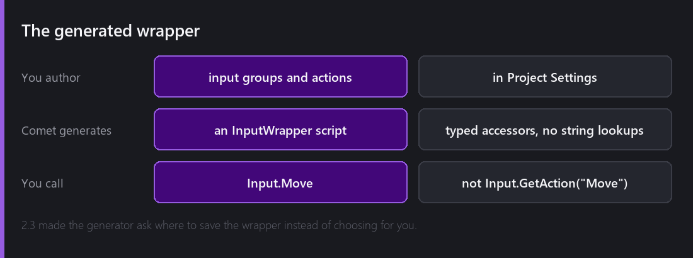
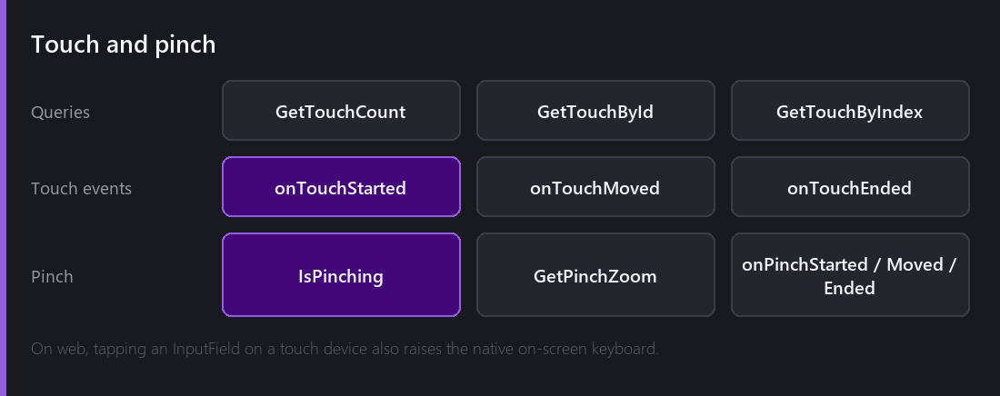

Input is the system where the naive approach works for exactly as long as your game has one player on one keyboard.

## Actions, not keys

The naive version is `if (Input.GetKey(Key.W))`. It works. Then you add a gamepad, and every check needs a second branch. Then rebinding, and every check needs to consult a settings table. Then a second control scheme, and the `if` has four arms.

Comet's model is **input actions**. You define an action — `Move`, `Jump`, `Attack` — in Project Settings, and give it bindings: a key, a gamepad button, an axis, a touch region. Your code asks about the *action*.

Rebinding becomes changing data. Adding gamepad support becomes adding bindings. Neither touches gameplay code, because gameplay code never knew which device it was reading.

Actions are grouped into **input groups**, which is how you get a scheme per context — gameplay bindings and menu bindings that can be active independently.

Three events per action: `onStarted` when it begins, `onPerformed`, and `onCancelled` when it ends. 2.0 added the first and last, which sounds minor and is what makes hold-and-release inputs expressible without polling.

## The generated wrapper

Asking for actions by string — `Input.GetAction("Jump")` — is how most systems do it, and it has the two problems every string API has: typos are runtime bugs, and renaming is a project-wide search.

Comet generates an **InputWrapper** script from your action definitions, giving typed accessors. `Input.Jump` rather than a lookup. A typo is now a compile error, and renaming an action in Project Settings regenerates the wrapper so the compiler tells you every call site.

2.3 changed the generator to ask where to save the wrapper instead of choosing for you, which matters once your project has an opinion about where generated code lives.

## Controllers

Comet reads gamepads through SDL3, which handles the mapping database so you are not writing per-controller quirks.

1.0 added eleven controller buttons that had been missing: `MISC1`, the four paddles, `TOUCHPAD`, and `MISC2` through `MISC6`. Nobody binds a jump to a paddle, but if you are supporting an Elite or a DualSense properly, they need to exist.

And the bug I like best in this whole system: **the left stick's Y axis was reading the right stick's Y axis.** Fixed in 1.0. It is a one-character class of mistake that survived a long time, because the most common way to test a stick is to push it *sideways*.

## Touch and pinch

Mobile needs more than "the mouse but a finger", because there can be several fingers and they have identity.

`GetTouchCount`, `GetTouchById` and `GetTouchByIndex` give you the active touches — the ID form is the one you want, because a touch keeps its ID for its whole lifetime while indices shuffle as fingers lift. Tracking a drag by index is a bug that appears the moment a second finger arrives.

`onTouchStarted`, `onTouchMoved` and `onTouchEnded` for events, and pinch is recognised for you: `IsPinching`, `GetPinchZoom`, and started/moved/ended events. You do not implement two-finger distance tracking.

On the web, tapping a `BehaviourInputField` on a touch device raises the **native on-screen keyboard**, added in 2.8. Without it, a web build on a phone has text fields you cannot type into — which makes the whole build feel broken for one missing hook.

## The debugger

There is an input debugger showing live action states and raw device input.

It answers the question you actually have, which is never "what is my code doing" — it is "did the input arrive at all?". Seeing that the device is producing nothing, or that the action is firing and your code is ignoring it, splits the problem in half immediately.

## What I would tell someone setting this up

**Define actions before you write movement code.** Retrofitting is mechanical but tedious, and you will be tempted not to.

**Use `onStarted`/`onCancelled` rather than polling for anything that is not continuous.** Jump is an event. Movement is a poll. Mixing them up produces missed inputs on frame-rate spikes, because a button pressed and released inside one long frame never registers as "down".

**Test with the device unplugged.** Half of input bugs are about what happens when a controller disconnects mid-game, and nobody finds them deliberately.

---

Next Wednesday we start on the content pipeline — the least glamorous and most quietly important system in the engine. Every asset becomes addressable, soft references let a script hold something it has not loaded, and a memory governor evicts what you are not using.

*Comments and questions welcome ;)*
