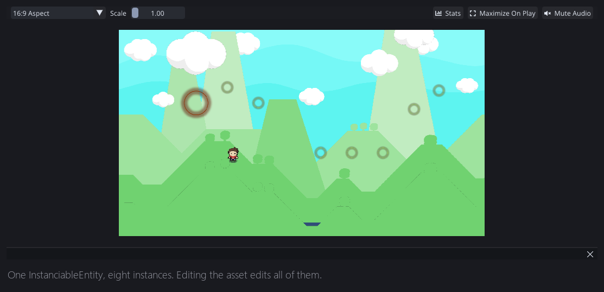
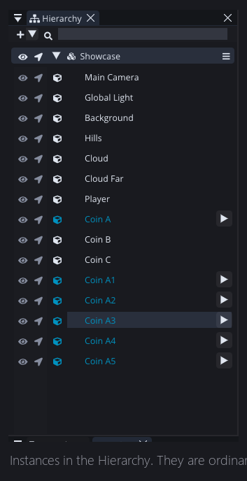
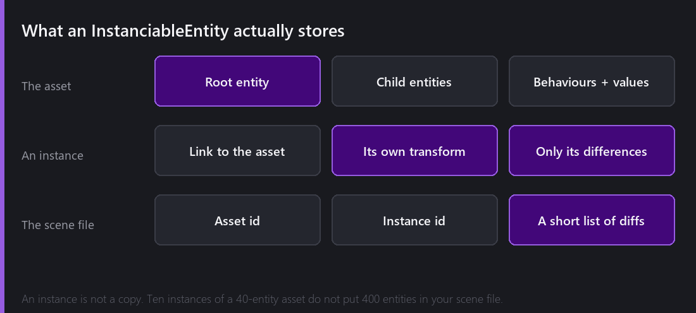
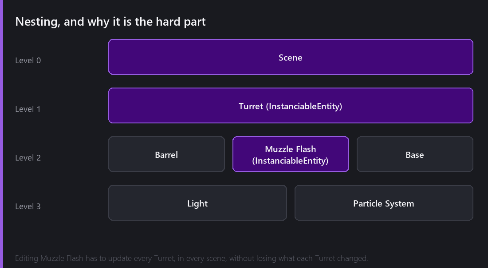

Comet calls them **InstanciableEntities**. If you are coming from Unity, this is the idea you already know as a prefab.

The concept fits in one sentence: an InstanciableEntity is an entity you saved as an asset, so you can place it as many times as you like and edit all of the copies from one place.

Getting the consequences of that sentence right took me about three rewrites.

## Making one

Build an entity in a scene, a coin for example. Transform, Sprite Renderer, a collider set to trigger, a little script. Then drag it from the Hierarchy into the Project panel.

That is all. You now have a `.cometInstanciableEntity` asset, and the entity still sitting in your scene is no longer just an entity, it is an **instance** of that asset. It remembers where it came from.

Drop that asset into the scene eight more times and you have eight instances. Open the asset, change the sprite, save, and all eight change. The value here is not clever architecture. It is that you do not have to select ninety-three coins to make them all slightly bigger.

In the Hierarchy they look almost like normal entities, because they are. An instance is a real entity in the scene with a real transform that you move, rotate and parent like anything else. The only difference is that it holds a link back to the asset it came from.

## What is actually stored

An instance is not a copy. When you place ten instances of an asset containing forty entities, your scene file does not gain four hundred entities. It gains ten short records that say "an instance of asset X lives here, with these specific differences".

That has three consequences you can feel:

- Scene files stay small and readable even in levels made mostly of repeated content.
- Loading a scene means loading the asset once and stamping it, rather than parsing the same forty entities ten times.
- Changing the asset really does change every instance everywhere, including in scenes that are not currently open, because they never had their own copy of the data to go stale.

## Nesting, and why it took three tries

An InstanciableEntity can contain another InstanciableEntity. A turret asset contains a muzzle flash asset. A room asset contains four turret assets. A level scene contains six room assets.

Now edit the muzzle flash.

Every turret has to update. Every room containing those turrets has to update. Every scene containing those rooms has to update. And none of them may lose the changes they made themselves. If one particular turret in one particular room was rotated 40 degrees and had its fire rate doubled, that has to survive an edit three levels below it.

Comet's answer is that every entity inside an instance carries a small set of identifiers: which asset it belongs to, which asset it is inside, which asset is outermost, and what its parent asset is. Those four values are what let the engine walk a three level deep structure and work out, for any given entity, which asset it should be inheriting from and which changes belong to it.

The original version of this system, back in 1.x, only supported one level. Nesting was added in 2.0 and it was the largest change in that release that nobody outside could see. It also produced the largest crop of bugs. The 2.4.1 changelog contains the line "Multiples errors on InstanciableEntities", which is doing a lot of work to describe a fortnight.

## The bar at the top of the scene view

Open an InstanciableEntity asset for editing and Comet puts you in a slightly different mode. You are editing the asset itself, not an instance of it. A header bar appears at the top of the scene view telling you so, with buttons to save or discard.

That bar exists because I kept editing an asset, wandering off, and losing the changes, or worse, saving something I had only meant to try. Making the state visible and the exit explicit fixed both.

## What breaks the illusion

Two limitations I am not happy about.

**You cannot delete a child of an instance.** Not really. If a turret asset has a barrel, and you delete the barrel on one instance, the engine cannot simply remove it, because the asset still says there is a barrel and re-stamping would bring it back. What actually happens is a tombstone: the instance records that this particular child is no longer valid. It works, and I think it is the correct answer, but it means the deletion is a stored opinion rather than an absence.

**Reordering behaviours on an instance is not free.** The list of behaviours is part of what is inherited, so changing the order on one instance is a diff like any other, and if the asset later gains a behaviour the merge has to make a decision. Comet errs on the side of the asset. Until 2.2 it errored on the side of showing you a confusing popup, which was worse.

---

Next Wednesday is the other half, and I think the more interesting one: what happens when instances start disagreeing with the asset. Overrides stored as diffs, variants that fork an asset while still inheriting from it, and the rule that decides who wins when three levels of the hierarchy have opinions about the same field.

*Comments and questions welcome ;)*
