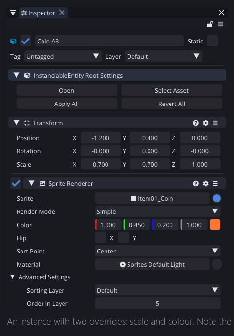
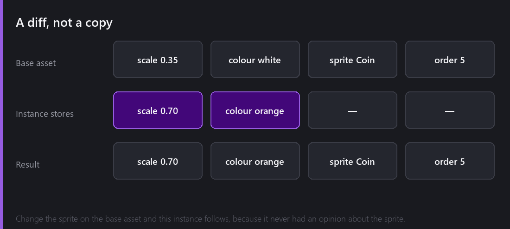
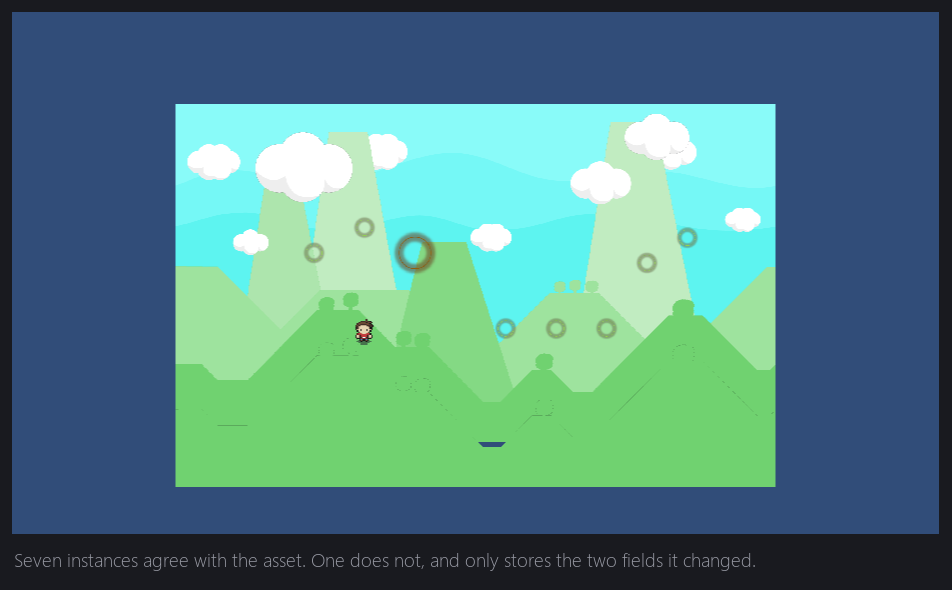
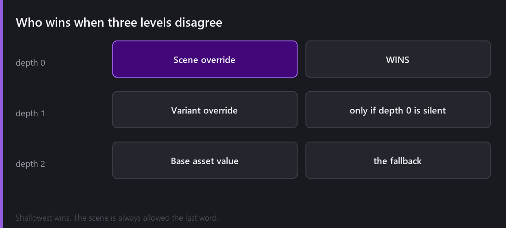

[Last Wednesday]() covered the easy half: an InstanciableEntity is an entity saved as an asset, instances point back at it, and nesting is where it gets hard.

This week is the half that makes the system actually usable, because a hundred identical coins is not a game. A hundred coins where three are bigger, one is on fire and two are worth double — that is a game.

## An override is a diff

Take one instance and change something. Make it larger, tint it orange.

Look at what Comet stores for that instance. Not a copy of the coin. Two values: `scale = 0.70` and `colour = orange`. That is the entire record.

Everything else — the sprite, the sorting order, the collider radius, the script and all its fields — is still being read from the asset, live. Which means if I go and change the coin's sprite tomorrow, **this instance follows**, because it never had an opinion about the sprite. It only ever disagreed about two things, and it still disagrees about exactly those two things.

This is the property that makes the system worth having. The naive implementation — copy the whole entity, let the user edit the copy — is much easier to write and completely useless in practice, because the moment you copy, the instance stops receiving improvements to the original.

Seven of those coins agree with the asset entirely. One does not. The scene file is seven links and one link with two extra lines attached.

## The bar at the top

When an instance has overrides, the Inspector grows a block above everything else with four buttons:

- **Open** — edit the asset itself
- **Select Asset** — highlight it in the Project panel
- **Apply All** — push this instance's changes *back into the asset*, so every other instance gets them
- **Revert All** — throw this instance's changes away and go back to agreeing with the asset

`Apply All` is the one worth being careful with. It is the correct button when you have been tweaking an instance in-scene because that is where you can see it, and you have arrived at the version you want everywhere. It is the wrong button when you had made that one deliberately special.

## Variants

Sometimes an instance is not an exception, it is a *kind*.

You have a basic enemy. You want an armoured version: same everything, but more health, a different tint, and one extra behaviour. You could make a second asset by copying the first, and then you have two assets that will drift apart forever.

A **variant** is the third option. It is a new asset that inherits from another asset. Change the base enemy's sprite and the armoured variant's sprite changes too — unless the variant had an opinion about the sprite, in which case it keeps its own.

It is the same override mechanism, one level up. An instance overrides an asset; a variant overrides an asset and can itself be instanced and overridden.

## The rule: shallowest wins

So now three things can have an opinion about `health`: the base asset, the variant, and the specific instance sitting in this scene.

The rule is **depth-based, and the shallowest depth wins.** Depth 0 is the scene. If the scene has an override, that is the answer, full stop. If the scene is silent, the variant's value is used. If the variant is also silent, you get the base asset's value.

Put plainly: **the scene always gets the last word.** Whatever you did by hand, in the level, in front of your eyes, is never quietly overruled by something further up the chain. That was not the first rule I tried, and the earlier version — where a variant could win over a scene edit in some nesting configurations — produced the most baffling bug reports I have ever written for myself.

Reconstructing that merged view is not free, so Comet caches it. When you ask for an entity's effective data, the scene manager walks the override chain once and remembers the result until something invalidates it. Getting that invalidation right is most of what 2.4.1's "multiple errors" were.

## Deletion is a tombstone

I mentioned this last week and it belongs here properly.

You cannot delete a child of an instance, because the asset still says the child exists. So the instance records that the child is `"Valid": false` — a tombstone in the overrides list.

The consequence people hit: if you delete a child from an instance and later `Apply All`, you are pushing a tombstone into the asset, and now *every* instance loses that child. Which is either exactly what you wanted or a small disaster, and the engine cannot tell which.

## Two bugs worth remembering

**The self-referencing joint.** Not strictly an InstanciableEntity bug, but it lived here. Instancing an asset containing a physics joint could, in a specific override configuration, produce a joint connecting a body to itself. Box2D does not enjoy that. The world corrupted, and the crash surfaced several frames later somewhere unrelated — the worst kind. Fixed in 2.8.

**The save that ate the asset.** Saving an InstanciableEntity used to write directly over the original file. If anything interrupted that write, the asset was gone. Now it writes to a temporary file and atomically replaces the original, so a failed save leaves the old version intact. This is a two-line change that I should have made years earlier, and it is in 2.8 because it finally happened to me.

---

Next Wednesday: scenes. What is actually inside one, the three different ways to load one, why load *order* matters when a rigid body points at a joint that points at a collider, and why a scene is readable JSON in the editor but a binary blob in a build.

*Comments and questions welcome ;)*
