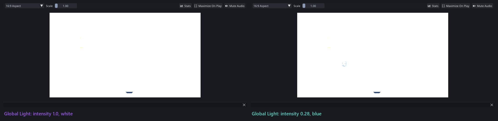
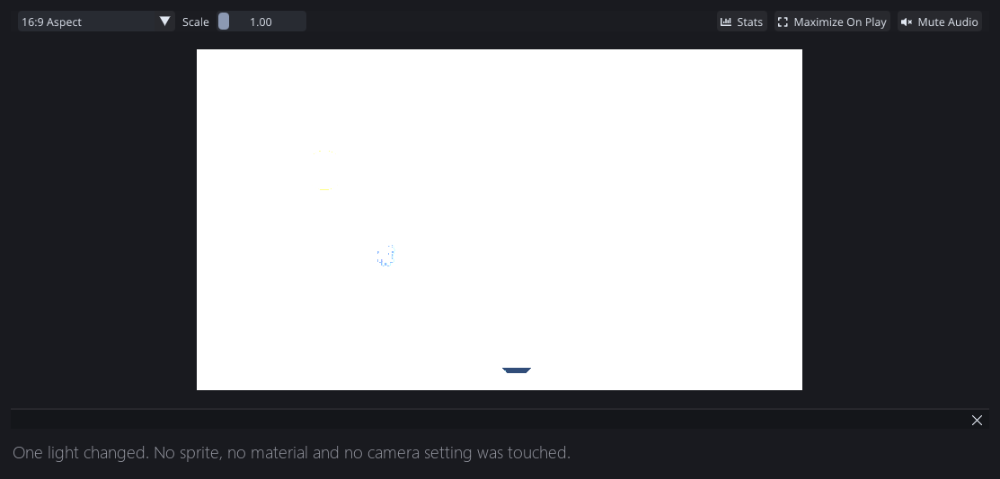
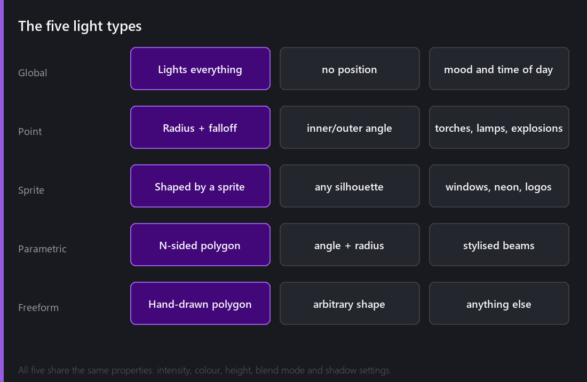
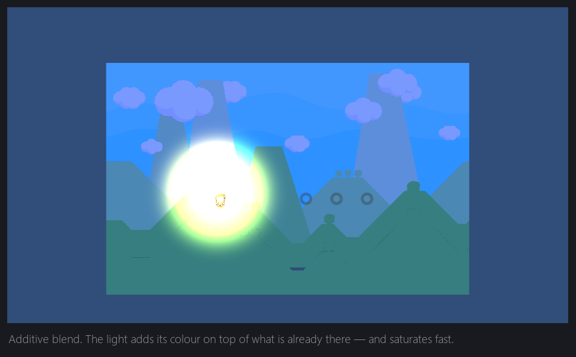
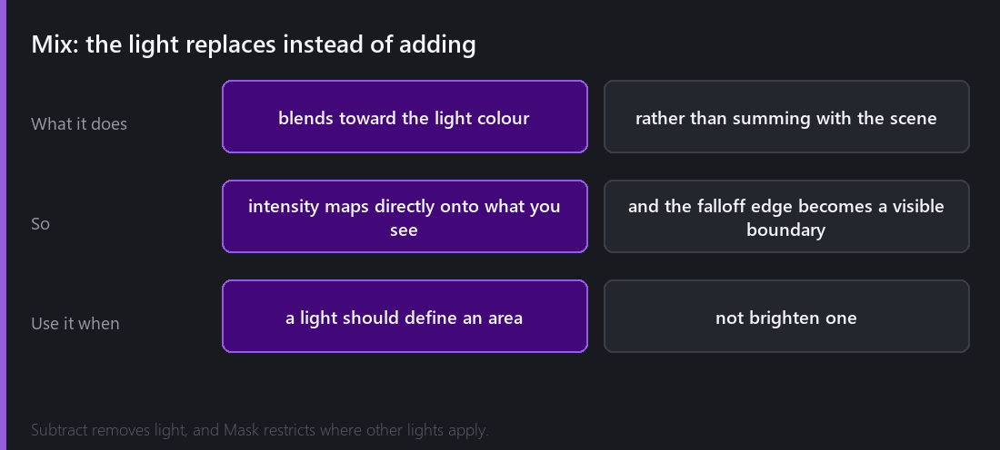
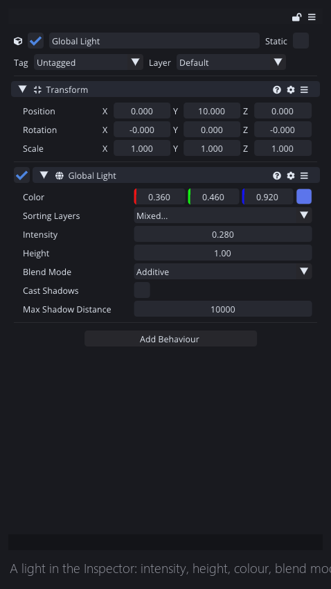

Nothing else in this engine changes how a scene feels as much as lighting does, and nothing else is as cheap to try. Here is the demo scene I have been using for these posts, unchanged in every way except one value on one entity.

The sprites, the materials and the camera are all identical. I dimmed the Global Light and tinted it blue, and that is the entire change.

That is the argument for 2D lighting in one image, and it is why I would put it near the top of the list of things worth learning in Comet.

## Five kinds of light

**Global Light** has no position. It affects everything and it sets the base mood of the scene: daylight, dusk, or the flat neutral wash of an indoor room. Most scenes want exactly one, and most of the time it is the only light you need to touch.

**Point Light** is the familiar one, with a position, a radius and a falloff. Torches, lamps, muzzle flashes. It also has inner and outer angles, which turn it into a spotlight, a cone rather than a circle.

**Sprite Light** takes its shape from a sprite. I think this is the one people underuse. If you want light spilling through a window in the shape of the window, or a neon sign that lights the wall in its own silhouette, you draw the shape and use it as a light.

**Parametric Light** is a regular polygon with a side count, a radius and an angle, which is good for stylised, hard-edged beams.

**Freeform Light** is a polygon you draw by hand, for when the shape is not describable any other way.

All five share the same core properties, which keeps the mental model small: intensity, colour, height, blend mode, and their own shadow settings.

## Height, in a flat world

A 2D scene has no depth, so what is a light's `Height`?

It is how far out of the screen the light sits. A light at height 0 is in the same plane as your sprites and grazes across them. Raise it and it comes toward the viewer, which changes the direction the light appears to arrive from at every point on the surface.

On a plain sprite this mostly affects how the falloff reads. On a **normal-mapped** sprite it changes everything, because now the engine has a surface direction to compare the light direction against, and that is next week's post.

## Blend modes

Every light has a blend mode, and this is the setting I most underestimated while I was building the system. The two you will actually use behave very differently.

**Additive** adds the light's colour on top of whatever is already there.

Additive is the intuitive one, light adding light, and it is right for torches, glows and anything emissive. Its failure mode is the one everybody hits. Over an already-bright surface it saturates to white very quickly, and once you are at white, turning the intensity down further does surprisingly little. If your lights look like blown-out discs, this is why, and the fix is a dimmer background rather than a dimmer light.

**Mix** blends toward the light's colour instead of adding to it.

Here the light replaces what is underneath, so the intensity value maps much more directly onto what you see, and the edge of the falloff becomes a visible boundary. Mix is the right choice when you want a light to define an area rather than brighten one, and the wrong choice when you wanted a soft glow.

**Subtract** removes light, and **Mask** restricts where other lights apply.

Subtract deserves a moment, because a light that makes things darker sounds like a mistake. A pool of shadow under a bridge, a creeping darkness following an enemy, a vignette that moves with the player, all of those are easier to do as a negative light than as anything else. Comet also allows negative intensity on ordinary lights, which gets you to the same place from the other direction.

## The inspector

Everything above lives on one Behaviour. Intensity, height, colour, blend mode, the radii and angles, and then a block of shadow settings: cast shadows, shadow mode, colour, strength and softness. Those are the post after next.

`AllSortingLayers` and the sorting layer list underneath it decide which layers this light touches at all. That is the escape hatch for the thing everyone hits eventually. You light your scene beautifully and then notice your UI has gone dark, or that the background is being lit when you wanted it flat. Restrict the light to the layers it should affect and the problem goes away.

## How I use it

After building this and then using it for a while, this is the workflow that works for me:

1. **Start with one Global Light** and get the mood right before adding anything else. Most of the emotional weight of a scene comes from this single entity, and it is very easy to skip past it and start adding torches.
2. **Add point lights for sources you can see.** A torch on the wall should light the wall.
3. **Keep intensities low.** Lights accumulate. Three lights at 0.4 read as far more natural than one at 1.2.
4. **Use sorting layers to keep things out of it.** Your UI almost never wants to be lit.

## A bug I found while writing this

While preparing the images for this post I found a real bug, and it is a good example of how a small thing produces a baffling symptom.

If a point light's inner radius is set to or past its outer radius, every pixel inside the light takes the no-falloff branch of the shader. The result is a flat, fully saturated disc that ignores distance entirely, and because it is already at full brightness, turning the intensity down appears to do nothing. It looks like intensity is broken, when really it is one bad pair of numbers.

The engine now clamps the inner radius to sit strictly inside the outer one, so a light authored that way degrades into a normal light instead of a white hole.

That was a real inconsistency rather than a documented design choice, and I would not have noticed it if I had not been generating before-and-after images for a blog post. Which is exactly the argument I made in the first post of this series about why writing these is worth the evenings.

---

Next Wednesday: making a flat rectangle lie about being a surface. Normal maps on 2D sprites, per-pixel diffuse shading, specular highlights, and what happens when you walk a torch past a wall that suddenly has bumps in it.

*Comments and questions welcome ;)*
