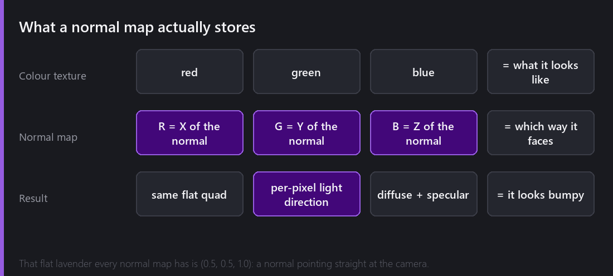
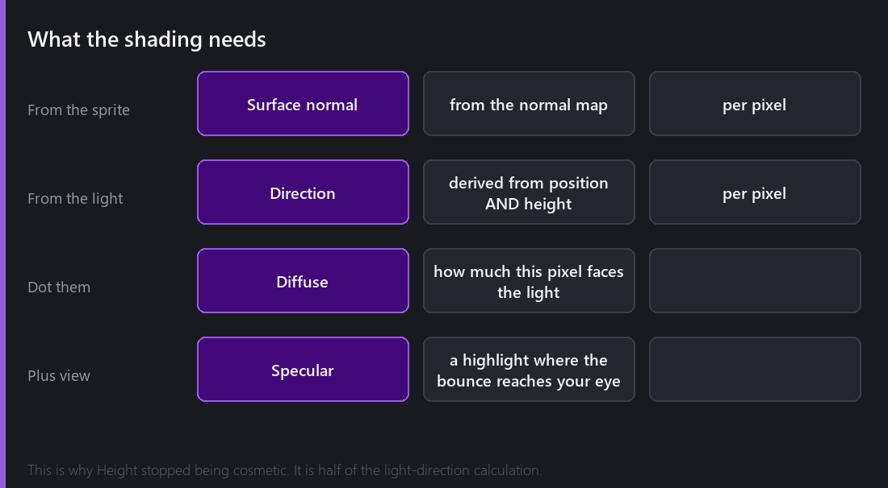
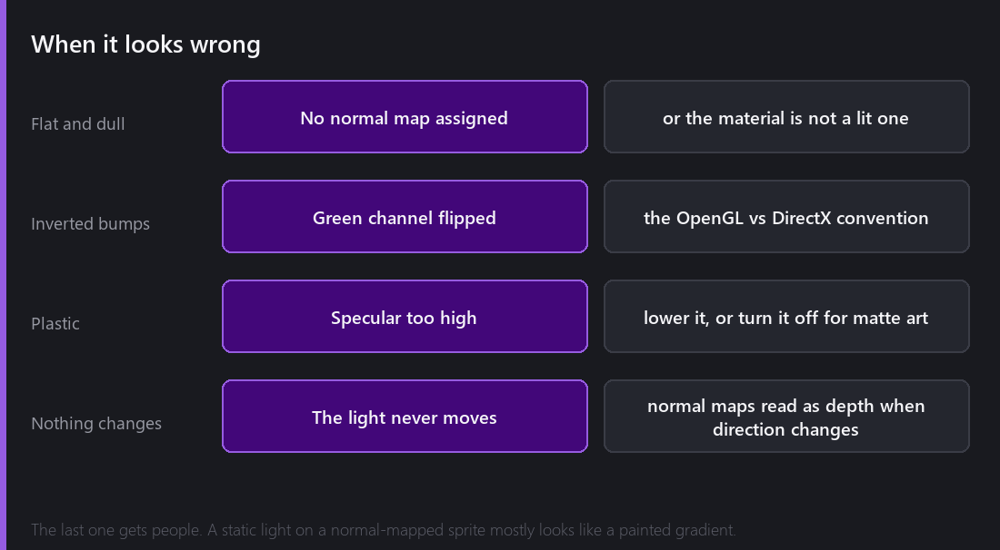

A sprite is a flat rectangle with a picture on it. It has no bumps, no grooves, no direction. When a light moves past it, nothing about its surface can respond, because it does not have one.

Normal mapping is how you lie about that convincingly.

## What a normal map is

You already know what a colour texture is: for every pixel, what colour it should be.

A normal map is the same idea for a different question: for every pixel, **which direction is this bit of surface facing?** That direction is a 3D vector with an X, a Y and a Z — and an image has three colour channels. So R holds X, G holds Y, B holds Z.

This is why every normal map you have ever seen is that particular flat lavender colour. That is `(0.5, 0.5, 1.0)` — X and Y at zero once you decode them, Z at maximum. A normal pointing straight out at the camera. Flat. The bits that are *not* lavender are the bits with a slope.

The rectangle stays a rectangle. The geometry does not change, the silhouette does not change, and looking at it head-on with a light directly in front, nothing changes. What changes is that the shading now has an opinion, per pixel, about which way the surface is turned.

## What the engine does with it

For every pixel of a lit sprite, Comet now has two directions: the surface normal from the normal map, and the direction to the light.

Take the dot product and you get **diffuse** shading — a number for how directly this bit of surface faces the light. Facing it straight on, bright. Turned away, dark. That single operation is what makes a flat sprite look like it has depth.

Add the view direction and you get **specular** — a highlight where the light would bounce off the surface toward your eye. Specular is what separates wet stone from dry stone and metal from cloth, and it is also the easiest thing in this entire post to overdo.

Here is where [last week's]() throwaway property becomes important. **Height.** The direction from a pixel to the light depends on where the light is, and a light in the same plane as your sprites is always grazing along the surface at a shallow angle. Raise the light out of the plane and the direction changes across the whole sprite in a way that reads as three-dimensional.

Height stopped being cosmetic the moment normal maps arrived. It is half of the light-direction calculation.

## Getting a normal map

Three routes, roughly in order of how much work they are:

**Generate one from the colour texture.** Tools will do this by treating brightness as height. It is a guess and it looks like a guess, but for rough stone or bark it is often good enough and it takes ten seconds.

**Paint one.** For pixel art especially, hand-authoring the normals gives you control over exactly which edges catch the light. It is slow and the results are much better.

**Render one.** If the art came from a 3D source, the normal map falls out of the render for free. This is why so much 2D-with-lighting work has a slightly 3D-rendered look — because it is.

You assign it on the **material**, not the sprite renderer, which trips people up. The lit material has a slot for the normal texture, and the sprite renderer just points at that material.

## When it looks wrong

Four things go wrong, and I have done all four.

**Nothing happens at all.** Usually the material is not a lit one. Comet ships `Sprites Default` and `Sprites Default Light` — if you are on the first, no light of any kind touches the sprite. This is by design, and it is also the correct answer for UI and for backgrounds you want flat.

**The bumps are inside-out.** Every dent looks like a bump and every bump like a dent. This is the green-channel convention: some tools write Y up, others write Y down. Flip the green channel and it is correct. There is no way to detect this automatically, because a plausible surface inverted is still a plausible surface.

**It looks like wet plastic.** Specular too high. Most 2D art is matte, and the highlight that looks great on a metal helmet makes a cloth banner look shrink-wrapped.

**It looks like a painted gradient.** This one is the most interesting, because nothing is technically wrong. Normal maps read as depth *because the shading changes as the light direction changes.* If your light never moves, the brain reads the result as a static painting with a gradient on it, which is exactly what it is.

Which leads to the actual point.

## The trick is motion

Normal mapping on a static scene with static lights is an expensive way to bake shading you could have painted.

Normal mapping earns its cost the moment something moves. A torch the player carries. A light that swings. A player who walks past a wall. In that moment the wall's surface responds continuously, every pixel of it, and the brain immediately reads a flat rectangle as a three-dimensional thing.

So the practical advice is: if your lights are static, consider painting the shading into the art and saving yourself the textures. If your lights move — or your *objects* move past lights — normal maps are the single biggest visual upgrade available to a 2D scene.

## The cost

Per-pixel shading against every light that reaches a sprite is not free. In practice, for the light counts a 2D game realistically has, it has never been the thing that made a frame slow in my testing — culling, batching and particles all cost more.

The thing that *does* cost is memory. Every normal-mapped sprite needs a second texture the same size as the first. You have doubled your texture memory for that art. Atlas them exactly like colour textures, and consider whether every sprite really needs one — usually the answer is that the terrain and the big set-piece objects do, and the small props do not.

---

Next Wednesday, with good timing for the last Wednesday before Halloween: shadows. Shadow Casters, occluders from sprite shapes or physics shapes, soft edges via PCF, per-light control over what gets darkened, and the afternoon I spent with every shadow in the scene pointing the wrong way.

*Comments and questions welcome ;)*
