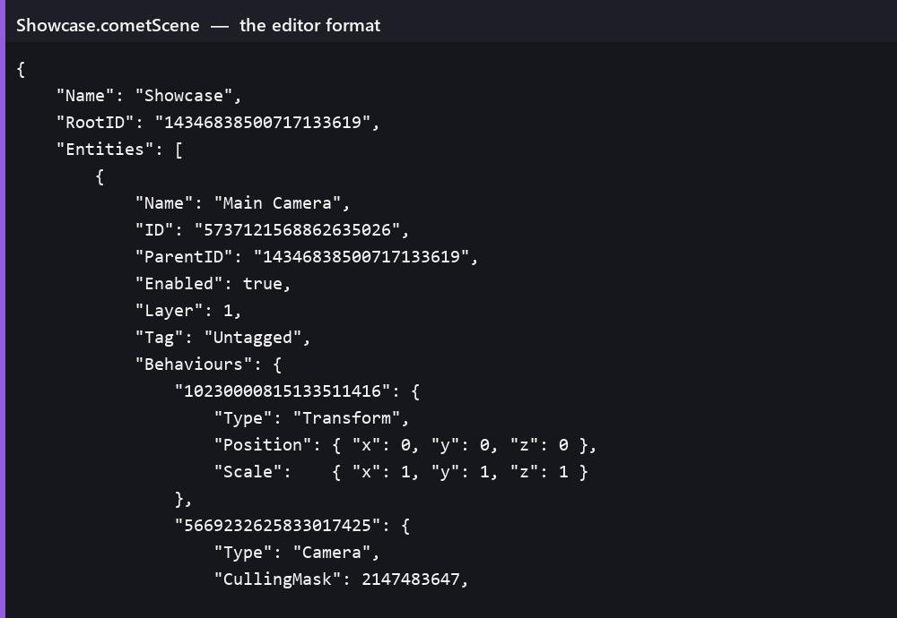
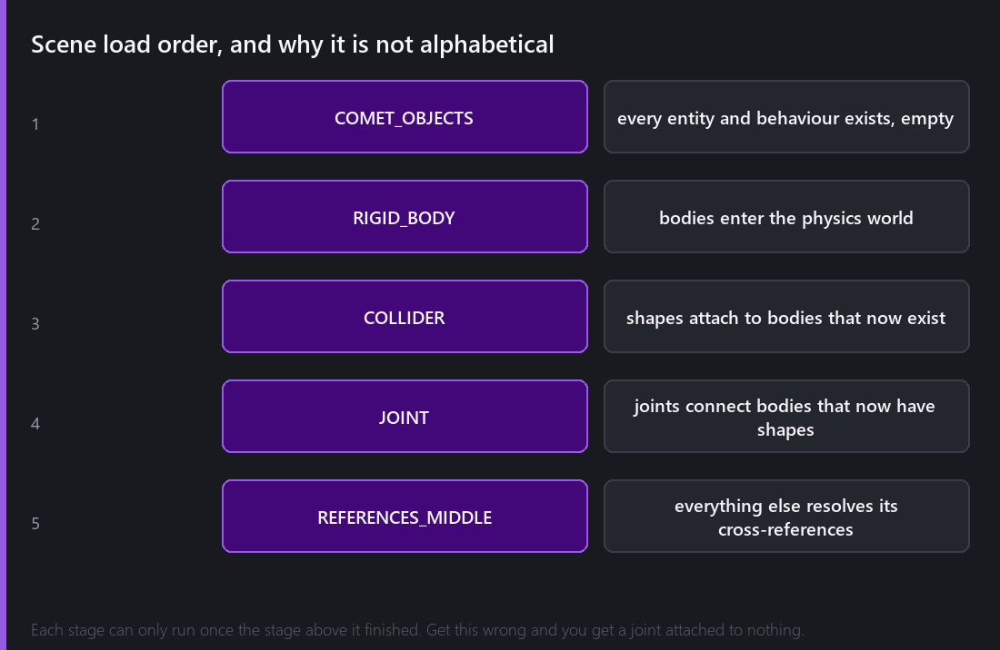
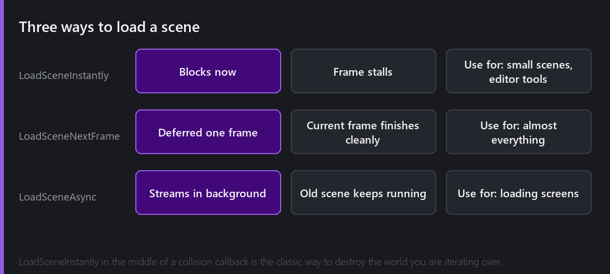

A scene is the file that holds a piece of your game. Opening one, saving one, and loading one while another is already running are three problems of very different sizes, and this post is about all three.

## What is actually in there

Comet scenes in the editor are JSON. Not a custom binary format that you need a tool to read, but actual JSON, on disk, in your `Assets/` folder, which you can open in a text editor and diff in git.

This is the top of the scene I have been using for these posts.

Every entity is a record: its name, its ID, its parent's ID, its enabled state, its layer and tag, and then a dictionary of behaviours keyed by their own IDs. Each behaviour writes whatever it needs. A Transform writes position, rotation and scale, a Camera writes its culling mask and clear colour, a Sprite Renderer writes the sprite it points at and its sorting layer.

Two things are worth noticing.

**Everything is an ID, not a name and not a path.** `ParentID` is a number. When a script field references another entity, that is a number too. Names are for humans, and the engine never uses them to find anything, which is why renaming an entity can never break a reference.

**Behaviours are a dictionary, not an array.** Each behaviour has its own persistent ID, so adding, removing or reordering behaviours does not shift what anything else points at.

That readability is a deliberate editor only choice. In a **build**, this same scene becomes a binary blob, an index of `ID + Hash + Type + Offset` entries followed by packed data. The editor wants a format you can inspect and merge, and the runtime wants a format that loads without parsing thirty thousand characters of text. There is no reason those have to be the same format, so they are not.

## Putting it back together, in order

This part is genuinely delicate.

You cannot just walk the entity list and construct things as you meet them. Think of a scene where a rigid body has a collider, and a joint connects that body to a second one that appears **later** in the file. Construct the joint when you reach it and you are connecting to a body that does not exist yet.

So loading happens in stages.

First every entity and every behaviour is created, present but empty. Then rigid bodies enter the physics world. Then colliders attach to bodies that are now guaranteed to exist. Then joints connect bodies that now have shapes. Then everything else resolves its cross references, and by that point every object in the scene is available to be pointed at.

Each stage depends on the one above it having completely finished. This is invisible when it works and produces very confusing bugs when it does not, like a joint that behaves oddly only when you saved the scene with the entities in a particular order.

Two of the bugs fixed in 2.8 live exactly here: joints that ended up connecting a body to itself and corrupted the physics world, and a rigid body attached to a joint crashing when you dragged it with the scene gizmos.

## Three ways to load

**`LoadSceneInstantly`** does what it says. The current frame stops, the scene is torn down, the new one is built, and then the frame continues. It is the simplest one and it is right for small scenes and editor tooling.

It is also the one that will hurt you, for a reason that is not obvious. Calling it from inside a collision callback means you are destroying the world in the middle of the physics step that is iterating over it. Comet defends against a lot of this, but "destroy everything, right now, from inside a callback" is a hard thing to make safe.

**`LoadSceneNextFrame`** is the same operation, deferred until the current frame has finished cleanly. This is the correct default and it is what I use for essentially every scene transition. Nothing is mid iteration, the frame ends, and then the swap happens.

**`LoadSceneAsync`** streams the new scene in the background while the current one keeps running and rendering. This is what a loading screen is built on: start the load, keep updating your spinner, poll for completion, then swap. 2.8 improved both async asset and async scene loading noticeably, and also the plain large scene load path.

You can also load a scene **by ID** rather than by reference. That sounds like a small thing, but it is what makes a data driven level flow possible, because a script can hold a list of scene IDs and load whichever one the save file says you were in.

## Leaving play mode is also a scene load

This one took me an embarrassingly long time to make fast.

When you press play in the editor, Comet has to remember the scene exactly as it was, because when you press stop it must put it back. That is the whole contract of play mode. Every change your scripts made during play has to be undone.

For a long time the recovery on a big scene took several seconds. You would press stop and just sit there waiting. 2.8 got that down to a fraction of a second, and it is one of the changes that has most improved how the editor feels to use, even though it is completely invisible in a feature list.

A related detail, also fixed recently: delta time was not being normalised after a scene load, so the first frame of a new scene received an enormous delta, the accumulated time of the whole load. Anything integrating over delta time on that first frame took one gigantic step. Objects teleported. It looked like a physics bug for a long time before I thought to look at the clock.

## Scenes as assets

A scene is a resource like any other, with an ID, which means other things can reference it. A script can expose a `Scene` field and you drag one in from the Project panel.

That matters at build time. Scenes referenced from a script or a CometObject are **automatically included in the build**. You do not maintain a list of levels somewhere and remember to update it. If something in your project points at a scene, that scene ships.

The build also does the reverse and strips out assets that nothing references and that have no content group assigned. That is a subject for its own post, in May.

---

Next Wednesday we follow one frame all the way to the screen: sorting layers, the spatial index that throws away everything off camera, what merges into a single draw call and what quietly refuses to.

*Comments and questions welcome ;)*
