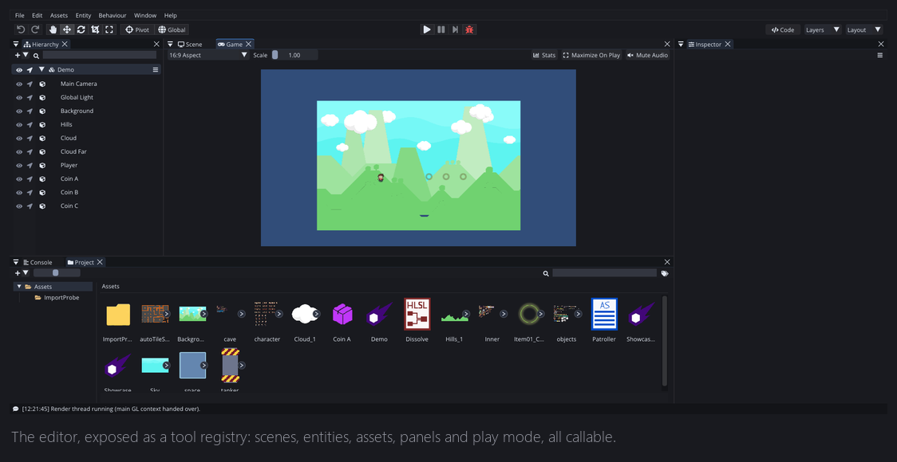
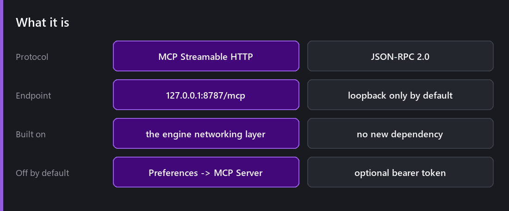
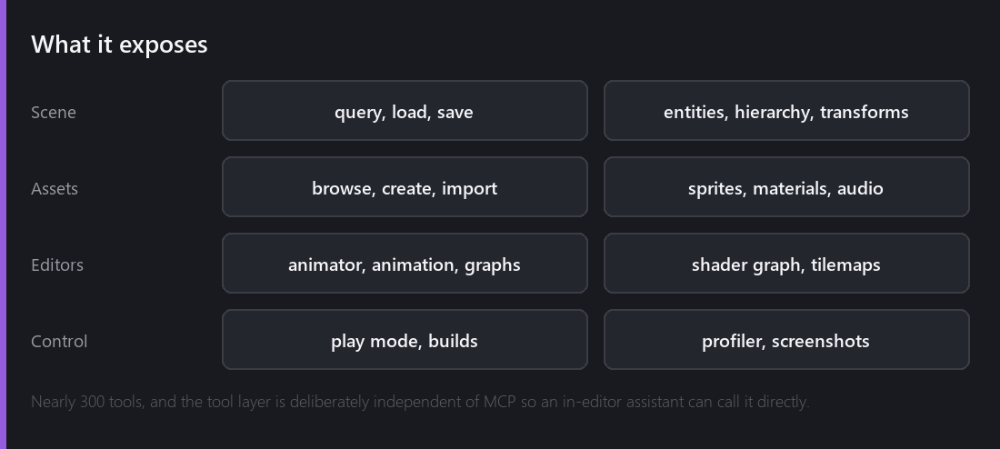
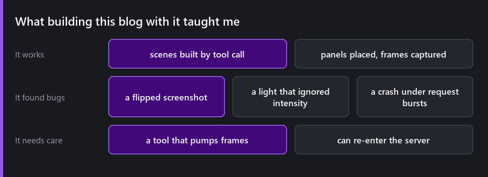

This is the strangest thing in Comet, and the reason the blog you have been reading for a year has screenshots in it.

The editor contains a **Model Context Protocol server**. An AI assistant, or any MCP client, or a shell script, can connect to a running editor and drive it.



## What it actually is



MCP is a protocol for exposing tools to language models. Comet implements it as **JSON-RPC 2.0 over Streamable HTTP**, served on `http://127.0.0.1:8787/mcp`.

It is built on the engine's own [networking layer](), `TCPServer` and `StreamPeerTCP`, so it added no new third-party dependency.

It is **disabled by default**. When enabled it is loopback-only with Host and Origin validation, and there is an optional bearer token. Configuration lives in `Preferences → MCP Server`.

Connecting a client is one line:

```bash
claude mcp add --transport http comet http://127.0.0.1:8787/mcp
```

## What it exposes



Nearly three hundred tools, covering most of what the editor can do: scenes and hierarchy, entities and behaviours and their fields, transforms, assets, sprite slicing, materials, tilemap painting, animator and animation editing, graphs, play mode, project settings, builds, the profiler, and screenshots.

The architectural decision I care about: **the tool layer is independent of MCP.** JSON-RPC is one consumer. Anything in-process, most obviously a future in-editor assistant panel, drives the same registry directly, with no socket and no protocol:

```
ToolRegistry& tools = McpServer::Get()->Tools();
ToolResult result = tools.Execute("entity_create", args);
```

Adding a tool is one class in one file under `Editor/MCP/`, picked up automatically by the build. Nothing outside that folder changes.

## What it found



This is the part I did not expect, and it is the strongest argument for the feature.

Driving the editor programmatically, at volume, found bugs that a year of using it by hand had not.

**Screenshots came out upside down.** `FlipVertical` swapped the rows without updating the recorded image origin, so the PNG encoder flipped them a second time. Nobody had noticed because nobody had used that path.

**A point light ignored its intensity** when its inner radius was at or past its outer radius, flooding a flat disc. It looked exactly like "intensity is broken" and was one bad pair of numbers.

**The server crashed under request bursts.** A tool that pumps frames, a scene load or an import, re-entered the request loop and reallocated the client list underneath the outer call.

All three are the same category: paths that only get exercised when something drives them faster and more mechanically than a person would. That is a very useful property to have in a codebase.

## Is this a good idea?

The honest concerns, and my answers.

**Security.** It is off by default, loopback-only, origin-validated, with optional token auth. It should never be exposed to a network, and nothing about the design encourages it.

**Determinism.** A model driving an editor makes mistakes. Everything it does goes through the same undo system a human's actions do, and nothing bypasses validation, because the tools are the same commands the UI issues.

**Is it just a gimmick?** It would be, if the tool layer were built only for MCP. It is not. It is a scriptable command layer for the editor, and that is worth having regardless of who calls it. The [Comet CLI]() and headless export come from the same instinct: the editor's capabilities should not be locked inside its UI.

## What is next for it

The in-editor assistant panel is the obvious one, and the reason the tool layer was factored the way it was.

Beyond that, what interests me is not "AI builds your game". It is the boring, high-volume work. Rename this across two hundred assets. Find every entity with a missing reference. Slice these forty sprite sheets. Build for four platforms and tell me what broke.

That is the work that makes a solo engine slow, and it is exactly the work a tool layer plus a model is good at.

---

Next Wednesday is the last post of this year of Wednesdays. Seven years and five months since the first commit, fifty-two posts, and an honest look back at what I would have done differently, plus where Comet goes next.

*Comments and questions welcome ;)*
