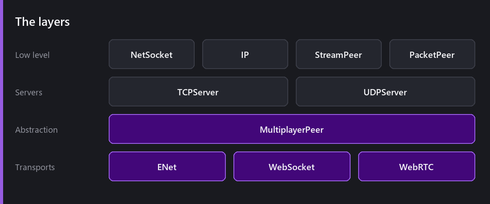
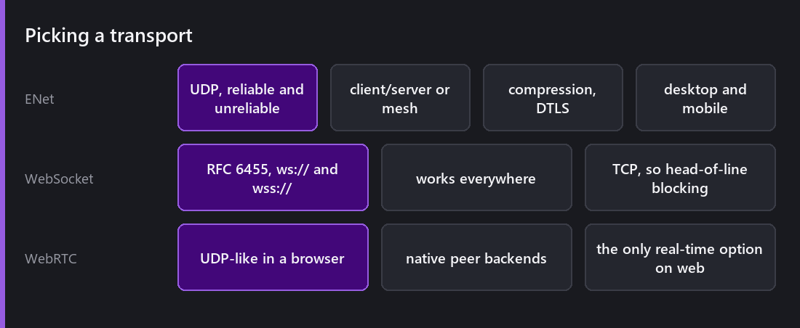
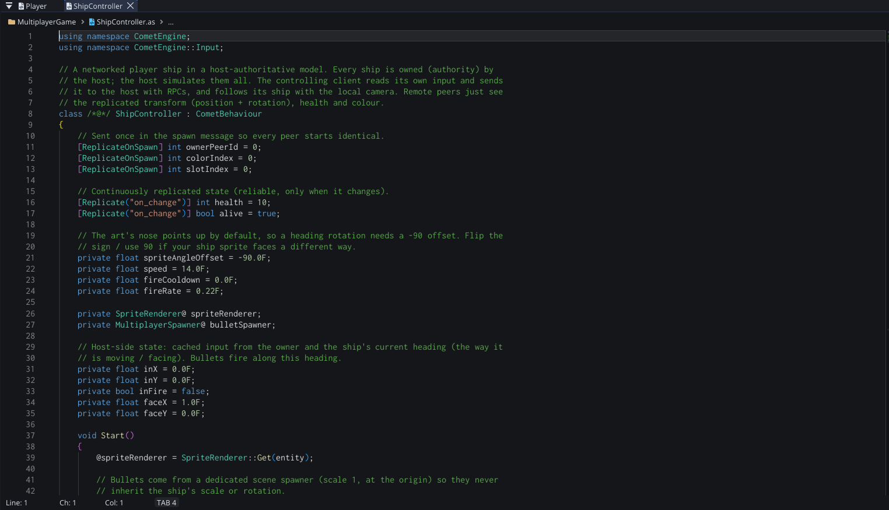
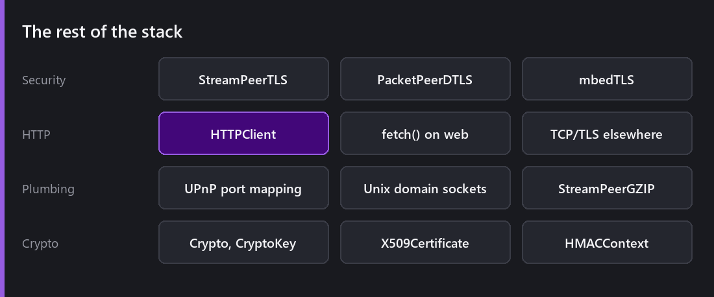

Comet 1.x had networking in the sense that it had sockets. `SocketClient`, `SocketServer`, some events. Enough to send bytes between two machines, and not enough to build a game on.

2.8 removed them and built a real stack.

## The layers

At the bottom, low-level I/O: `NetSocket`, `IP`, `StreamPeer`, `PacketPeer`. Above that, `TCPServer` and `UDPServer`. Above *that*, one abstraction — **`MultiplayerPeer`** — and three transports implementing it.

The reason for that shape is the same reason [rendering has IRenderHardware](): the layer above should not know which one it got.

## Three transports

**ENet** is the desktop and mobile answer. UDP with optional reliability per message, client/server or mesh topologies, four compression schemes (FastLZ, zlib, Zstd, Range Coder) and DTLS encryption. It is the transport you want for anything real-time when the platform allows it.

**WebSocket** (RFC 6455, `ws://` and `wss://`) works everywhere including browsers. It runs over TCP, which means head-of-line blocking: one delayed packet stalls everything behind it. Fine for turn-based games and lobbies; a real problem for a shooter.

**WebRTC** is how you get UDP-like behaviour in a browser, with native backends (`EMWSPeer`, `RTCPeerConnection`) for web builds. More setup — it needs signalling — and the only real-time option on the web.

## The constraint that shaped this

Everything above exists because of one fact: **a browser cannot open a raw socket.**

If Comet only targeted desktop, ENet alone would do and the abstraction would be pointless. Because [web is a first-class target](), the same game code has to work over a transport that behaves quite differently, and the only sane way to do that is to define the interface first and implement it three times.

This is the same pattern as the [render backends]() and the [shader pipeline](). Support one awkward platform properly and it forces an abstraction that makes everything else cleaner. The web has been the most productive constraint in this engine's history.

## What it looks like in a script

Nothing in that file is networking boilerplate. It is an ordinary `CometBehaviour` with attributes on three of its fields, and the layer above — [next Wednesday's post]() — is what turns those attributes into packets.

## Everything else in the box

**TLS and DTLS** via `StreamPeerTLS` and `PacketPeerDTLS`, backed by mbedTLS, with certificate and key handling.

**`HTTPClient`**, which uses the browser's native `fetch()` on web and TCP/TLS everywhere else. Leaderboards, analytics, remote content — and the same code path on every platform.

**UPnP NAT port mapping** via miniupnpc, which is how a player-hosted server has a chance of being reachable without the host configuring a router.

**Crypto primitives** — `Crypto`, `CryptoKey`, `X509Certificate`, `HMACContext` — plus `StreamPeerGZIP` and Unix domain sockets.

## What I would tell someone starting

**Pick your transport from your platforms, not your ambitions.** If you need the web, you need WebSocket or WebRTC, and that decides more about your netcode than any amount of preference.

**Reliable is not free.** ENet lets you choose per message and the temptation is to make everything reliable because it is easier to reason about. Position updates should be unreliable — a dropped one is superseded by the next, and forcing a retransmit makes things worse.

**Encrypt from the start.** Adding DTLS at the end means discovering your packet sizes no longer fit.

**Test with real latency.** Everything works on loopback. Everything.

## Would I build this again?

The stack is a large amount of engine for a feature most 2D games do not use, and I thought hard about whether it was the right thing to spend a release on.

What convinced me is that it is not really optional infrastructure. `HTTPClient` is used by games that have no multiplayer at all. TLS is needed the moment you talk to any service. Remote content groups in the [content system]() are built on this. The transports are the visible part of something that was needed anyway.

---

Next Wednesday: the layer that makes all of this invisible. RPCs with authority and reliability, synchronizers replicating entity state, spawners handling late joiners, and interest management so a peer only hears about what it can see.

*Comments and questions welcome ;)*
