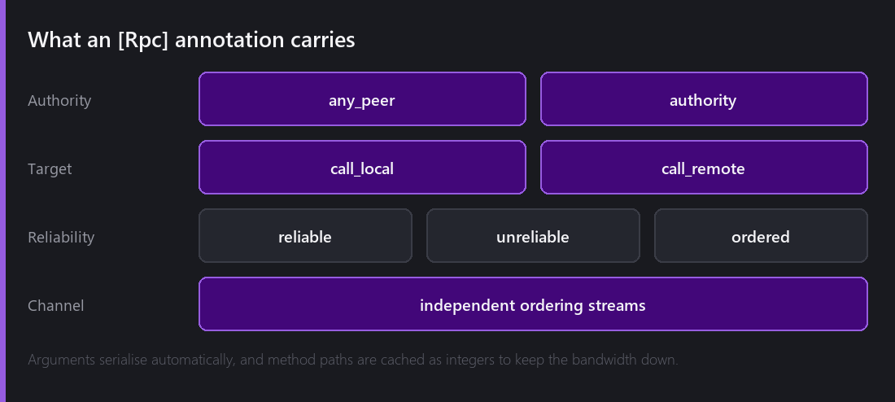
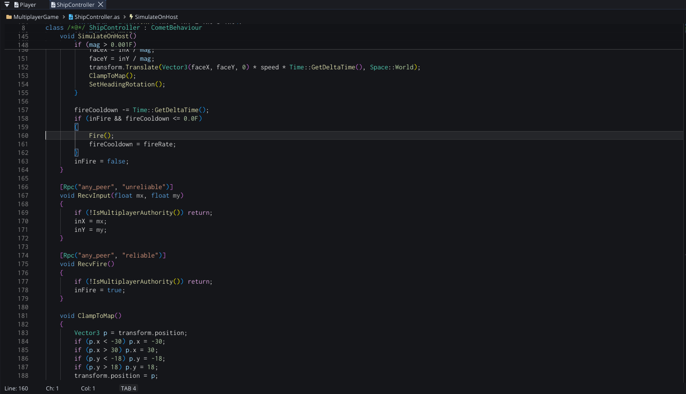
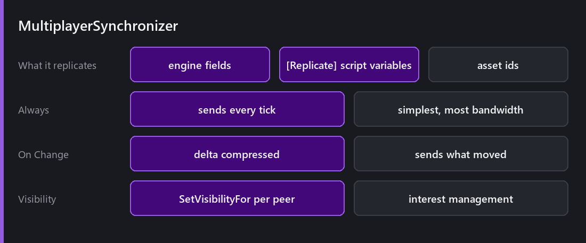
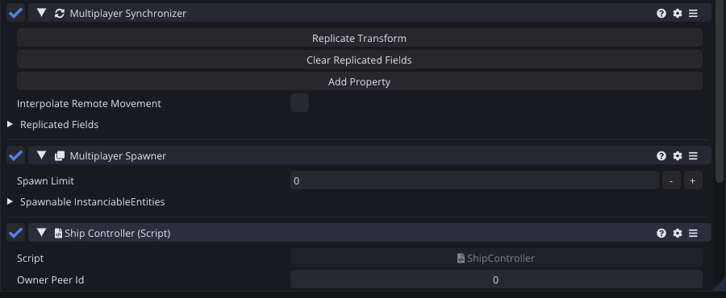
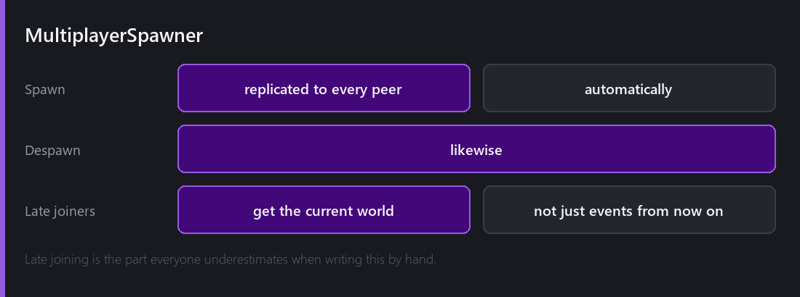
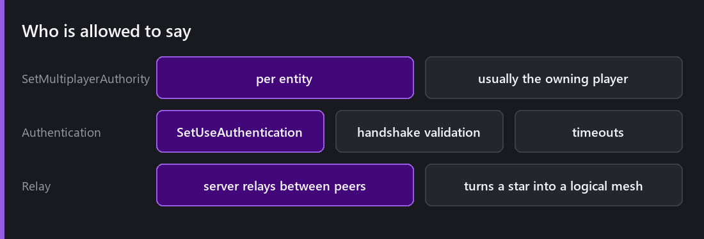

[Last Wednesday]() was sockets and transports. This week is the layer whose entire job is to make you never think about them.

## RPCs

That is a client sending its input to the host: an unreliable RPC for the stick, a reliable one for the fire button. The `IsMultiplayerAuthority()` guard at the top of each is not optional — an RPC is a method anyone can call.

Annotate a method with `[Rpc]` and calling it calls it on other peers.

The annotation carries four decisions, and each one is a bug you would otherwise write by hand.

**Authority** — `any_peer` or `authority`. Who is allowed to invoke this? A client saying "I picked up the item" is `any_peer`. A server saying "the round ended" is `authority`. Getting this wrong is how a cheat client rewrites your game state.

**Call target** — `call_local` or `call_remote`. Does the caller also run it? Fire a weapon and you want local (instant feedback) plus remote. Apply damage and you may want remote only.

**Reliability**, per call. Chat is reliable. A footstep sound is not.

**Channel**, so independent streams do not block each other.

Arguments serialise automatically, and method paths are cached as **integers** rather than sent as strings. That optimisation is invisible and it is the difference between an RPC costing a few bytes and costing forty.

## Synchronizers

RPCs are events. Most of multiplayer is not events, it is *state* — where everyone is, right now.

Both behaviours sit on the ship: the synchronizer above, the spawner below. Neither has much of a surface, which is the point — the interesting configuration lives on the script's fields.

`[ReplicateOnSpawn]` sends a value once, in the spawn message, so every peer starts identical. `[Replicate("on_change")]` keeps it in sync afterwards and only sends it when it actually moves.

`MultiplayerSynchronizer` replicates an entity's properties. Engine fields, script variables marked `[Replicate]`, and asset IDs so "which sprite" replicates as a reference rather than a texture.

Two modes. **Always** sends every tick — simplest, most bandwidth, right for things that genuinely change constantly. **On Change** delta-compresses and sends only what moved, which is right for almost everything else.

The instinct is to synchronise everything and let On Change sort it out. Resist it: a property that never changes still costs a comparison every tick, and a synchronised property is a property you have decided is authoritative somewhere.

## Spawners, and the late joiner

`MultiplayerSpawner` replicates dynamic instantiation and destruction. Spawn an enemy on the server, it appears for everyone. Destroy it, it disappears.

The part people underestimate — every time — is **late joiners**.

Naive replication broadcasts events. A player who joins after twenty enemies have spawned receives none of those events, so they see an empty world while everyone else fights. Handling that means the spawner has to track what currently exists and replay it to a new peer as *state* rather than as history.

Comet's spawner does this. It is the single biggest reason to use it rather than hand-rolling spawn RPCs, and it is invisible until the first time someone joins your game in progress.

## Authority and interest

`SetMultiplayerAuthority` sets, per entity, which peer is allowed to say what is true about it. Usually a player has authority over their own character and the server has authority over everything else.

**Interest management** is `SetVisibilityFor` on a synchronizer — per peer, per entity. A player on the far side of the map does not need updates about things they cannot see.

That is bandwidth *and* anti-cheat at once. Data you never send is data a modified client cannot read, and in a game with any hidden information that matters more than any encryption.

There is also handshake **authentication** (`SetUseAuthentication`) with timeout enforcement, and a **server relay** option that turns a star topology into a logical mesh — peers appear connected to each other while everything actually routes through the server, which is how you get mesh semantics without every player needing a reachable address.

## The honest limitations

**No rollback or prediction.** Comet replicates state; it does not reconcile a locally predicted simulation against an authoritative one. For a fighting game or a competitive shooter you would build that yourself on top of the RPC layer. That is a large project.

**No lag compensation.** Server-side rewinding to check whether a shot hit where the client saw it is not provided.

**No built-in matchmaking or relay service.** The transports are there; the service is yours.

**No dedicated server template.** You can build one — `--headless` plus the networking stack is exactly that — but there is no project template that hands it to you.

What Comet gives you is the layer that makes co-op, turn-based, and casual real-time games straightforward. Competitive netcode is a specialism, and I would rather provide honest primitives than a shallow imitation of it.

---

Next Wednesday, the strangest feature in the engine and the one that made this blog possible: an editor an AI can drive. A Model Context Protocol server running inside Comet, what it exposes, and exactly how the screenshots in this series were made.

*Comments and questions welcome ;)*
