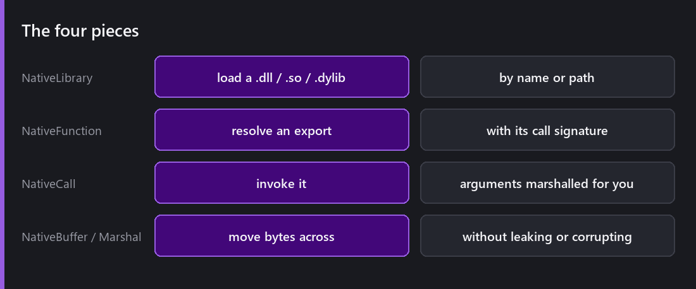
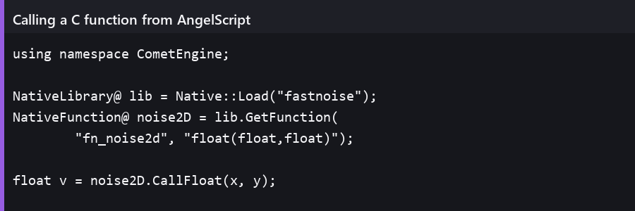
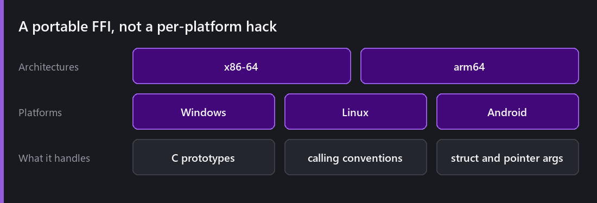
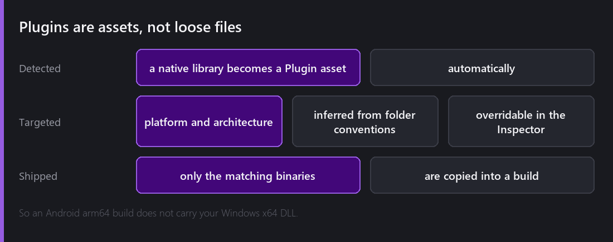

Every scripting language eventually needs an escape hatch. Somebody wants to use a physics solver you did not write, or a compression library, or a piece of hardware with a C SDK, and no amount of engine API will substitute.

2.8 added the hatch: AngelScript can load and call into a native `.dll`, `.so` or `.dylib`.

## The four pieces

`NativeLibrary` loads the library. `NativeFunction` resolves an export and pins down its call signature. `NativeCall` invokes it. `NativeBuffer` and the `Marshal` helpers move raw bytes across the boundary without leaking or corrupting them.

That is genuinely the whole surface. The design goal was that calling a C function should be about as much ceremony as calling an engine function, and mostly it is — the one extra thing you have to do is declare the signature, because a `.dll` export is just an address and nothing in the file tells you it takes two floats.

## A portable FFI, not a per-platform hack

The interesting engineering is underneath. Calling a C function whose signature you only learn at runtime means constructing a call frame by hand, and the rules for that differ by architecture — which registers hold which argument, how floats are passed, what the stack alignment must be, what happens to structs.

Comet ships a portable foreign function interface covering **x86-64 and arm64** across Windows, Linux and Android. That combination is what makes it usable on mobile, which is where a native library is most often the reason you needed one.

It is also the part I would advise treating with respect. A wrong signature does not throw a nice error — it corrupts a stack frame and crashes somewhere unrelated, which is exactly the class of bug the [migration away from C#]() was supposed to reduce. The FFI is a sharp tool by nature.

## Plugins are assets

This is the part that stops native libraries being a build-system nightmare.

Drop a native library into the project and Comet detects it as a **Plugin asset**. It has an inspector with platform and architecture targeting, and those settings are *inferred from folder conventions* — put an `arm64-v8a` build in a folder named for it and the importer works out what it is.

Then at build time, **only the plugins matching the destination platform and architecture are copied into the export**. An Android arm64 build does not carry your Windows x64 DLL. A web build carries none of them, because it cannot load any.

Without that, every project using a native library grows a hand-maintained copy step, and every platform bug becomes "did the right binary get copied?". With it, the answer is decided by data you can see in an inspector.

## When to reach for this

Honestly: rarely.

**Good reasons.** A mature library that would take months to reimplement — a solver, a codec, a format parser. Vendor SDKs for hardware. Genuinely hot code where the scripting layer is measurably the bottleneck, and you have profiled it rather than assumed.

**Bad reasons.** "Native is faster" as a general belief. It is faster per instruction and each call across the boundary costs something, so a native function called in a tight loop can easily be *slower* overall than the AngelScript one it replaced. Measure the whole loop, not the function.

**The one that catches people:** using it to avoid learning the engine API. If Comet already does the thing, the built-in path is the one that works on the web, gets debugged with the [script debugger](), and does not need a separate build per architecture.

## The web

Worth stating plainly because it comes up: **there is no native interop on the web.** A browser cannot load a `.dll`. If your game depends on a native library, it does not have a web build.

That is a real architectural decision, not an oversight, and it is the main reason I would think hard before making a native library load-bearing. Comet's whole platform story rests on the same project running everywhere, and a native plugin is the one feature that can break that promise.

If you need the library *and* the web, the answer is to compile it to WebAssembly and use it through the web build's own mechanisms — which is a different project, and one Comet does not do for you.

---

Next Wednesday: keeping what the player did. `SaveData` as a typed key/value store, binary saves with atomic writes, JSON when a human should be able to read it, and the compression, encryption and hashing that sit alongside them.

*Comments and questions welcome ;)*
