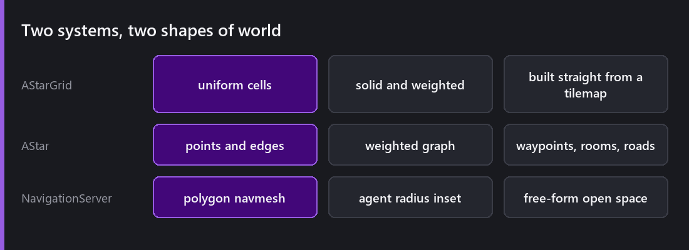
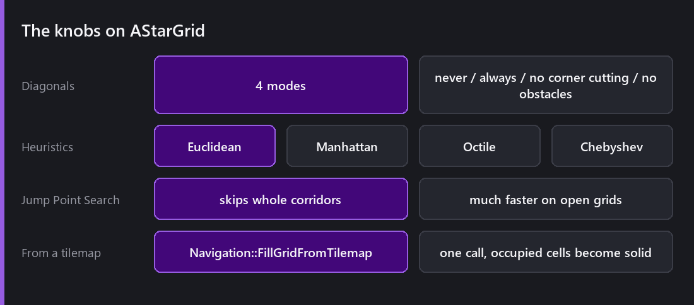
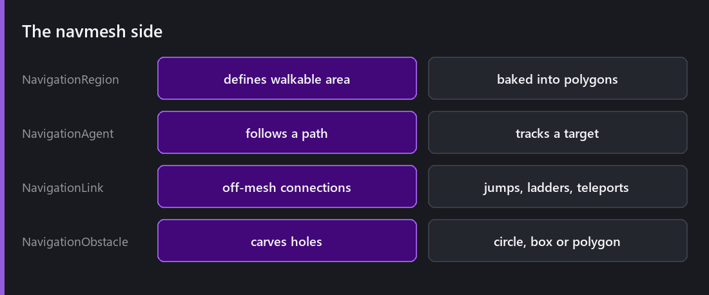
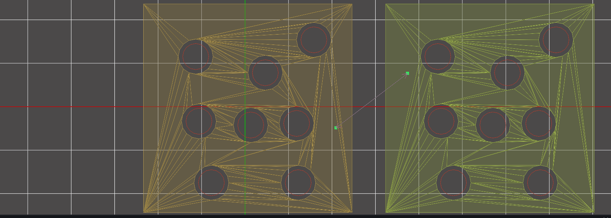
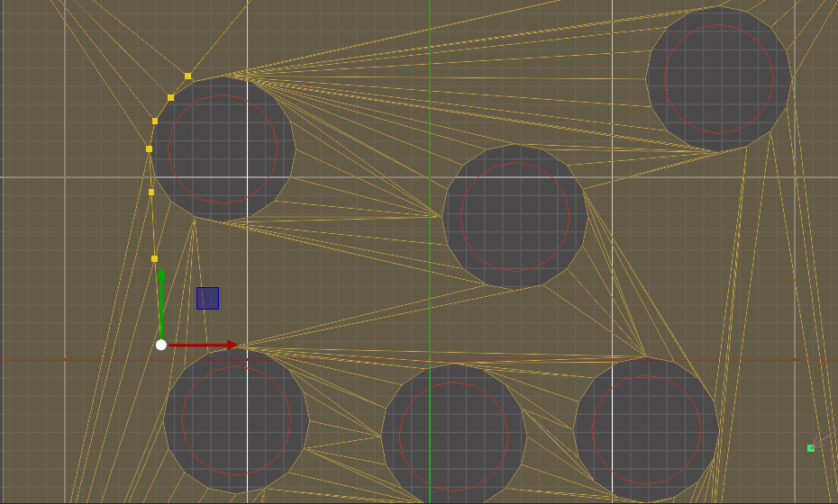
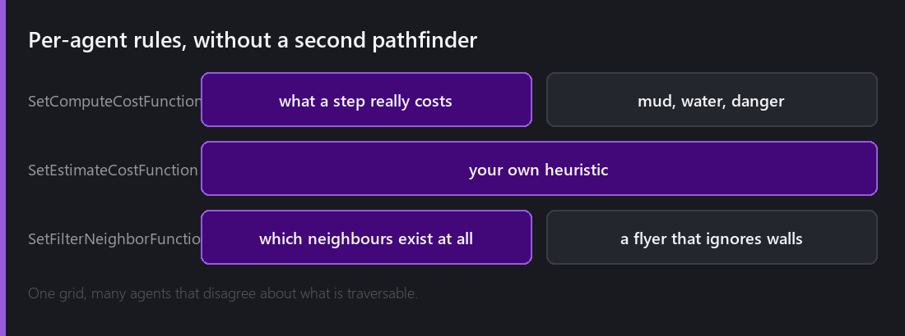

Pathfinding is one of those systems where the algorithm itself is the easy part. A* is short and well documented. What takes the time is everything around it: where the graph comes from, what happens when the world changes, and the fact that not every agent agrees about what is walkable.

2.8 added the whole system, and it has two halves, because 2D worlds come in two shapes.

## Grids, when your world is cells

`CometEngine::AStarGrid` is a uniform grid of cells, and each cell is solid, free, or free but expensive.

If your world is a [tilemap](), and in 2D it very often is, the grid already exists. `Navigation::FillGridFromTilemap` populates an `AStarGrid` directly from a tilemap's occupied cells. That is one call between having a level and having a pathfinding graph, with no separate authoring step and nothing to keep in sync.

The options matter more than they look.

**Diagonal modes**, and there are four of them. "Never" for grid-locked movement. "Always" for free movement. And two variants that refuse to cut corners: no diagonal movement through a gap between two solid cells, or no diagonals near obstacles at all. That distinction is the difference between an agent that walks through a wall corner and one that does not, and here it is a checkbox instead of a bug you have to hunt down.

**Heuristics**, which are Euclidean, Manhattan, Octile and Chebyshev. You want to match the heuristic to the movement you allow. Manhattan with diagonal movement enabled overestimates, and an overestimating heuristic makes A* stop being optimal, so it will find a path but not the shortest one. This is the most common way I have seen people get subtly bad paths.

**Jump Point Search** is the optimisation that matters on open grids. Instead of expanding every cell, JPS skips along straight runs and only considers cells where the path could meaningfully turn. On a large open map it is dramatically faster for identical results. On a maze it helps much less, because there are turns everywhere.

`CometEngine::AStar` is the same algorithm on an arbitrary weighted point-and-edge graph, for when your world is rooms and doors rather than cells.

## Navmeshes, when your world is not cells

For open, irregular spaces a grid is the wrong shape. You either make the cells small and pay for thousands of them, or make them large and lose precision.

The `NavigationServer` bakes walkable polygons instead, with an agent-radius inset so an agent never plans a path its own body cannot fit through. That inset is the thing most people forget when they write their own, because a path along a wall is only valid if you are a point.

There are four behaviours. **NavigationRegion** defines walkable area, **NavigationAgent** follows paths and tracks a target, **NavigationLink** connects places the mesh cannot, like a jump, a ladder or a teleporter, and **NavigationObstacle** carves holes with a circle, box or polygon.

Those are two regions, baked. The triangulation is the mesh the server actually searches, the circles punched out of it are obstacles, and the pair of green markers with a line between them is a NavigationLink bridging the gap the mesh cannot cross.

Obstacles are how you handle a door that closes or a crate that gets pushed, without rebaking the whole mesh.

Select an agent while the game runs and you get the path it is currently following, corner by corner. Notice that it does not hug the obstacle, because the agent-radius inset keeps the whole body clear of it.

## Agents that disagree

This is the part I am most pleased with, because it solves a problem that most pathfinding systems handle badly.

Say your world has a flying enemy that ignores walls, a heavy enemy that cannot cross the bridge, and a normal one. That is three different notions of traversable over the same world.

The usual answers are not good. Three separate graphs costs memory and gives you three things to keep in sync, and one graph plus filtering after the fact produces wrong paths rather than filtered ones.

In Comet each query can supply script callbacks: `SetComputeCostFunction` for what a step actually costs, `SetEstimateCostFunction` for the heuristic, and `SetFilterNeighborFunction` for whether a neighbour exists at all for this particular agent.

So you keep one grid. The flyer's filter accepts solid cells, and the heavy unit's cost function returns infinity on the bridge. Nothing is duplicated.

## What this costs

Pathfinding is the system most likely to spike a frame, because a path request is not incremental. It either completes or it does not.

Some practical advice. Do not path every agent every frame, stagger the requests instead, and reuse a path until the world or the target moves meaningfully. Prefer grids with JPS for open maps. Keep navmeshes coarse, because more polygons means more search.

And the one people miss is that a failed path is expensive. If the target is unreachable, A* explores the entire reachable set before it can conclude that. An enemy repeatedly pathing to a player behind a locked door can cost more than the whole rest of your AI. Check reachability cheaply first, or cache the failure.

## What is missing

There are no flow fields, so a hundred agents heading to the same place each compute their own path rather than sharing one.

There is no local avoidance in the navigation system itself. Agents follow paths but they do not steer around each other. RVO is in the dependency list and this is the gap I would close next.

There is no dynamic navmesh rebaking at runtime. Obstacles carve, but changing the geometry means a rebake.

---

Next Wednesday: the other end of the loop. Input, with actions instead of key codes, the generated wrapper, controllers including the strange buttons, and touch and pinch on mobile.

*Comments and questions welcome ;)*
