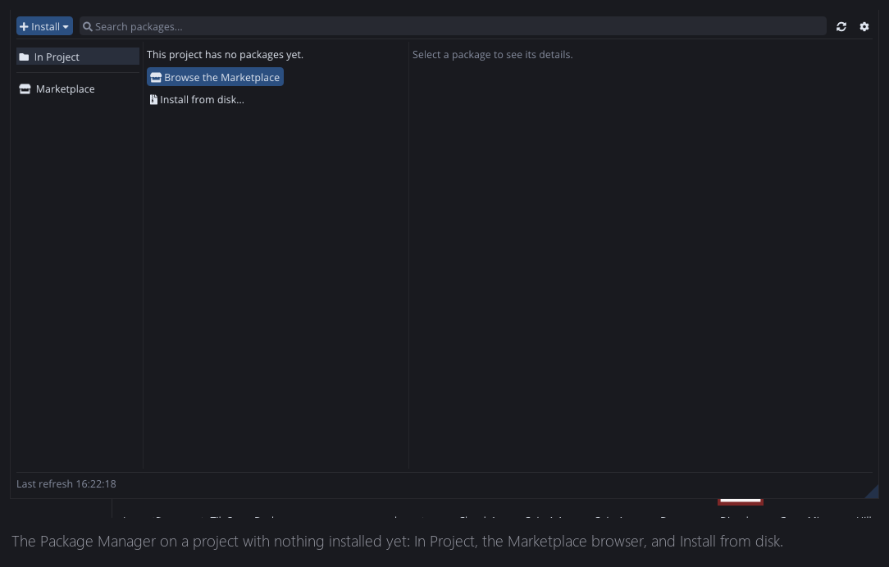
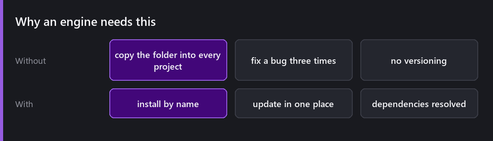
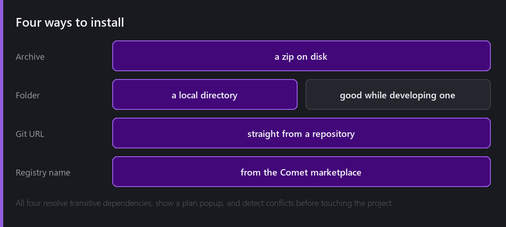
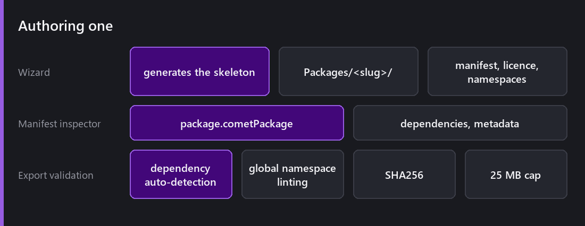

[Last week]() was about shipping content to players. This week is about sharing *code and assets between projects*, which is a different problem and one Comet ignored for a long time.

That is the Package Manager on a project with nothing installed. `Window → Package Manager` gives you **In Project**, **Updates**, **Errors** and an integrated **Marketplace** browser onto the Comet registry.

## Why an engine needs this

Without a package system, sharing anything between projects means copying a folder. Then you fix a bug and have to remember which three projects have the copy. Then two of them have diverged and you cannot tell which version is which.

I did that for four years. The camera controller I use in every prototype existed in six slightly different states, and "which one is the good one" was a real question I could not answer.

## Installing

Four sources: a local **archive**, a local **folder**, a **git URL**, or a **registry name** from the marketplace.

The folder option is the one I use most while developing a package. I point a project at the working directory and iterate without publishing anything.

All four go through the same resolution: **transitivity** (a package's own dependencies are pulled in), a **dependency plan popup** showing exactly what is about to be installed and why, and **conflict detection** when two packages want incompatible versions of the same thing.

Showing the plan before acting matters. Package managers that silently resolve a graph and then leave you to work out what happened are how projects get into states nobody understands.

## The Packages folder

Installed packages live in `Packages/` at the project root, next to `Assets/`. Not inside it, which is deliberate: `Assets/` is yours, `Packages/` is other people's, and the split means you can delete and reinstall the second without worrying about the first.

Packages are **read-only** in the editor. Trying to import into one is refused rather than silently allowed, because a local edit to an installed package is a change you will lose on the next update and not notice.

## Authoring one

The **creation wizard** generates the whole skeleton under `Packages/<slug>/`: manifest, licence file, namespace layout, runtime assembly, and the hidden folders the tooling expects. Getting the structure right by hand is the kind of thing that is easy to get subtly wrong, and a wizard removes the question.

The manifest is `package.cometPackage`, with a dedicated inspector.

Then **export validation**, which is the part that earns its keep:

- **Dependency auto-detection.** It works out what your package actually references, so you cannot publish something that only compiles because of an asset sitting in the project you developed it in.
- **Global namespace linting.** A package that dumps names into the global namespace will collide with somebody. It tells you.
- **SHA256** for integrity.
- **A 25 MB cap.** Deliberate: packages are for code and small assets, not for shipping art libraries.

The dependency auto-detection is the one that has saved me. "It works in my project" is the default state of every package before it is published, and only a tool can tell you why.

## What I would tell someone publishing

**Install it into an empty project before you publish.** That is the only test that means anything, and it is exactly what the validation cannot fully do for you.

**Namespace everything.** One global `Utils` class in a published package is antisocial in a way you will not notice and everyone else will.

**Version honestly.** If you break an API, say so in the version. The dependency resolver can only protect people if the numbers mean something.

## Where this is thin

**The registry is young.** A package manager is only as useful as what is in it, and that is a chicken-and-egg problem no amount of engineering solves.

**No package-level tests.** There is no way to say "run this package's checks before publishing", so validation is structural rather than behavioural.

**Updates are all-or-nothing.** You take the new version or you do not; there is no partial adoption or side-by-side install.

None of that is a reason not to use it. All of it is on the list.

---

Next Wednesday: the platform that started all of this. Shipping to the web: Emscripten, ASYNCIFY, and an honest list of what a browser does not get and what Comet does instead.

*Comments and questions welcome ;)*
