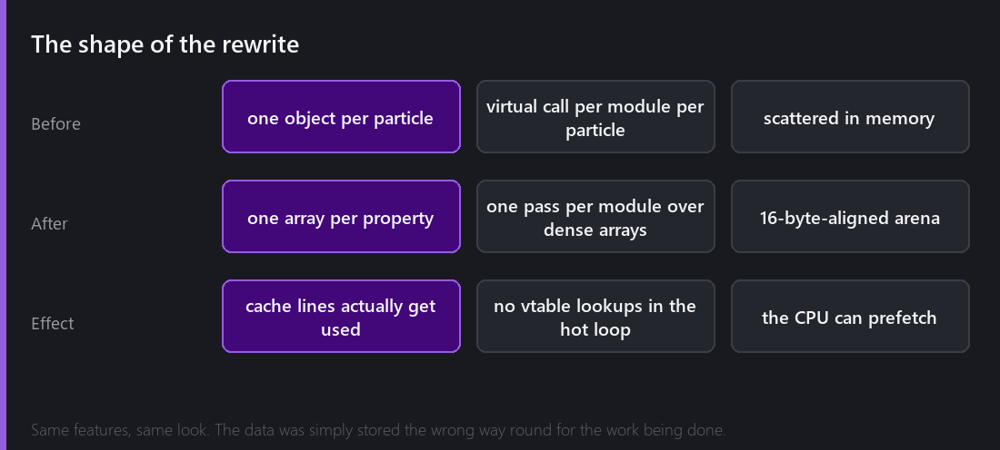
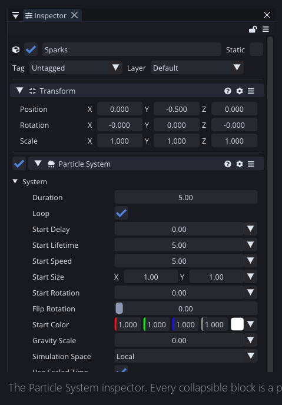
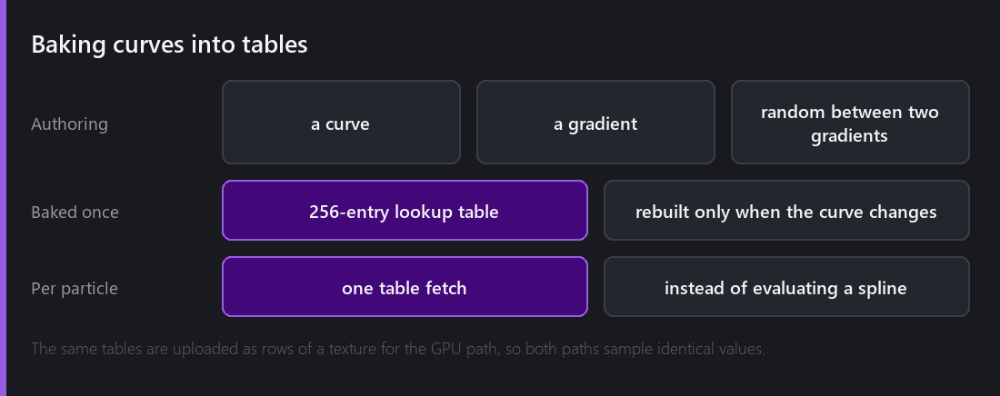
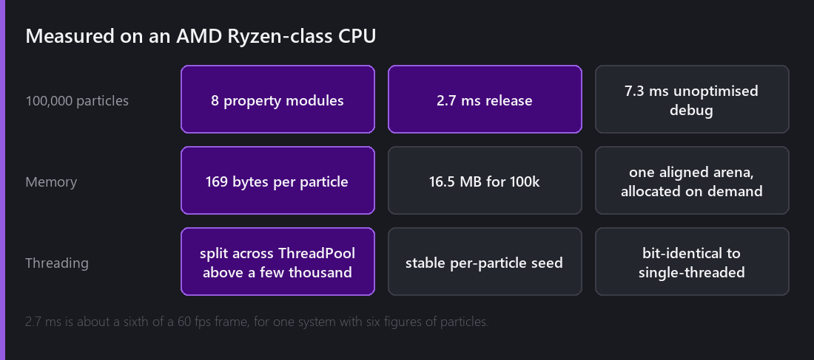

The old particle system worked. It had emission, shapes, lifetime, velocity, forces, size and colour over lifetime, rotation and texture animation, everything you would expect. It also fell over somewhere around eight thousand particles, and I could never quite explain to myself why.

When I finally sat down with it, the answer was not any single slow function. It was that the data was stored the wrong way round.

## One object per particle

The original design was the obvious one. A particle is a thing, so a particle is an object. Position, velocity, colour, size, rotation, age and lifetime, all in one struct, one per particle, in a list.

Then each frame, for each particle, you walk the property modules and let each one update that particle.

Two things about this are bad.

**The virtual call.** Each property module is polymorphic, so "let each module update this particle" is a virtual call per module, per particle, per frame. With eight modules and ten thousand particles that is eighty thousand indirect calls a frame, none of which the CPU can predict.

**The memory layout.** The velocity module only cares about position and velocity. But position and velocity are embedded in a struct next to colour, size, rotation and everything else. So every cache line the CPU pulls in contains mostly data this module will not touch. You are paying full memory bandwidth to use a fraction of it.

## One array per property

The rewrite inverts it. Instead of one array of particle objects there is one array per property: an array of positions, an array of velocities, an array of colours. A structure of arrays.

Now the velocity module is a single pass over two dense, contiguous arrays. There are no virtual calls inside the loop, and every byte the CPU loads is a byte the loop actually uses. The hardware prefetcher, which was useless before, now predicts the whole access pattern correctly.

It is the same features and the same look. Nothing about what the system does changed.

Every collapsible block in that inspector is a property module, and each one is now one pass over the pool instead of a participant in a per-particle loop.

## Baking the curves

The second big win was curves.

Comet lets you author values as curves and gradients over a particle's lifetime, so size ramps up, colour fades out, or you get a random pick between two gradients. Evaluating a spline is not expensive on its own, but doing it per particle, per property, per frame adds up fast.

So they are baked. When a curve changes it is sampled once into a **256-entry lookup table**. Per particle, evaluating "what size am I at 43% of my life" becomes an array index.

The rebuild only happens when the curve actually changes, which in practice means once at author time and never during play.

This also turns out to be the thing that made GPU simulation possible later, because those same tables upload as rows of a texture, so the CPU and GPU paths sample identical values rather than approximately similar ones. I did not plan that, I just got lucky.

## Threading, without breaking determinism

Above a few thousand particles a pass splits across the `ThreadPool` workers.

That introduces an obvious hazard. Particle systems use randomness, like random start speed, random lifetime, or a random colour between two gradients. If randomness comes from a shared generator, then the order the threads happen to run in changes which particle gets which number, and the same scene produces different results on different runs.

The fix is that update-time randomness derives from a **stable per-particle seed**. Particle 4,812 gets the same random sequence regardless of which thread processes it or when. A threaded step is bit-identical to a single-threaded one.

I think that property is more useful than it looks at first. It means the web build, which is single-threaded because Emscripten has no threads, produces exactly the same particle behaviour as the desktop build.

## The numbers

**100,000 particles with eight property modules enabled step in 2.7 ms** in a release build on an AMD Ryzen-class CPU. In an unoptimised debug build it is 7.3 ms, which is a useful reminder about where you measure.

2.7 ms is roughly a sixth of a 60 fps frame budget, for one system carrying six figures of particles.

Memory is **169 bytes per particle** in a single 16-byte-aligned arena, so 16.5 MB for 100,000. It is allocated on demand up to `Max Particles`, so a system configured for a million particles that only ever runs a hundred does not reserve the space.

One detail I am fond of is that the pool is kept age-ordered, so particles dying at the front of the window cost no data movement at all. The common case, the oldest particles expiring first, is free.

## What I would tell myself

Two things, if I could go back to the version of me who wrote the first system.

**The naive layout is a design decision you are making by default.** One object per particle is already a choice about memory layout, it is just an invisible one, so it is not something you can put off as premature optimisation.

**Measure before rewriting, but measure the right thing.** I spent a while optimising individual property modules before understanding that the cost was structural. Every one of those local optimisations was real, and together they bought maybe 15%. The layout change bought an order of magnitude.

---

Next Wednesday: 2.7 ms is good, and it is still the CPU doing work the GPU could do instead. Three compute kernels, an alive list compacted with a prefix sum, a draw call that never learns how many particles exist, and the rule that keeps the same project running on hardware with no compute at all.

*Comments and questions welcome ;)*
