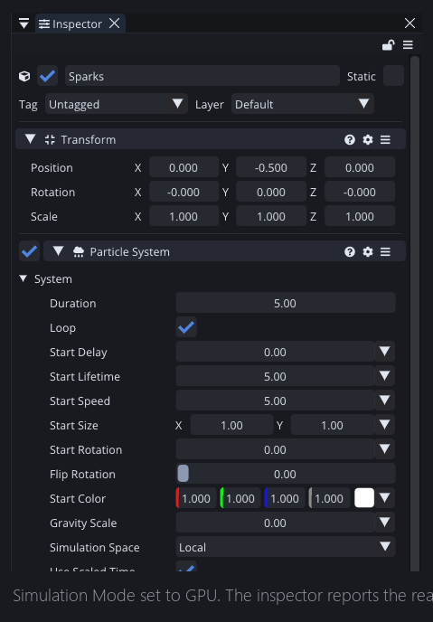
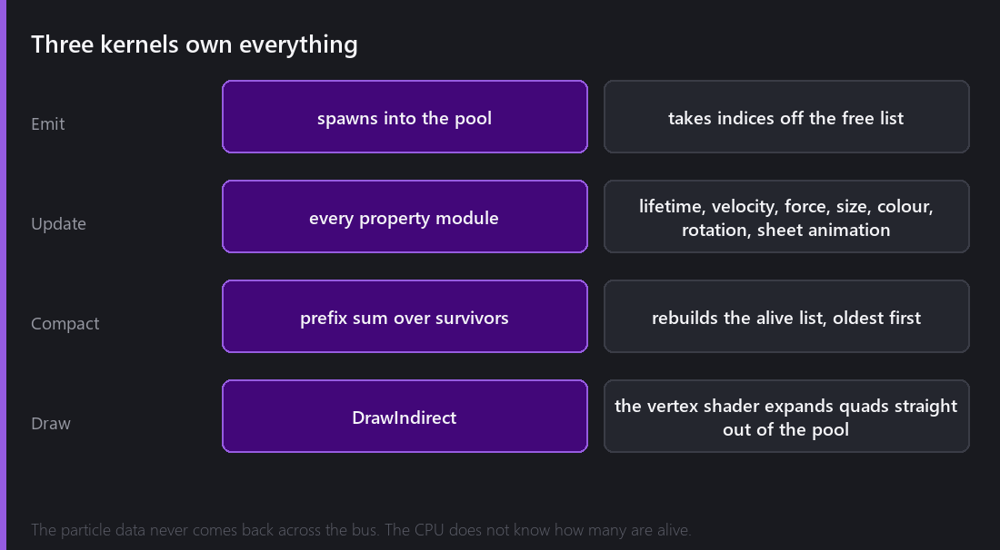
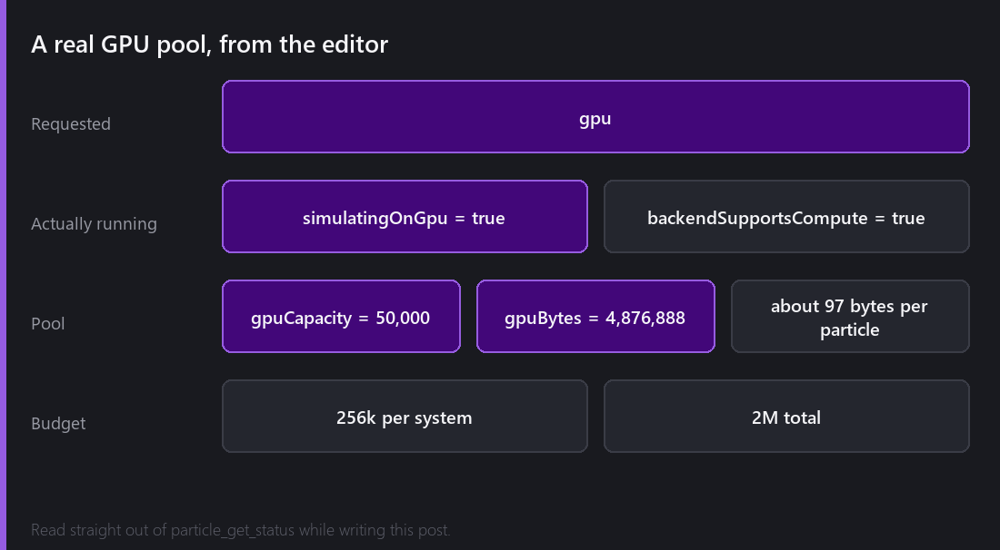
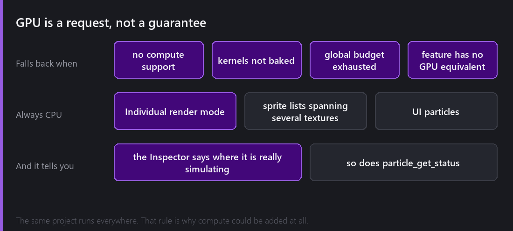

[Last Wednesday]() ended at 100,000 particles in 2.7 ms on the CPU. That is a good number. It is also 2.7 ms of a CPU doing arithmetic on arrays, which is the kind of work a GPU is built for.

So 2.8 added a **Simulation Mode** dropdown. Set it to GPU and the entire simulation moves.



## Compute shaders, briefly

If you have not written one, a compute shader is a program that runs on the GPU but does not draw anything. There are no vertices and no pixels, just "run this function a hundred thousand times in parallel, here is a buffer, do maths on it".

That is an almost perfect description of a particle update. Every particle does the same arithmetic on different data, and no particle depends on any other.

Comet exposes compute through the render hardware abstraction, gated behind `IRenderHardware::SupportsCompute()`. It is available on Vulkan and on desktop OpenGL 4.3+. It is **not** available on OpenGL ES or on the web, and that constraint shapes everything below.

## Three kernels



**Emit** spawns new particles, taking indices off a free list held on the GPU.

**Update** runs every property module: lifetime, velocity, forces, limit velocity, size, colour and rotation over lifetime and by speed, texture sheet animation. All of it, in one dispatch.

**Compact** is the interesting one. After an update, some particles died. The survivors need to be gathered into a contiguous alive list, and the naive way, where each thread atomically appends itself, produces a list in whatever order the atomics happened to land. That order is essentially random and it changes every frame.

Comet instead compacts with a **prefix sum**, which preserves order. The alive list stays sorted oldest-first, deterministically.

That one decision buys two things. **Force Respawn** mode can recycle the actual oldest particle, because it knows which one that is. And both CHUNK sort modes become free, since sorting front-to-back or back-to-front is just walking the alive list forwards or backwards.

**Draw** is a single `DrawIndirect`. The vertex shader reads the particle pool and the alive list and expands each entry into a quad on the fly.

## What that last part means

The draw arguments, including how many particles to draw, live in a GPU buffer written by the compute kernels. The CPU issues one indirect draw call and never learns the count.

No particle data is read back. Nothing crosses the bus in the wrong direction. The CPU's entire per-frame involvement with a GPU-simulating system is to dispatch three kernels and issue one indirect draw.

This is why the counts get absurd. The budget is **256,000 particles per system and 2 million in total**, and those are budget numbers rather than performance cliffs.

## Real numbers, from writing this post

I set a system to GPU mode with a 50,000 particle maximum while preparing these images, and asked the editor what it was actually doing.



```
requestedMode        = gpu
simulatingOnGpu      = true
backendSupportsCompute = true
gpuCapacity          = 50000
gpuBytes             = 4876888
```

50,000 particles in **4.88 MB**, about 97 bytes each, against 169 bytes on the CPU path. The GPU layout is tighter because several CPU-side bookkeeping fields have no equivalent when the pool manages itself.

That readout comes from the `particle_get_status` tool, and the same information is shown live in the Inspector, which matters for the next section.

## GPU mode is a request



The whole feature rests on one design decision. **Setting Simulation Mode to GPU tells Comet that you would like the system to run on the GPU.** It does not guarantee that it will.

A system silently keeps simulating on the CPU when:

- the backend has no compute support, so OpenGL ES, WebGL or older desktop GL
- the compute kernels were not baked into this build
- the global GPU particle budget is already spent
- the system uses an authoring feature the kernels cannot reproduce faithfully

The word to pay attention to in that last one is "faithfully". The kernels might be able to produce something close, but if a GPU path would produce a slightly different result from the CPU path, Comet takes the CPU path. A particle effect that looks different on a phone than on a desktop is a bug you will find at the worst possible moment.

Three things always stay on the CPU:

- **Individual render mode**, which depth-sorts every particle against the other renderers in its layer. That needs positions back on the CPU each frame, which defeats the whole point. Use Chunk, which now sorts on the GPU for free.
- **Sprite lists whose frames span more than one texture.**
- **UI particles.**

And the system tells you. The Inspector reports where it is really simulating, not what you asked for. Without that I do not think a silent fallback would be acceptable.

## Was it worth it?

For most 2D games, honestly, no. If your biggest effect is two thousand particles, the CPU path handles it in well under a millisecond and the GPU path adds nothing.

It was worth it for two reasons. Ambient effects at counts that were previously impossible, like rain across a whole level, a snowfield, or a hundred thousand drifting embers, are now cheap enough to just leave running. And building it forced compute and indirect drawing into the render hardware abstraction properly, which is infrastructure everything else can now use.

---

Next Wednesday: how you find out any of this. The profiler, with flame graphs, deep script profiling down to individual branches, auto-stop on a frame spike, and attaching the editor's profiler to a game running as a standalone build.

*Comments and questions welcome ;)*
