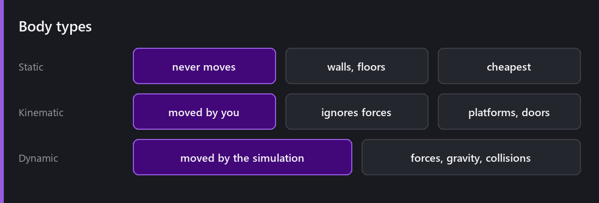
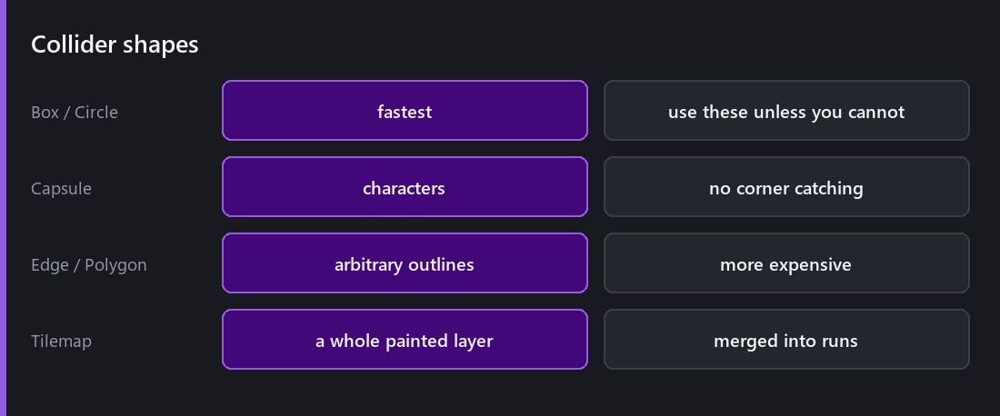
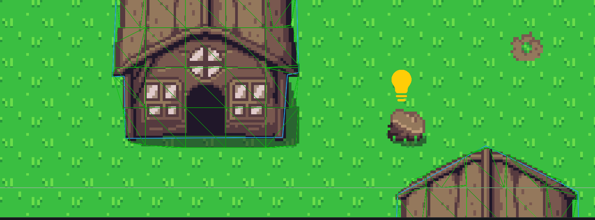
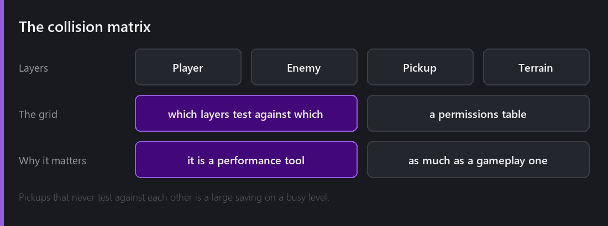
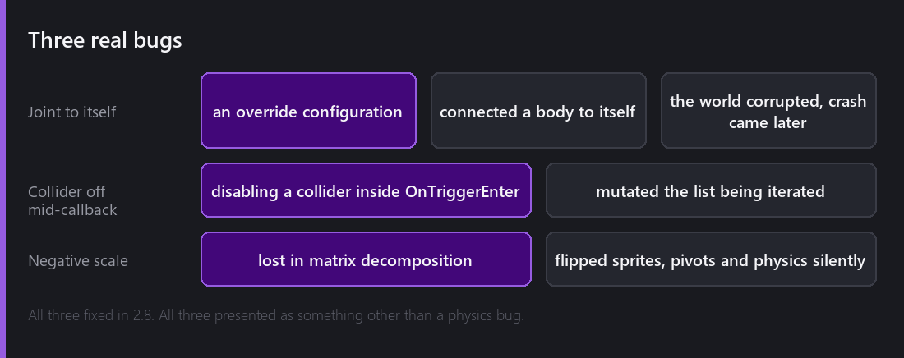

Comet uses **Box2D 3.x** for physics. I did not write a physics engine and I am not going to write one. Box2D is twenty years of accumulated correctness about a genuinely hard problem, and my job is to wrap it well.

So this post is mostly about the wrapping. What Comet exposes, which decisions are left to you, and where I found the sharp edges.

## Bodies and shapes

There are three body types, and picking the right one is most of your performance budget. **Static** never moves, so it is for walls and floors, and it is by far the cheapest. **Kinematic** is moved by your code and ignores forces, so it is for moving platforms, doors, anything on rails. **Dynamic** is simulated.

The common mistake is making level geometry dynamic just in case you need it later. A static body takes part in far less of the solver's work.

Shapes attach to bodies. Box and circle are the fastest and they cover most things. **Capsule** is the character shape. A box catches on tile corners in a way a capsule does not, and that alone fixes a whole class of platformer bug. Edge and polygon are for arbitrary outlines and they cost more. And a [Tilemap Collider]() turns a whole painted layer into merged runs.

That is a Tilemap Collider on the buildings layer, with **Draw All Colliders** turned on so the scene view shows every collider instead of only the one on the selected entity. The blue outline is one merged shape per building, not one box per painted cell.

2.2 fixed capsule editing, where dragging one handle moved all of them. That kind of bug makes the editor feel broken even when the runtime is fine.

## The collision matrix

Layers, plus a grid of which layers test against which. Player, Enemy, Pickup, Terrain, and a checkbox for every pair.

Most people treat this as a gameplay tool, so that bullets do not hit the player who fired them. It is also a performance tool. Every unchecked box is a set of pairs the broadphase never has to look at. On a level with three hundred pickups, saying that pickups do not collide with pickups removes about forty-five thousand potential pairs.

## Triggers, and the ordering trap

A collider marked as a trigger reports overlaps without resolving them, and you get `OnTriggerEnter`, `OnTriggerStay` and `OnTriggerExit`, plus the collision equivalents for solid contacts.

The trap is that you are inside the physics step while those callbacks run.

Disabling a collider inside `OnTriggerEnter` mutates the list the solver is iterating over. That crashed the editor until 2.8. Comet defends against it now, but the habit is still worth having. If a callback needs to destroy or disable something, mark it and act at the end of the frame. [Deferred destruction]() exists for this.

2.2 fixed the related case, a collision or trigger callback firing on an entity whose script had gone missing.

## Raycasts

`Physics::RaycastClosest` and `RaycastAny`, both with layer masks and distance bounds.

2.7.2 made both of them return `null` when there is no hit, instead of an object you had to inspect. It is a small API change but it helps, because now you cannot accidentally treat a miss as a hit. You have to check.

2.4 also fixed a default that had been wrong for a long time. The default `minDepth` for raycasts was positive when it should have been negative, so raycasts silently ignored anything behind the plane you would expect them to cover.

## Three bugs

These are worth telling because none of them looked like a physics bug.

**The joint that connected a body to itself.** A specific [InstanciableEntity override]() configuration produced a joint whose two ends resolved to the same body. Box2D does not expect that. The world got corrupted and the crash arrived several frames later in unrelated code, so every stack trace pointed at something innocent. I spent a week convinced the whole integration was broken. Fixed in 2.8, together with a crash when dragging a rigid body with the scene gizmos while a joint was attached.

**Negative scale.** Negative transform scale values were being lost during matrix decomposition, so a sprite flipped by scaling `x` to `-1` silently reverted. That broke sprite pivots, facing vectors and physics alignment at the same time, and it looked like four separate bugs in four separate systems. One fix in 2.8 closed all of them.

**The tilemap collider seam.** I covered this in the tilemap post, but it belongs here too. Per-tile collider boxes let a character catch on the boundary between two flat floor tiles, because shared edges at floating-point positions are not exactly equal.

What the three have in common is that physics bugs show up as timing and geometry weirdness a long way from the cause. The solver's state is global, and the corruption outlives the frame that caused it.

## What Comet does not do

Continuous collision is not on for everything by default, so fast small objects can tunnel unless you enable it where it matters. That is a Box2D setting I expose rather than a decision I made, and it is a real cost against benefit choice.

No 3D. That is obvious, but it is worth saying, because physics is the system where people most often expect an escape hatch. There is not one.

No soft bodies, no cloth, no fluids. Box2D is a rigid body solver.

---

Next Wednesday: the other system that touches everything, and the one people fight hardest. UI. Canvases, rect transforms, anchors explained until they click, and the 2.8 snapping guides that made laying one out bearable.

*Comments and questions welcome ;)*
