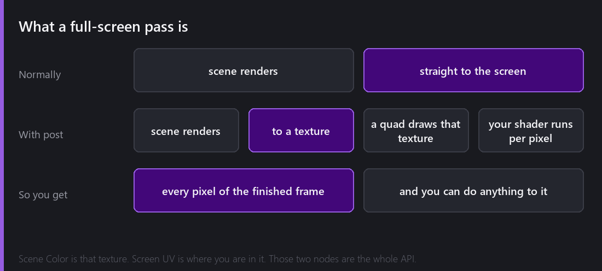
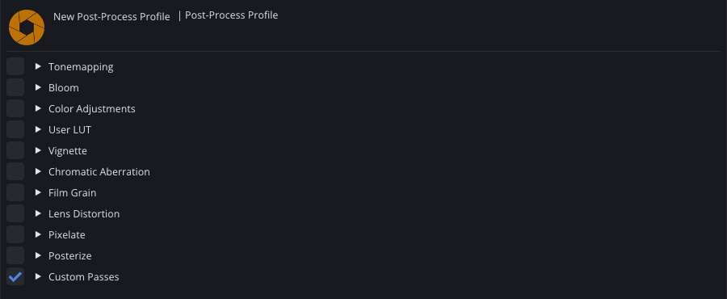
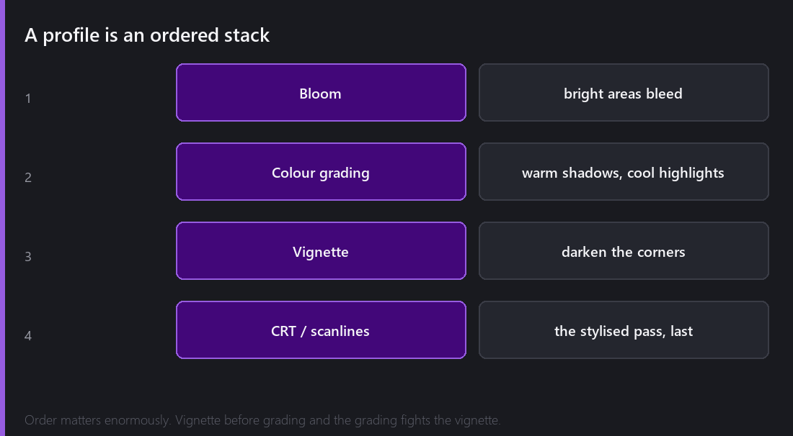
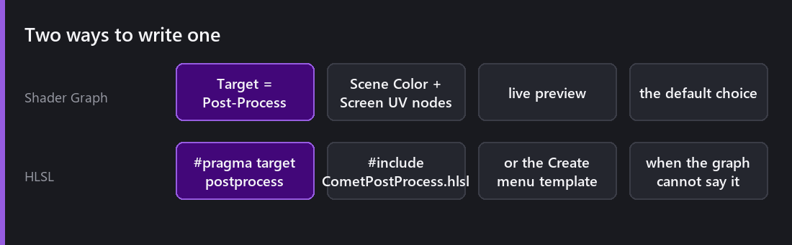
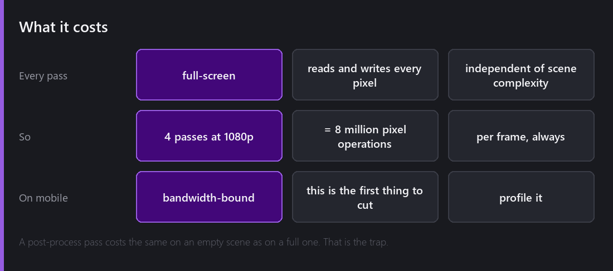

Everything in the rendering posts so far has been about drawing *things*. Sprites, tiles, particles, lights. This one is about what happens after all of that is finished and you have a complete frame sitting in a texture.

## What a full-screen pass actually is

Normally the scene renders straight to the screen. With post-processing enabled, it renders to a **texture** instead. Then a single quad covering the whole screen is drawn with that texture as its input, and your shader runs once per pixel.

That is the entire mechanism. It sounds almost too simple, and the consequence is the interesting part: at that moment you have every pixel of the finished frame available, and you can do anything you like with it. Blur it, tint it, distort it, sample neighbouring pixels, sample it twice at different offsets.

In Shader Graph, this is exposed as two nodes: **Scene Color**, which is that texture, and **Screen UV**, which is where you are inside it. That is the whole API surface.

## Profiles

Post-processing in Comet is configured through a **Post-Process Profile** asset — an ordered list of passes.

Every effect is a checkbox and a fold. Nothing is on until you turn it on, and **Custom Passes** at the bottom is where a shader you wrote yourself joins the same stack as the built-in ones.

Order matters more than people expect. A vignette applied before colour grading gets graded along with everything else, so your carefully warmed shadows now include an artificial dark ring you did not intend to warm. Applied after, it sits cleanly on top. Neither is wrong; they produce visibly different images, and you have to decide.

The way I build a profile: get the scene looking right unprocessed first, then add one pass at a time, and look at the frame after each. It is very easy to add five effects, decide it looks muddy, and have no idea which one is responsible.

## Writing your own

2.8 made custom passes a first-class thing, with two routes.

**Shader Graph.** Set the graph's Target to `Post-Process`. The master node changes to suit, and you get Scene Color and Screen UV alongside the entire standard node library. Everything from [last week]() still applies — exposed properties become knobs on the pass, so a `_Strength` float on your vignette is adjustable in the profile.

This is the route I use for almost everything, mainly because the live preview is so useful when you are tuning something visual.

**HLSL.** Write a `.hlsl` file with `#pragma target postprocess`, include `CometPostProcess.hlsl`, and you have the same inputs available as functions. There is a template under `Create → Shader → Post-Process` so you are not starting from a blank file.

The HLSL route wins when the effect needs loops — a proper multi-tap blur is a loop with a kernel, and expressing that as nodes is unpleasant.

## A CRT effect, roughly

To make it concrete, the classic stylised pass, as a graph:

**Curve the screen.** Take Screen UV, push it away from the centre proportionally to the squared distance from centre, and sample Scene Color at the curved coordinate. Now the image bulges like a tube.

**Scanlines.** Take the Y of Screen UV, multiply by the vertical resolution, feed into a sine, and multiply the colour by a value that dips slightly on alternate lines.

**Chromatic aberration.** Sample Scene Color three times at slightly different offsets and take red from one, green from another, blue from the third. The offsets should grow with distance from the centre.

**Vignette.** Darken by distance from centre.

Four passes, or one graph with four sections. Expose the strength of each and you have a knob for "how much CRT" that an artist can turn.

## The cost, which is the actual point of this post

Here is the thing that catches people, and it caught me.

**A post-process pass costs the same on an empty scene as on a full one.**

Everything else in a renderer scales with scene complexity. More sprites is more work; fewer sprites is less. Post-processing does not care. It reads and writes every pixel of the screen, every frame, regardless of what is in it.

At 1080p that is about two million pixels per pass. Four passes is eight million pixel operations, every frame, forever. On a desktop GPU that is comfortable. On a mid-range phone, where you are bandwidth-limited rather than compute-limited, reading and writing a full-screen texture four times is frequently the single most expensive thing your game does.

The practical consequences:

- **Profile on the target device**, not on your desktop. This is the effect category where desktop numbers mislead most badly.
- **Merge passes where you can.** Two effects in one shader read the scene texture once instead of twice. That is usually a bigger saving than optimising either effect.
- **Consider resolution.** Some effects — bloom especially — look fine computed at half resolution and upscaled. That is a 4× saving.
- **Make it a setting.** "Effects: low/medium/high" that removes passes is a legitimate and effective quality option.

## What Comet does not have

No temporal effects. Nothing that accumulates across frames — no motion blur that samples previous frames, no temporal anti-aliasing. That needs history buffers and motion vectors, which is a substantial system for a 2D engine.

No depth buffer to sample. This is a 2D renderer; there is no meaningful per-pixel depth, so depth-of-field and depth-based fog are not available in the way a 3D engine would offer them. You can fake a lot of it with sorting layers and separate passes, but it is faking.

And post-processing applies to the camera's output, so a UI canvas in overlay mode sits on top and is not affected. That is usually what you want — a vignette over your health bar is rarely the goal — but if you *do* want the UI graded too, it has to be a camera-space canvas rendering into the same target.

---

Next Wednesday we leave rendering for a while and go somewhere much more measurable: the particle system rewrite. One hundred thousand particles, eight property modules, and a 2.7 millisecond frame — starting from a system that used to allocate one object per particle.

*Comments and questions welcome ;)*
