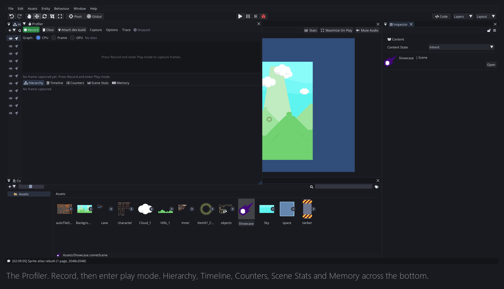
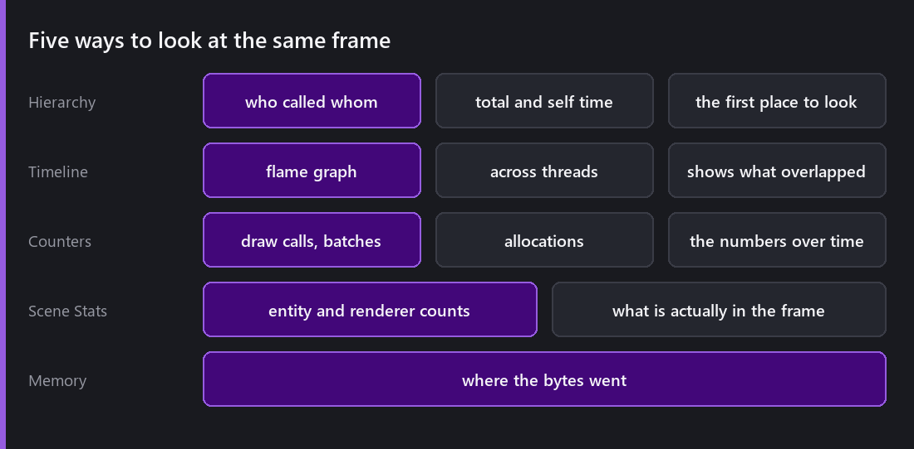
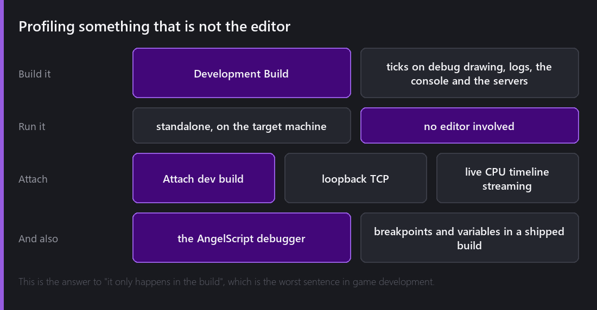

Every number in [the last two posts](), the 2.7 ms, the 169 bytes, the 4.88 MB, came from somewhere. This post is about the somewhere.

`Window → Profiler`. Press **Record**, enter play mode, and it captures every frame.

## Reading a frame

There are five views across the bottom, and each one answers a different question.

**Hierarchy** is where I start. It is a tree of what called what, with total time and self time. Total time tells you which subsystem is expensive, and self time tells you whether it is expensive by itself or just calling something that is. The gap between those two numbers is usually where the answer is.

**Timeline** is the flame graph. Same data, laid out horizontally, across threads. This is the view that shows you what overlapped, so you can see whether the render thread was genuinely working in parallel with the game thread or sitting idle waiting for it. The hierarchy view cannot answer that.

**Counters** are the numbers over time: draw calls, batches, allocations. Useful for spotting the frame where something spiked.

**Scene Stats** is what was actually in the frame, entity counts and renderer counts.

**Memory** is where the bytes went.

## Deep scripts

By default, script execution shows up as a single entry: your scripts took 3.1 ms.

That is fine until it is not. Turn on **Deep scripts** and the profiler descends into AngelScript itself, capturing individual script functions and following nested calls down through the branches.

It is expensive, and deep profiling changes the timings it is measuring, which is the eternal problem with instrumentation. So it is a mode you switch on when you already know scripts are the problem and you need to know which script.

The workflow that works for me is normal profiling to find out that scripts are 60% of the frame, then deep profiling to find out that it is one `Update` doing a linear search over every entity in the scene.

## Catching the frame you cannot reproduce

The hardest performance bugs are the intermittent ones. Everything runs at 60 fps and then once every thirty seconds there is a hitch, and by the time you have looked at the profiler the frame is gone.

Two features exist for exactly this.

**Auto-stop on frame spike.** Set a threshold, hit record and go play. When a frame exceeds the threshold, recording stops automatically with that frame captured. You come back to the machine and the evidence is waiting.

**Jump to worst frame.** From any capture, go straight to the slowest frame in it.

Between them, "it hitches sometimes" becomes something you can look at directly instead of something you try to reproduce.

Captures also **save and load** as binary trace files, and export to CSV. The trace files matter for two reasons: comparing before and after a change honestly, and being able to look at a capture from a machine that is not yours.

## Profiling something that is not the editor

Everything above profiles the game running inside the editor. That is a useful approximation, but it is not what your players get. The editor is drawing panels, running the scene view camera, holding editor-only data structures and generally doing a lot of work your shipped game does not do.

So the profiler can attach to a **development build** over loopback TCP.

You export the game with `Development Build` ticked, run it standalone, press `Attach dev build` in the profiler, and you get live CPU timeline streaming out of a real build. The same flame graphs, from the actual thing.

The AngelScript debugger attaches over the same channel, so you can also set breakpoints, step, and inspect variables in a running standalone build. There is a whole post about development builds in June.

This is the answer to "it only happens in the build", which used to be a horrible sentence to hear, because it meant your tools stopped working exactly when you needed them most.

## What I found in Comet with it

Three real ones, to be concrete.

**Play mode exit taking seconds.** It was not a frame-rate problem, it was a several-second freeze when you pressed stop on a large scene. The hierarchy view showed it immediately, and the entire cost was in scene restoration doing far more work than it needed to. 2.8 got it down to a fraction of a second, and it is the change that most improved how the editor feels day to day.

**Single-pixel texture writes.** A script writing one pixel triggered a full re-upload of the whole texture. Invisible at small sizes, catastrophic on a 2048×2048 atlas. The counters view showed the upload volume, and nothing about the frame rate suggested a texture problem.

**Tiles drawn twice.** Some tilemap tiles were being submitted twice when a scene had more than one camera. It was not slow enough to notice, and it was clearly wrong once the draw call counter did not match the arithmetic.

I would not have found any of those three by watching the frame rate, which is why I try to profile as a habit and not only when something is already broken.

## What it does not do

The GPU side is thinner than the CPU side. You get GPU frame timing and the flame graph shows GPU work, but nothing approaching what a vendor tool like RenderDoc or Nsight gives you. For "which draw call is expensive and why", those are still the right answer, and Comet is not trying to replace them.

What the built-in profiler is for is the question they are bad at, which is where my frame went across gameplay, physics, scripts, rendering and everything else, in a build I can actually ship.

---

Next Wednesday, something lighter for December: sound. SoLoud, the redesigned mixer, effects, and what 3D audio means in a game that does not have a third dimension.

*Comments and questions welcome ;)*
