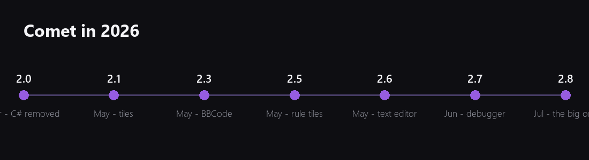
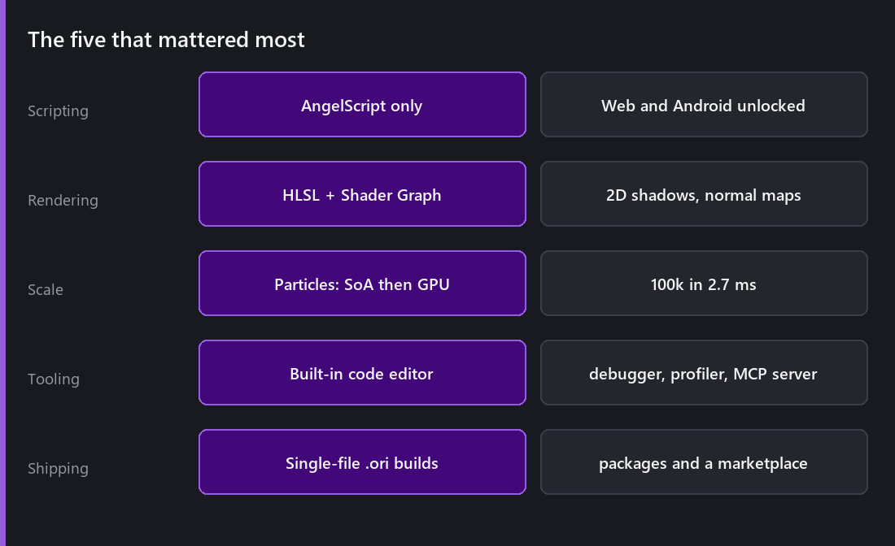
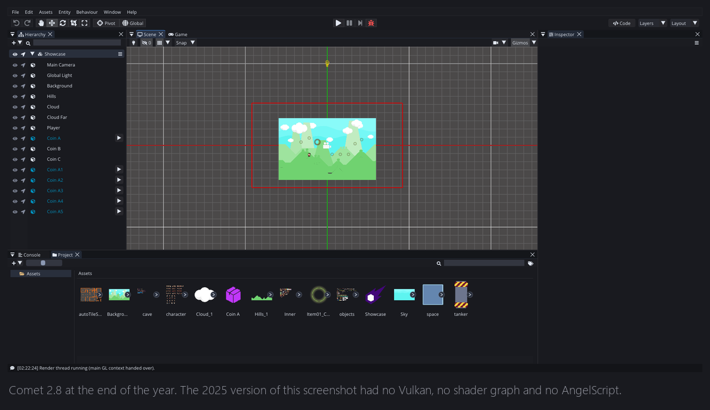
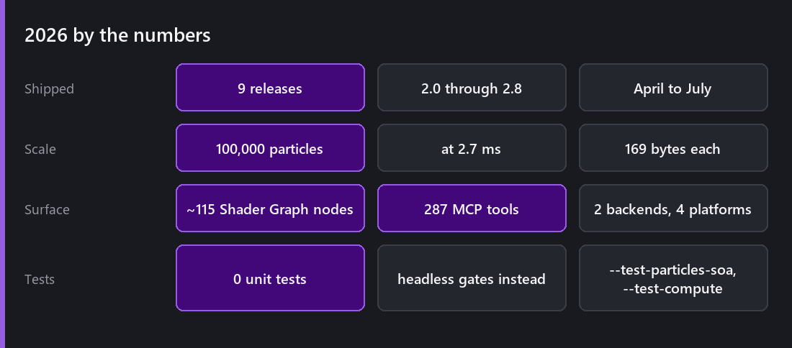

Last Wednesday of the year, so it is time to be honest about it.

## What shipped

Nine releases: 2.0 in April, then 2.1, 2.2, 2.3, 2.4, 2.5, 2.6, 2.7 and 2.8 across the following four months. That is a faster cadence than I have ever managed, and it happened for a specific reason I will come back to.

**2.0 removed C#.** Nine months of work, 300 script files, and a hard break that made every existing project incompatible. In exchange, Comet gained the two platforms it could not otherwise have had. Everything else this year sits on top of that.

**2.8 was the largest release in the project's history.** HLSL shaders, Shader Graph, Visual Scripting, GPU particles, compute, a networking stack, multiplayer replication, the package manager and marketplace, single-file content packaging, native interop, the profiler, the MCP server, and a redesigned editor theme. Looking at that list now, it should have been three releases.

## The number I am most pleased with

**2.7 milliseconds for 100,000 particles**, eight property modules enabled, release build.

It is not that the number is impressive on its own, plenty of engines do more. It is what it replaced. The old system fell over at around eight thousand particles, and for a long time I assumed that was roughly where a CPU particle system lands. It was not a CPU limit at all. It was a data layout mistake I had made years earlier and never questioned.

That is the most useful thing I learned this year. Some slow things are slow because of a decision I took, not because of physics, and the fix was not a clever optimisation, it was noticing the decision.

## The worst bug

A joint that connected a physics body to itself.

It arrived through a specific InstanciableEntity override configuration, corrupted the Box2D world, and then crashed several frames later in a completely unrelated place. Every stack trace pointed at innocent code. I spent the better part of a week convinced the physics integration was fundamentally broken.

The runner-up is the InstanciableEntity save that wrote directly over the original file, so an interrupted save destroyed the asset. That one is worse in consequence and much less interesting to find, because the moment it happened to me the cause was obvious. It now writes to a temporary file and atomically replaces the original, which is a two-line change I should have made years ago.

## The best day

The evening the AngelScript layer compiled clean for the first time.

I described this back in [August](): five months of a console that was solid red, hundreds of errors, and no way to run anything because nothing runs until all of it compiles. Then one evening I fixed what I assumed was another of several hundred remaining errors, and the console printed nothing at all.

I really thought it had crashed.

## Some numbers

- **9** releases
- **~7,000** commits since February 2020
- **~115** Shader Graph nodes
- **287** MCP tools exposed by the editor
- **2** rendering backends, **4** target platforms
- **100,000** particles at 2.7 ms
- **169** bytes per particle on the CPU, **97** on the GPU
- **0** unit tests, and a growing set of headless test gates instead

## What I got wrong

**2.8 was too big.** Twelve major features in one release meant twelve features that got less individual attention than they deserved, and a changelog nobody could reasonably read. 2.9 will be smaller.

**I stopped writing.** This blog went quiet for fourteen months while I built. That felt productive and I now think it was a mistake, for a reason I did not expect.

## About writing the posts

Since restarting this blog in July I have written twenty-two posts, and every one of them found something.

The lighting post found that point light intensity behaves inconsistently between blend modes. The frame post made me re-examine batch breaking. Explaining the InstanciableEntity override rules out loud made me notice a case that the depth comparison handles by accident rather than by design.

I do not think this is a coincidence, and I do not think it is about writing in particular. Explaining a system to someone who does not already know it forces you to say what it is supposed to do, and then you go and check, and sometimes it does not do that.

For a solo project with no code review, that turns out to be the most reliable review process I have.

## 2027

Roughly, in order of confidence:

**More releases, smaller.** 2.8 taught me that.

**Consolidation over features.** A lot of 2.8 shipped as version one. Shader Graph needs better navigation for large graphs. Visual Scripting needs the same. The content system needs its rough edges filed down. None of that makes a good changelog line and all of it makes the engine better to use.

**Documentation.** This is the weakest part of the project. This blog helps, but a blog is not reference documentation.

**The in-editor AI assistant.** The MCP server was built with this in mind. The tool layer is deliberately independent of the protocol, so an assistant panel inside the editor drives the same tools an external client does. That is the piece I am most curious about.

Thank you to everyone who has been reading. Comments on these posts have already changed things in the engine, which is more than I expected when I started writing again.

See you in January.

*Comments and questions welcome ;)*
