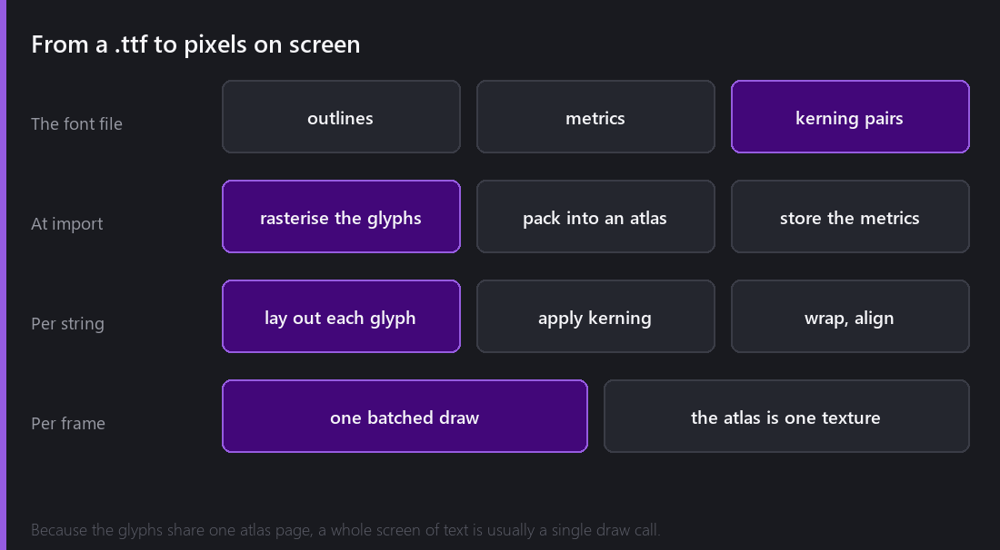
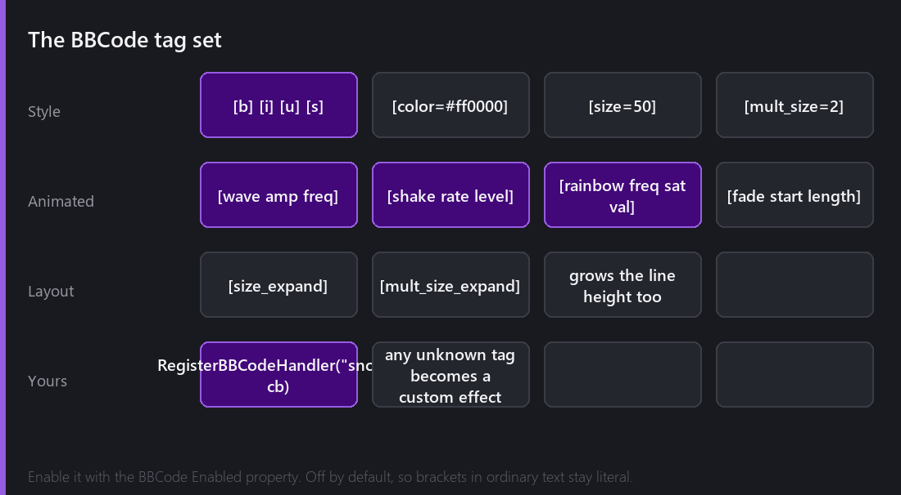
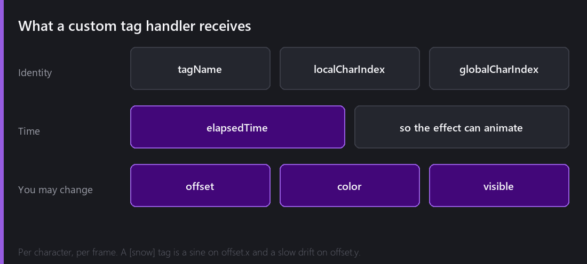

It is the week before Christmas, so this one is light, visual, and ends with me writing a `[snow]` tag.

Text is one of those systems that seems like it should be simple and is not. "Draw some letters" turns into font formats, glyph rasterisation, kerning, line breaking, alignment, atlases and rich text, and every one of those has a way to look subtly wrong.

## From a font file to pixels



A `.ttf` is not pictures of letters. It is outlines, metrics, and a table of **kerning pairs** — how much closer specific letter combinations should sit than their individual widths suggest.

At import, Comet rasterises the glyphs it needs and packs them into an **atlas**: one texture holding every character, with a lookup table of where each one lives. That single decision is why text is cheap — because the glyphs share one texture, a whole screen of text is usually one batched draw call.

Then per string, the layout walks the characters, places each glyph using its metrics, applies kerning, and handles wrapping and alignment.

Kerning is the detail that separates "text" from "text that looks right". Set the word *AVATAR* without it and the A-V pairs sit too far apart, leaving visible gaps. The `BehaviourText` behaviour uses the font's kerning table from 2.0 onward, and it is one of those fixes nobody notices and everybody would notice the absence of.

Comet also imports **`.fnt` bitmap fonts** as a `BitmapFont`, which is the right answer for pixel art — a hand-drawn font at a fixed size, no rasterisation, no smoothing, exactly the pixels the artist drew.

The font inspector shows the generated texture and every available glyph, which is genuinely useful when a character is missing and you are trying to work out whether it is a layout problem or a font problem.

## Rich text

A `Text` behaviour has style properties — bold, italic, underline, strikethrough — that apply to the whole string. Fine for a label. Useless for "this one word is red and shaking".

So there is **BBCode**, enabled per behaviour with the `BBCode Enabled` property. Off by default, so square brackets in ordinary text stay literal.



The static tags are what you expect: `[b]`, `[i]`, `[u]`, `[s]`, `[color=#ff0000]` (hex or named colours), `[size=50]`, `[mult_size=2]`.

`[size_expand]` and `[mult_size_expand]` do the same as their counterparts but also grow the line height to fit, which is the difference between a big word sitting comfortably and a big word overlapping the line above it.

The **animated** ones are where it gets fun:

- `[wave amp=2 freq=3]` — each character rides a vertical sine, offset by its index
- `[shake rate=15 level=2]` — random offsets, `rate` times a second
- `[rainbow freq=0.5]` — hue cycles along the string
- `[fade start=0 length=5]` — alpha ramps across a character range

Tags nest. `[rainbow][wave]hello[/wave][/rainbow]` waves and cycles at once.

## Damage numbers, which is what this is really for

The reason animated text exists is that games are full of text that needs to feel like an event rather than information.

A damage number that just appears is data. A damage number that appears with `[shake]` on a critical hit is *feedback*. Boss dialogue with a slow `[wave]` reads as otherworldly for free. A `[rainbow]` item name says "legendary" without a legend.

None of that needs a script. It is a string with brackets in it, which means a designer or writer can do it without touching code — and that is the actual win.

## Writing your own tag



Any tag Comet does not recognise becomes a **custom effect**. You register a handler from AngelScript:

```
RegisterBBCodeHandler("snow", @OnSnow);
```

The callback receives a `BBCodeHandlerData` per character per frame, carrying `tagName`, `localCharIndex`, `globalCharIndex`, `elapsedTime`, and three fields you are allowed to modify: `offset`, `color` and `visible`.

So `[snow]` is: drift `offset.y` downward with time, wrapping; add a slow sine to `offset.x` so it sways; nudge the colour toward white. Ten lines, and now every string in the game can snow.

```
void OnSnow(BBCodeHandlerData@ d)
{
    float t = d.elapsedTime + d.localCharIndex * 0.37f;
    d.offset.y -= (t % 2.0f) * 6.0f;
    d.offset.x += sin(t * 1.7f) * 2.0f;
    d.color = Color(1, 1, 1, 1);
}
```

Unregister it with `UnregisterBBCodeHandler` when you are done.

The design decision I am happy with here: unknown tags do not error. They become custom effects, so a handler that has not been registered yet renders as plain text rather than breaking the string. Text authored by a writer who does not know what has been implemented yet still displays.

## Text that fits

Two properties that solve the perennial problem of strings being longer than the box you drew for them.

**Auto font size** shrinks the text to the largest size that fits. Right for buttons, damage numbers, anything with a fixed frame.

**`autoContentSizeMode`** does the opposite: it resizes the `RectTransform` to fit the text, in width, height or both. Right for tooltips and dialogue boxes that should grow with their content.

Both matter enormously the moment your game is translated, because the German version of your UI string is reliably about a third longer than the English one.

## What is missing

No right-to-left support. Arabic and Hebrew need bidirectional layout, and that is a real project, not a flag.

No complex script shaping in the general case — HarfBuzz is in the dependency list and doing work, but I would not claim full coverage for scripts with heavy contextual forms.

No inline images in text. `[img]` is a tag I have wanted several times, for button prompts inside dialogue especially.

---

Next Wednesday is the last of the year, and traditionally the one where I look back honestly: what 2026 actually contained, the numbers, the best day, the worst bug, and what 2027 looks like from here.

*Happy holidays, and comments and questions welcome ;)*
