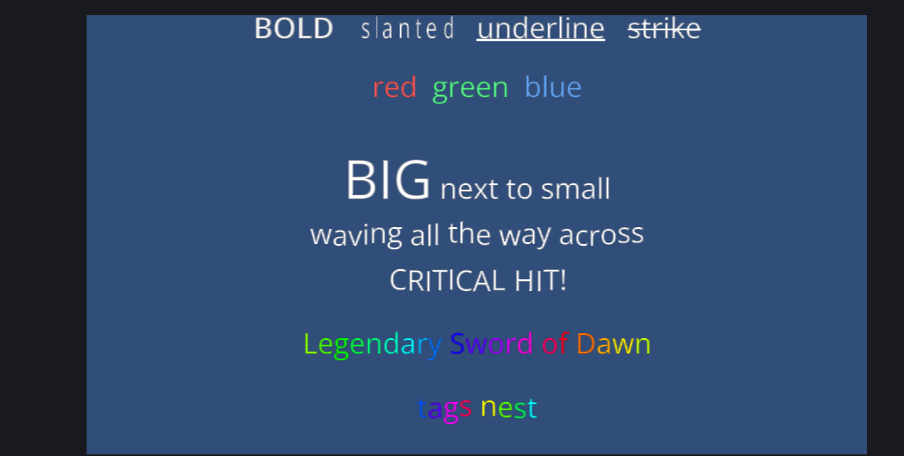

It is the week before Christmas, so this post is light and visual, and it ends with me writing a `[snow]` tag.

Text is one of those systems that looks like it should be simple and is not. "Draw some letters" turns into font formats, glyph rasterisation, kerning, line breaking, alignment, atlases and rich text, and every one of those has a way of looking subtly wrong.

## From a font file to pixels


A `.ttf` file does not contain pictures of letters. It contains outlines, metrics, and a table of **kerning pairs**, which say how much closer certain letter combinations should sit than their individual widths suggest.

At import time, Comet rasterises the glyphs it needs and packs them into an **atlas**: one texture holding every character, with a lookup table of where each one lives. That is why text is cheap. Because all the glyphs share one texture, a whole screen of text is usually one batched draw call.

Then, for every string, the layout walks the characters, places each glyph using its metrics, applies kerning, and handles wrapping and alignment.

Kerning is the detail that separates text from text that looks right. Set the word AVATAR without it and the A-V pairs sit too far apart, leaving visible gaps. The `BehaviourText` behaviour uses the font's kerning table from 2.0 onwards. It is the kind of fix nobody notices once it is there.

Comet also imports **`.fnt` bitmap fonts** as a `BitmapFont`, which is the right answer for pixel art. A hand drawn font at a fixed size, with no rasterisation and no smoothing, so you get exactly the pixels the artist drew.

The font inspector shows the generated texture and every available glyph, which is really useful when a character is missing and you are trying to work out whether it is a layout problem or a font problem.

## Rich text

A `Text` behaviour has style properties (bold, italic, underline, strikethrough) that apply to the whole string. That is fine for a label and useless when you want one word to be red and shaking.

So there is **BBCode**, enabled per behaviour with the `BBCode Enabled` property. It is off by default, so square brackets in ordinary text stay literal.




That is one `Text` behaviour per line with `BBCode Enabled` ticked, running in the editor. The wave and the shake are moving in the engine, and a screenshot can only catch them at one moment.

The static tags are what you expect: `[b]`, `[i]`, `[u]`, `[s]`, `[color=#ff0000]` (hex or named colours), `[size=50]`, `[mult_size=2]`.

`[size_expand]` and `[mult_size_expand]` do the same as their counterparts but also grow the line height to fit, so a big word sits comfortably instead of overlapping the line above it.

The animated ones are the fun part:

- `[wave amp=2 freq=3]`: each character rides a vertical sine, offset by its index
- `[shake rate=15 level=2]`: random offsets, `rate` times a second
- `[rainbow freq=0.5]`: hue cycles along the string
- `[fade start=0 length=5]`: alpha ramps across a character range

Tags nest. `[rainbow][wave]hello[/wave][/rainbow]` waves and cycles at once.

## Damage numbers

I built the animated tags because games are full of text that needs to feel like an event rather than like information.

A damage number that simply appears is data. Put `[shake]` on it for a critical hit and it starts to feel like feedback. Boss dialogue with a slow `[wave]` on it reads as something not quite human, and an item name with `[rainbow]` tells the player it is rare without saying so.

None of that needs a script. It is a string with brackets in it, so a designer or a writer can do it without touching any code.

## Writing your own tag


Any tag Comet does not recognise becomes a **custom effect**. You register a handler from AngelScript:

```
RegisterBBCodeHandler("snow", @OnSnow);
```

The callback receives a `BBCodeHandlerData` per character per frame, carrying `tagName`, `localCharIndex`, `globalCharIndex`, `elapsedTime`, and three fields you are allowed to modify: `offset`, `color` and `visible`.

So `[snow]` is not much work. Drift `offset.y` downwards with time and wrap it, add a slow sine to `offset.x` so it sways, and push the colour towards white. About ten lines, and now every string in the game can snow.

```
void OnSnow(BBCodeHandlerData@ d)
{
    float t = d.elapsedTime + d.localCharIndex * 0.37f;
    d.offset.y -= (t % 2.0f) * 6.0f;
    d.offset.x += sin(t * 1.7f) * 2.0f;
    d.color = Color(1, 1, 1, 1);
}
```

Unregister it with `UnregisterBBCodeHandler` when you are done.

There is one design decision here that I am happy with. Unknown tags do not throw an error. They become custom effects, so a tag whose handler has not been registered yet renders as plain text instead of breaking the string. A writer can use a tag that has not been implemented yet and the text still displays.

## Text that fits

Two properties for the old problem of strings being longer than the box you drew for them.

**Auto font size** shrinks the text to the largest size that fits. That is right for buttons, damage numbers and anything with a fixed frame.

**`autoContentSizeMode`** does the opposite. It resizes the `RectTransform` to fit the text, in width, height or both. That is right for tooltips and dialogue boxes that should grow with their content.

Both of them matter a lot the moment your game is translated, because the German version of your UI string is reliably about a third longer than the English one.

## What is missing

There is no right to left support. Arabic and Hebrew need bidirectional layout, and that is a real project, not a flag.

There is no complex script shaping in the general case. HarfBuzz is in the dependency list and it is doing work, but I would not claim full coverage for scripts with heavy contextual forms.

There are no inline images in text. `[img]` is a tag I have wanted several times, especially for button prompts inside dialogue.

---

Next Wednesday is the last post of the year, and that is normally the one where I look back honestly: what 2026 really contained, the numbers, the best day, the worst bug, and how 2027 looks from here.

*Happy holidays, and comments and questions welcome ;)*
