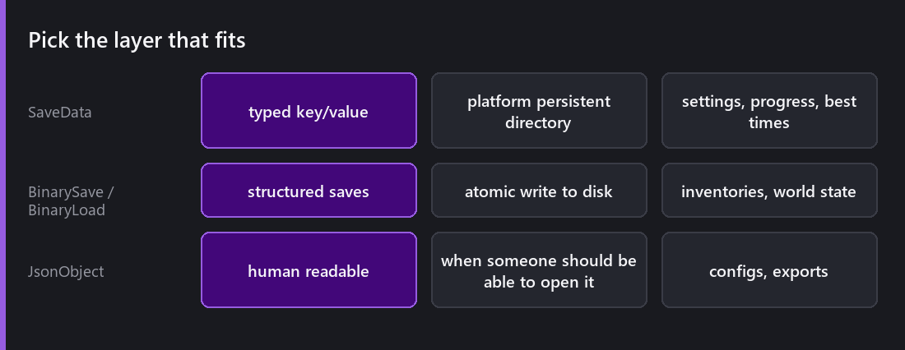
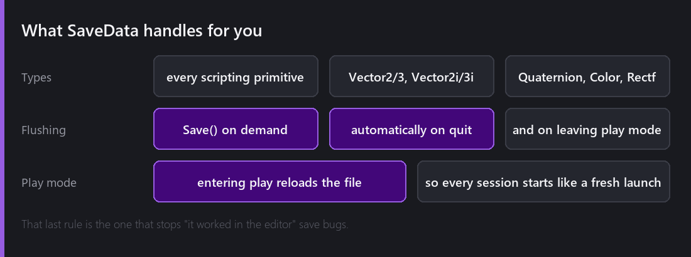
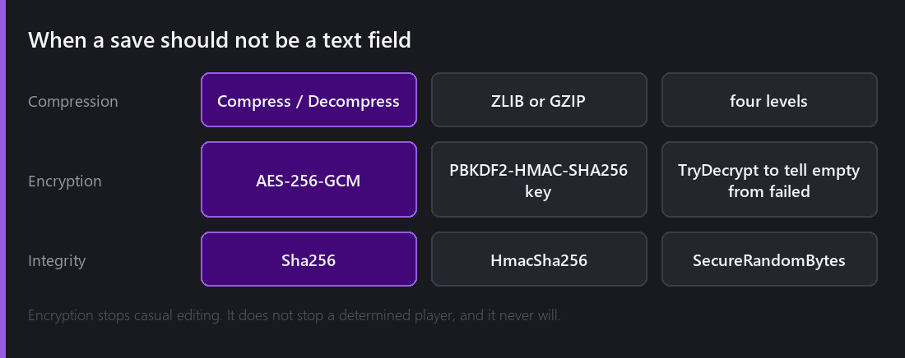

Saving is one of those systems that looks like an afternoon of work and turns into two weeks. Writing the file is the easy part. The parts that are not easy are where the file goes on four different platforms, what happens when the write gets interrupted, and what your save file does when you ship an update that changes the data.

Comet gives you three layers, and most of the work is picking the right one.

## SaveData, for the boring 80%

`CometEngine::SaveData` is a typed key/value store. `SetInt`, `GetFloat`, `SetString`, and typed accessors for every scripting primitive plus `Vector2` and `Vector3`, their integer variants, `Quaternion`, `Color` and `Rectf`. Scalar getters take a default, so reading a key that does not exist yet is not an error, it is the first run.

It writes JSON into the platform's persistent data directory, and that is most of the value for me. You do not have to think about where a save file lives on Android versus Windows versus the web, the engine knows.

Changes are held in memory and flushed on `Save()`, automatically when the game quits, and in the editor when you leave play mode.

There is one rule here that I am really happy with. Entering play mode reloads the saved file, so every play session starts exactly like a fresh game launch.

That sounds like a small detail, but it removes a whole category of bug. The one where your save logic seems to work for an hour because the values are still sitting in memory from the last time you pressed play, and then it fails the first time a real player launches the game cold. If it works in play mode in Comet, it worked from disk.

For settings, progress, unlocks, best times and "has the player seen the tutorial", this layer is all you need.

## Binary, for structured state

When you are saving an inventory, a world, or four hundred entities' worth of state, key/value stops being the right shape.

`BinarySave` and `BinaryLoad` give you typed `Set` and `Get` for all the primitives, strings and byte buffers, plus the engine math types. You write fields in order and you read them back in order.

The property that matters is that `Save` is atomic. It writes to a temporary file and replaces the original only once the write succeeded. An interrupted save, from a power loss, a crash, or a player force-quitting on mobile, leaves the previous save intact instead of a half-written file.

I care about this one for a specific reason. The [InstanciableEntity asset save]() did not do it until 2.8, and I destroyed one of my own assets finding that out. Doing it for player saves from the start was the one lesson I actually applied in advance.

## JSON, for when a human should read it

`CometEngine::Json::JsonObject` handles the cases where the file is not really a save, it is data. Level definitions, balance tables, exported debug state. 2.2 widened it to cover `Vector2i`, `Vector3i`, `Color` and friends, so engine types round-trip without marshalling them by hand.

My rule of thumb: if you would ever want to open the file in a text editor, or diff it in git, use JSON. If only the game is ever going to read it, use binary and get the size and the speed.

## Compression, encryption, and being honest about it

Three namespaces sit alongside the save layers.

`Compression` does ZLIB and GZIP at four levels, plus Base64. It is worth it on large binary saves and pointless on a settings file.

`Encryption` does authenticated **AES-256-GCM**, with the key derived by PBKDF2-HMAC-SHA256 over a random salt. It has `Encrypt`, `Decrypt`, and `TryDecrypt` with an explicit success flag, which is the one I would use. With that flag you can tell a truly empty plaintext apart from an authentication failure, and that is the difference between "the save is empty" and "the save has been tampered with". Conflating the two is a real bug.

`Crypto` gives you `Sha256`, `HmacSha256` and `SecureRandomBytes` from the OS entropy source.

Now the honest part. Encrypting a local save file does not stop a determined player and it never will, because the key has to be in the binary they are running. What it does stop is casual editing, the player who opens the JSON, changes `coins` to 999999, and then reports your economy as broken.

If the integrity of a value actually matters, for a leaderboard or anything competitive, it has to be validated on a server. That is not a Comet limitation, it is just how it works.

## Versioning, which nobody does until it hurts

Comet does not solve this one for you and I want to be clear about it.

The moment you ship an update that changes your save structure, every existing save is from the old version. `SaveData` degrades gracefully because a missing key returns its default. Binary saves do not. Read the fields in the wrong order and you get garbage.

So write a version number as the first field of every binary save, from day one, before you need it. It costs four bytes and it is what lets you migrate old saves instead of abandoning them.

---

Next Wednesday we start a month on building worlds. Tilemaps: grids, palettes, the painting tools, layering, and the collider merging that stops your character catching on invisible seams.

*Comments and questions welcome ;)*
