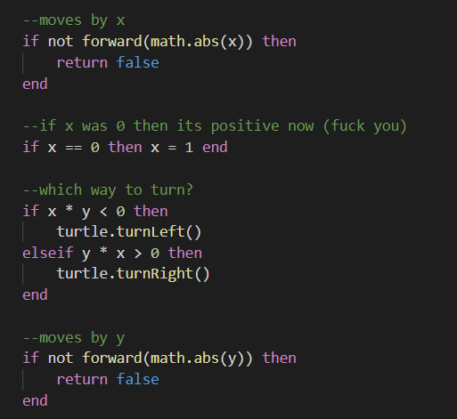
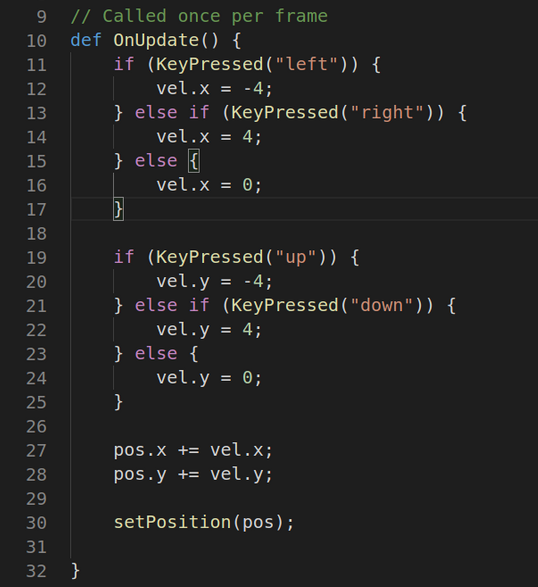
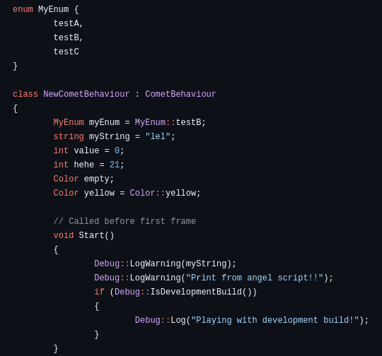
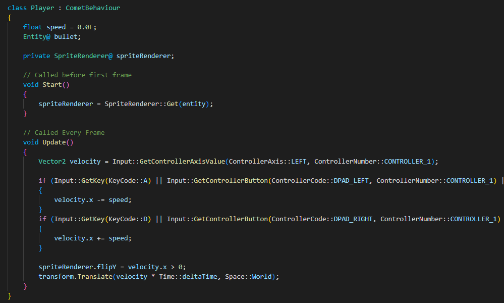
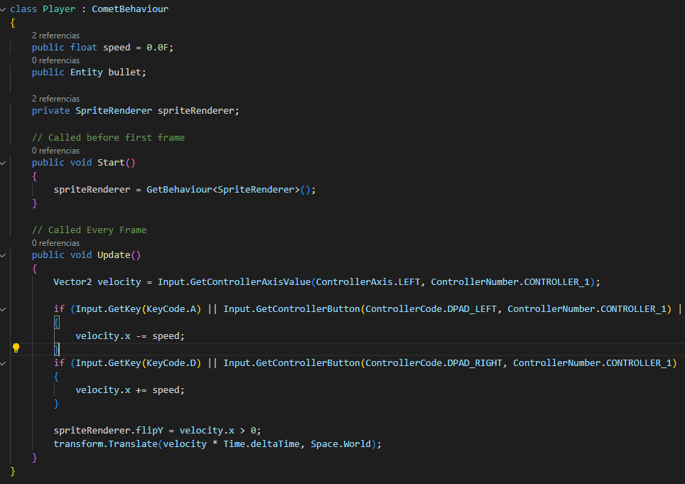

Comet Engine is currently using C# for the scripting system. C# is a really powerful programming language but I have found trouble when trying to export for Web and Android. That is why some weeks ago I started looking for a new scripting language more cross-platform friendly. 

After some research I gave a try to this three languages:
- [Lua](https://www.lua.org/about.html): It is one of the most known scripting languages and it is really easy to embed to a C++ application using [Sol3](https://github.com/ThePhD/sol2). After making a try to integrate this language I decided to look for another because Lua is not an object oriented language and I would like to find one that it is. 
This is how lua looks like:

- [Chaiscript](http://chaiscript.com/index.html): It is a javascript-like scripting language created to be embeded to C++ applications. I did also some testing using it and I was feeling really comfortable working with it, but after reading more about it I felt that it was not prepared to be exported to Web or Android even if some post said that it was possible. As the main purpose is to change to a cross-platform language I had to give up implementing this one. Chaiscript looks like this:

- [AngelScript](https://www.angelcode.com/angelscript/): It is a scripting language really similar to C# and also it could be compared to C++ as well. It is mainly used to be integrated to C/C++ applications. It is a object oriented language and it is compiled in byte code, so this makes this language to be type safety. Also the C++ library used to embed this language works almost the same way I used with C# with mono. This is the most important point because this will allow me to keep everything from my current scripting system and I just have to adapt some new things.

A few days ago I started adapting all the Comet Engine C# classes to Angelscript and even if the syntaxis is quite the same I think it will take me about 6 months to adapt the 300 C# script files to AngelScript. So I expect that just before the ending of 2025 I will be able to release a CometEngine_v2.0_Beta version.

Here it is a comparasion between the same script in C# and in AngelScript:

 

Once I will have all the AngelScript scripting integrated, I will take a look to export to Web and Android again. Let's see if AngelScript has been a good choice.