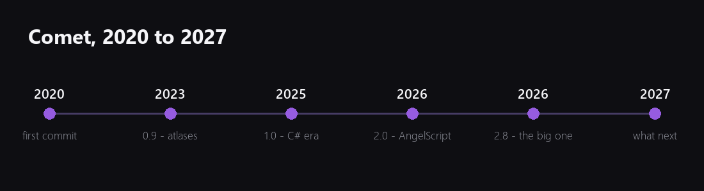
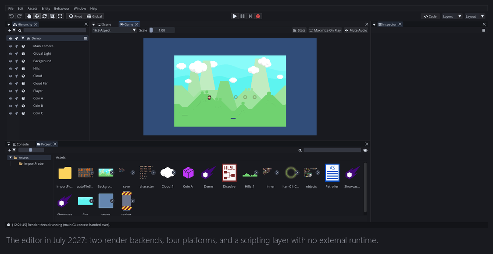
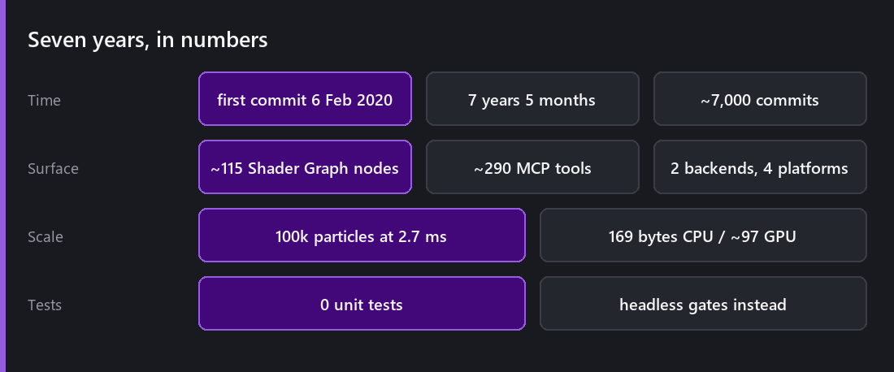
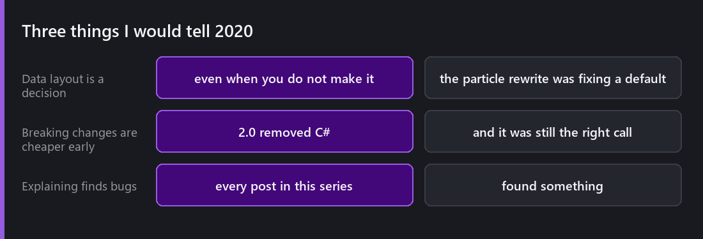

First commit: **6 February 2020**. That makes this seven years and five months, and this post the fifty-second Wednesday in a row.

## The arc

**2020 to 2022** was learning. A 2D renderer that barely worked, then one that worked, then an editor around it. Most of what I wrote in those two years has been replaced, and that is fine. It was the cost of finding out what a game engine actually needs to contain.

**2023** brought the things that made it feel like a tool rather than a project: sprite atlases, curves and gradients, unique instances, a line renderer, animating script fields. 0.9.2's changelog is the first one that reads like an engine.

**January 2025: 1.0.** C# through Mono, and really pleasant to build games in, on Windows and Linux, which turned out to be the sentence that mattered.

**2026 was the year everything changed.** [2.0 removed C#]() after nine months of work and broke every existing project. In exchange Comet got [the web]() and [Android](). Then eight more releases in four months, ending with 2.8: [HLSL](), [Shader Graph](), [Visual Scripting](), [GPU particles](), [networking](), [packages](), [the content system](), [the profiler](), [the MCP server]().

**2027 has been consolidation**, which does not make exciting changelogs and has made the engine considerably better to use.

## The numbers

Around **7,000 commits**. Two render backends, four platforms. About 115 Shader Graph nodes and nearly 290 MCP tools. A hundred thousand particles in 2.7 ms. Zero unit tests, and a growing set of headless gates instead.

## Three things I would tell 2020

**Data layout is a decision even when you do not make one.** The [particle rewrite]() was not an optimisation, it was fixing a default I had never questioned. "A particle is a thing, so a particle is an object" felt like not making a choice. It was a choice, and it cost an order of magnitude for six years.

**Breaking changes are cheapest early and never get cheaper.** Removing C# in 2026 broke everything and was still right. Removing it in 2024 would have been righter. The cost of a breaking change grows with your user base, and the cost of *not* making it grows forever.

**Explaining something is the most reliable review you will get.** Every single post in this series found something. The [lighting post]() found a light that ignored its intensity. Writing about [InstanciableEntity overrides]() made me notice a case the depth comparison handled by accident. For a solo project with no code review, this is the closest thing I have to one, and it works because you cannot write "the system does X" without checking whether it does.

## What I got wrong

**I stopped writing for fourteen months.** It felt productive. It cost me every bug the writing would have found.

**2.8 was three releases pretending to be one.** Twelve major features meant twelve features that each got less attention than they deserved, and a changelog nobody could read.

**Documentation is still the weakest part of the project.** This blog helps and a blog is not reference documentation. Fifty-two posts explaining how systems *feel* does not tell you what the third parameter of a method does.

**I under-communicated the content system migration.** Removing `RuntimeAssets` was right; announcing it in a changelog line and letting people meet it as a compile error was not.

## Where Comet goes

**3.0, eventually, and smaller than 2.0 was.** The breaking changes I would still like are mostly in serialization. I am in no rush.

**Consolidation over features.** Shader Graph and Visual Scripting both need better navigation for large graphs. The content system needs its edges filed. None of that makes a good headline.

**The in-editor assistant.** The [tool layer]() was built for it. What interests me is not "AI makes your game" but the high-volume, boring work that makes a solo engine slow.

**Documentation.** Properly, finally.

## And this blog

It continues.

Year two starts next Wednesday and it is deliberately a different shape. Year one was *the engine*, system by system. Year two is **using it**, starting with fourteen Wednesdays building a complete small game in public, from an empty scene to a playable web build, and then the internals, the craft, and the things I have never written down.

Thank you for reading. The comments on these posts have really changed things in the engine, which is more than I expected when I started writing again a year ago.

See you Wednesday.

*Comments and questions welcome ;)*
