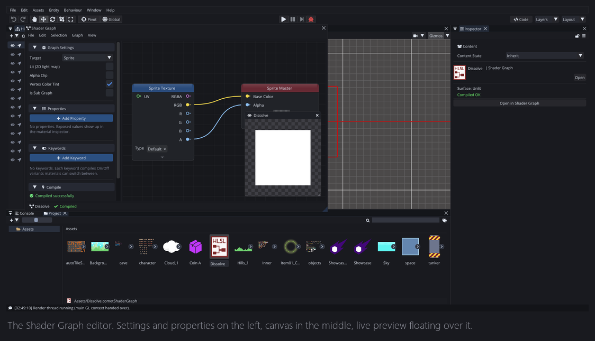
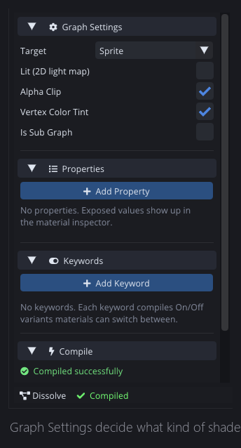
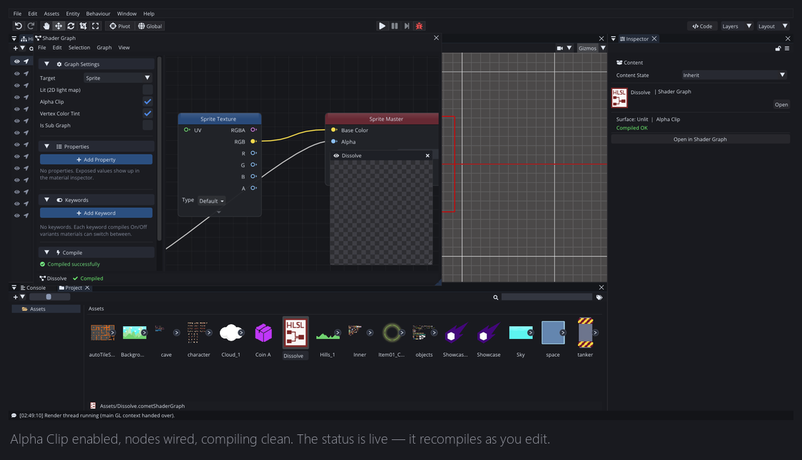

[Last Wednesday]() I explained why Comet deleted GLSL authoring and moved to HLSL, and ended on a claim: most people will never need to write a shader by hand.

This is why.

That is Comet's Shader Graph. Nodes on a canvas, a live preview floating over them, settings and exposed properties down the left, and a compile status at the bottom that updates as you work.

## What is on screen

Three regions.

The **canvas** is where the graph lives. Right-click for a searchable palette of about 115 node types, drag from an output pin to an input pin to connect, edit constant values inline on the node itself.

The **left column** is the graph's contract with the outside world: Graph Settings (what kind of shader this is), Properties (what shows up in the material inspector), Keywords (compile-time variants), and Compile status.

The **preview** renders the graph, live, on a quad. Not a mockup — the actual compiled shader. And every node has its own small preview too, so you can look at the noise on its own, then the noise after a step, then the result of the multiply. Being able to see the intermediate values is most of why a graph is easier than a text file, and it is the thing that is genuinely hard to replicate in a code editor.

## Building a dissolve

A dissolve is the effect where something burns away, usually with a glowing edge. It is the "hello world" of shader graphs because it is four ideas stacked.

**One: get some noise.** A `Simple Noise` node gives a greyscale value per pixel. Wire a scale into it and you control how chunky the pattern is.

**Two: threshold it.** A `Step` node takes the noise and a cutoff and returns 0 or 1 — below the cutoff, above the cutoff. The cutoff is what drives the effect: at 0 nothing is hidden, at 1 everything is.

**Three: cut holes.** Turn on **Alpha Clip** in Graph Settings and feed the step result into the master node's alpha. Now the pixels below the threshold are not drawn at all. That is the dissolve.

**Four: burn the edge.** Take the noise again through a `Smoothstep` with a range just above the cutoff, and you get a thin band that is 1 only near the boundary. Multiply that by a hot orange and add it to the base colour. Now the edge glows.

Nine nodes, give or take. No text file, no compile step, no reload — the preview updates while you drag.

## The part that surprised me while building it

I expected the hard part of a node editor to be the graph — links, cycles, evaluation order. It was not. The hard part was **type coercion**.

In HLSL you write `float3 c = n * tint;` and the compiler works out that `n` is a float, `tint` is a float3, and the multiply broadcasts. In a graph, `n` is a pin with a type and `tint` is a pin with a type, and the user just dragged a wire between them and expects it to work.

So the graph has to decide: is this connection legal, and if so what conversion is implied? Get it too strict and users are inserting conversion nodes constantly and hating it. Get it too loose and graphs silently do the wrong thing, which is worse, because there is no error to read — just a shader that looks slightly off.

Comet lands on the permissive side for the obvious cases and refuses the ambiguous ones. I still occasionally think a particular refusal is wrong, and it is the part of the graph I have adjusted most.

## Does it cost anything?

No — and this was a hard requirement, not a nice outcome.

A Shader Graph compiles to the same HLSL pipeline as a hand-written shader. It becomes SPIR-V, then whatever GLSL the target needs, baked at build time, exactly like [any other shader](). A graph does not carry a node-graph runtime, it is not interpreted, and it does not evaluate nodes at draw time.

The output is not always *identical* to what an experienced person would hand-write. The generated code can contain intermediate values a human would have folded together. In practice the shader compiler on the other end optimises most of that away, and the difference has never been the thing that made a frame slow.

The rule I held myself to: if using the graph made your game slower, the graph would be a toy. It has to be the default way to write shaders in Comet, not the easy way.

## When to still write it by hand

Being fair about it:

- **Anything with real control flow.** Loops and complex branching are painful as nodes.
- **Anything you want to read as maths.** A carefully derived lighting term is clearer as five lines of algebra than fifteen boxes.
- **Very long graphs.** Past a certain size, a graph becomes harder to navigate than a file. Sub Graphs help, and are next week.

For those there is the `Custom HLSL` node, which lets you drop a snippet directly into the middle of a graph — so it does not have to be all one or all the other.

---

Next Wednesday: turning a graph into something other people can use. The Blackboard and exposed properties, keywords and compile variants, Sub Graphs for reuse, and Vertex Offset — the input that lets a shader move the geometry rather than just colour it.

*Comments and questions welcome ;)*
