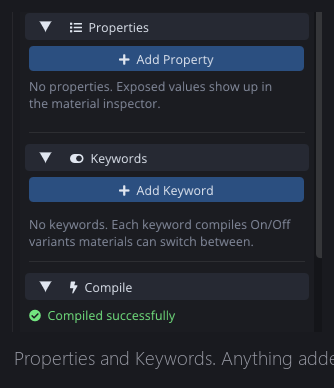
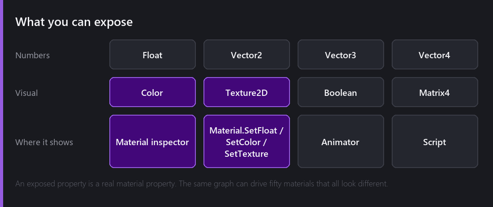
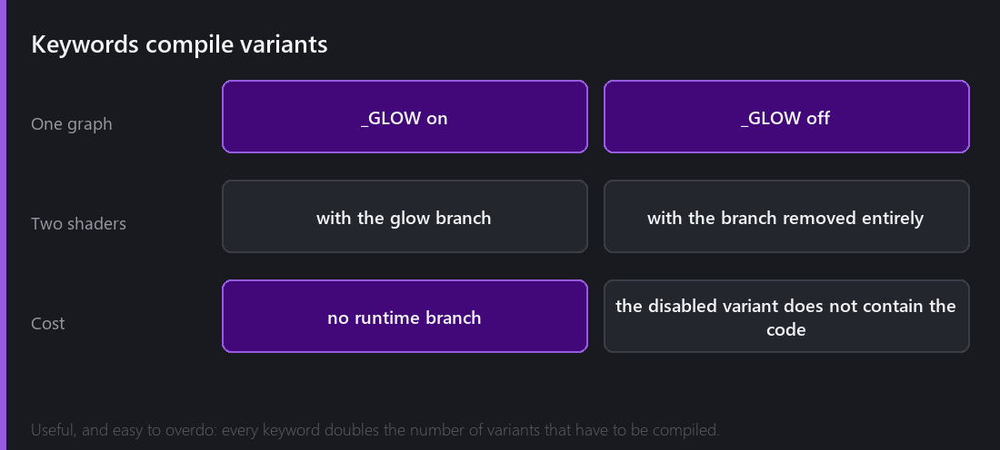
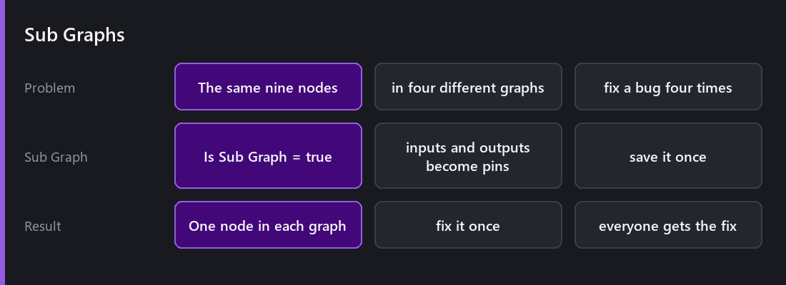
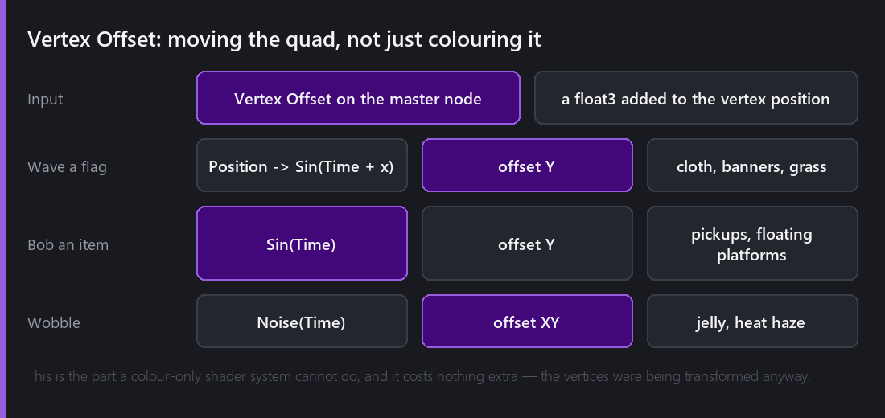

[Last Wednesday]() I built a dissolve. It worked, and it had one flaw that made it nearly useless: every value in it was hard-coded inside the graph. If you wanted a slower dissolve, or a blue burning edge instead of an orange one, you had to open the graph and edit it.

So what I had built was one specific effect, and not something anybody else could reuse.

## The Blackboard

The **Properties** section is how a graph stops being a single effect and becomes a template.

You add a property, wire it in place of a constant, and it appears in the **material inspector**. Now one graph backs fifty materials that all behave differently. The dissolve gets a `_Progress` float, an `_EdgeColor`, an `_EdgeWidth` and a `_NoiseScale`, and now it is a whole dissolve system: a fast blue one for teleports, a slow orange one for burning, a chunky one for stone.

Floats, vectors, colours, booleans, textures and matrices. Whatever you expose is also reachable from AngelScript through `Material.SetFloat`, `SetColor`, `SetTexture` and friends, and that is the part that makes this a gameplay feature and not only an authoring convenience. Animating `_Progress` from 0 to 1 over half a second in a script is how the dissolve actually gets used.

They can be animated by the Animator too, because a material property is just a value with a name.

## Graph Settings, revisited

The settings block is small and every switch in it matters.

**Target** decides what kind of shader this is: Sprite, UI, and, from 2.8, Post-Process, which is [next week]().

**Lit (2D light map)** decides whether the result takes part in [2D lighting](). With it off, your shader ignores every light in the scene. This is the switch people forget about when their beautiful custom material comes out flat in a lit scene.

**Alpha Clip** enables discarding pixels, which the dissolve needs.

**Vertex Color Tint** multiplies by the per-vertex colour, so the sprite renderer's Color field still works. Turn it off and your material stops responding to tinting, which is occasionally what you want and usually a bug.

**Is Sub Graph** turns the whole thing into a reusable node. More on that below.

## Keywords

A keyword compiles two versions of the shader, one with a branch included and one with it removed entirely. A material picks which variant it uses.

What you get out of that is that the disabled variant does not contain the code at all. There is no runtime branch and no cost, so a glow you can toggle per material genuinely costs nothing on the materials that have it off.

The trap is combinatorial. Each keyword doubles the variant count. Three keywords is eight shaders to compile at build time, and six keywords is sixty-four. Use them for genuinely separate looks, and not for things a float could express.

## Sub Graphs

Once you have written a few graphs you notice that you keep rebuilding the same cluster of nodes. A particular noise setup, a UV distortion, a colour remap.

Set **Is Sub Graph** and the graph becomes a node. Its exposed inputs become input pins, its outputs become output pins, and you drop it into other graphs like any built-in node. Fix a bug in the sub graph and every graph using it is fixed.

I think this is the feature that decides whether a node-based system stays usable past about twenty nodes, and it is worth reaching for it earlier than it feels necessary.

## Vertex Offset

Everything so far has been about colour. Vertex Offset is the input that moves the geometry.

The master node has an input that takes a `float3` added to each vertex position before it is transformed. It is a small hook with a very big payoff, because it turns a shader into an animation system that runs entirely on the GPU:

- **A waving flag.** Take the vertex's X, feed it into a sine with time, offset Y. The quad ripples.
- **A floating pickup.** Sine of time into the Y offset, no position input. It bobs. No script, no Animator, no CPU cost.
- **Grass in wind.** The same as the flag, but mask the offset by the vertex's Y so the base stays planted and only the top moves.
- **Heat haze or jelly.** Noise into the XY offset.

What I like about this is that it is free. The vertices were being transformed anyway, so adding an offset to that transform costs almost nothing, and it happens on the GPU for every instance without the CPU knowing about it.

The limit is that it moves vertices, and a sprite has four of them. You cannot bend a sprite smoothly along its length, because there is nothing in the middle to bend. For that you need geometry with more vertices, like a tilemap, a line renderer, or a mesh built for it.

## The node library

There are about 115 nodes, grouped into families: **Artistic** (22 blend modes, filters, adjustments), **Channel**, **Input** (geometry, camera, time, object data), **Math**, **Procedural** (noise, shapes, patterns), **UV** and **Utility**.

Two of the ones in Utility are worth knowing about specifically. **Custom HLSL** lets you drop a snippet directly into the graph, and **Expression** evaluates a small formula inline. Both of them exist so that hitting the limits of the node vocabulary does not mean abandoning the graph and rewriting the whole shader by hand.

## What I would change

Two things bother me.

**Large graphs are hard to read.** Past forty nodes or so, following a wire across the canvas is genuinely difficult. Sub Graphs are the answer and I do not think they are enough on their own. I would like to add some form of grouping, or reroute nodes.

**There is no diffing.** A shader graph is a file, but it is not one you can review in a pull request in any useful way. Text shaders diff well. Graphs do not, and I do not have a good answer for that yet.

---

Next Wednesday: taking the whole rendered frame and doing something to it. Post-process profiles as a stack, the `Post-Process` graph target with its Scene Color and Screen UV nodes, writing one in HLSL instead, and why a post-process pass costs exactly the same on an empty scene as on a full one.

*Comments and questions welcome ;)*
