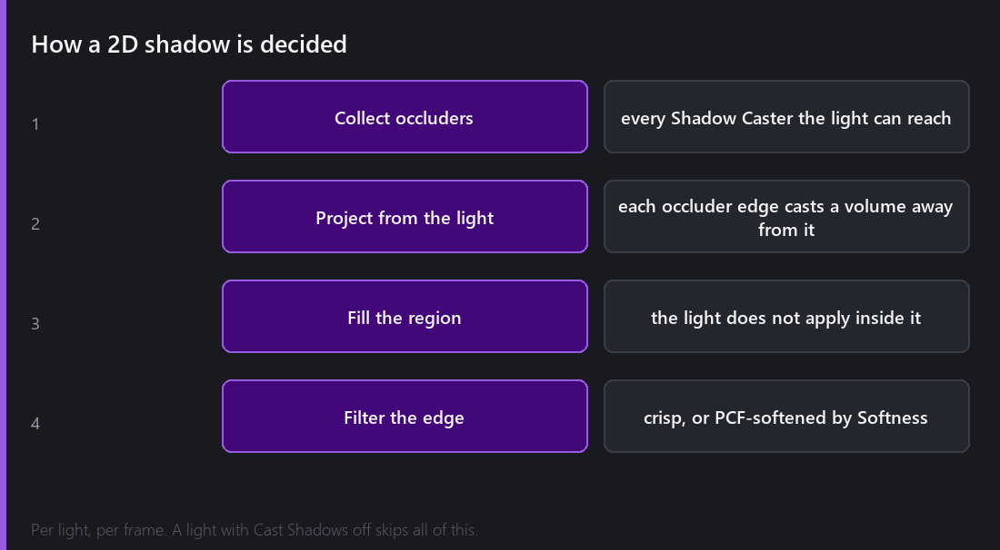
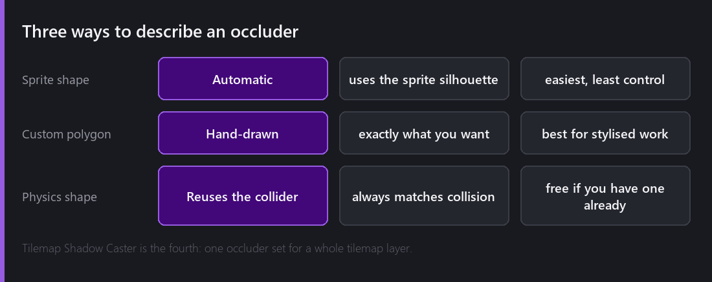
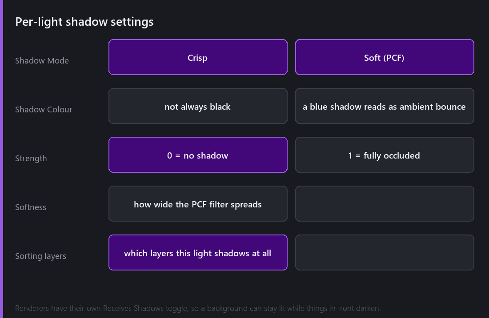

It is the last Wednesday before Halloween, so let's talk about shadows.

Comet's 2D shadows are real-time and dynamic. If you move a light, the shadows move. If you move an object, its shadow moves. Nothing is baked, so nothing has to be rebaked when you change your level.

## How a 2D shadow gets decided

For each light that has shadows enabled, the engine gathers every **Shadow Caster** within its reach. The edges of each occluder are projected away from the light, and that forms the regions the light cannot get into. Those regions are filled, the light is not applied inside them, and then the edge is filtered, either left crisp or softened.

The word to keep in mind there is per light. Each light does this on its own. Two lights in a room produce two sets of shadows, overlapping where they should. It also means the cost of shadows scales with `lights × occluders`, and that is worth remembering before you add the fortieth torch to your scene.

A light with `Cast Shadows` off skips all of this. Most lights in most scenes should have it off. A small glow on a coin does not need to occlude anything, and turning it off is free performance.

## Telling the engine what blocks light

An entity does not cast a shadow because it has a sprite. It casts a shadow because you put a **Shadow Caster** behaviour on it. I did it that way on purpose. In a 2D scene most things are backgrounds, decals and effects, and if all of them blocked light the result would be an unreadable mess.

The caster can get its shape in three ways.

**From the sprite.** It uses the sprite's silhouette. No setup at all, and it is right most of the time.

**From a custom polygon.** You draw the occluder by hand. It is more work, and it is the right answer whenever the visual silhouette is not the shape you want to block light. A character with a big hat, or a tree whose canopy should not cast a solid slab.

**From the physics shape.** It reuses the collider. This is my default for level geometry, because the thing that stops you walking through it is exactly the thing that should stop light, and now the two can never disagree.

There is a fourth one, **Tilemap Shadow Caster**, which builds a single occluder set for a whole tilemap layer instead of one per tile. On a level with three thousand tiles, that is the difference between working and not working at all.

## The controls

Shadow settings live on the **light**, not on the caster. I think that is the right way round, because the same wall should be able to throw a hard shadow from a nearby lamp and a soft one from a distant window.

**Shadow Mode** is crisp or soft. Crisp gives you a hard edge and it suits stylised and pixel art. Soft uses PCF, so the edge is sampled several times and averaged, which gives you a gradient. Soft looks better in realistic scenes and it costs more.

**Shadow Colour** does not have to be black. This is the setting that improves how shadows look the most, and it is the one nobody ever touches. Real shadows are areas lit only by bounced light, and bounced light has colour. A dark blue shadow in a warm scene reads as daylight instead of as a hole cut in the image.

**Strength** is how much light gets blocked. Below 1.0 some light leaks through, which is often what you want.

**Softness** widens the PCF filter.

**Sorting layers** restrict which layers this light shadows at all. On the other side, every renderer has its own `Receives Shadows` toggle, so a background can stay evenly lit while everything in front of it darkens. Using both together is how you get shadows that support the art instead of fighting it.

## The afternoon everything was inside-out

Shadow Casters support a polygon **cull mode**, clockwise or counter-clockwise, which decides which side of an edge counts as facing the light.

That does sound like an implementation detail that should not be exposed to the user, and I agree with that. It is exposed anyway, because polygons authored in different tools wind in different directions and I have not found a reliable way to guess.

Getting it wrong does not give you no shadows. It gives you inverted shadows. Every area that should be lit is dark and every area that should be dark is lit. The scene is still fully rendered, it still looks plausible at a glance, and it is completely wrong.

I spent an afternoon on this convinced the projection maths was broken. I rewrote a working function twice. In the end the fix was a dropdown.

## What this costs

Shadows are the most expensive thing in Comet's 2D lighting, by a wide margin.

Roughly, the cost scales with the number of shadow-casting **lights** multiplied by the number of **occluders** each one can reach, and soft shadows multiply that again by the PCF sample count.

Some practical advice, from having made this slow and then made it fast again:

- **Turn Cast Shadows off by default** and enable it only on the lights where a shadow is doing some work.
- **Use Tilemap Shadow Caster** instead of per-tile casters. Always.
- **Restrict lights to sorting layers.** A light that only touches the character layer only tests occluders on the character layer.
- **Prefer crisp over soft** unless the art really needs the gradient. It is a big saving for a small visual difference in stylised work.

## What Comet does not do

There is no shadow casting from emissive sprites. A glowing object does not automatically light its surroundings. If you want that, put a light on it.

There is no shadow bounce and no global illumination. A shadow is a region a light does not reach, and light does not accumulate off surfaces. That is a whole different class of renderer.

And shadows are per-light in screen space, so a very large number of small shadow-casting lights is not the workload this is built for. Using fewer lights and placing them better is faster, and I think it usually looks better too.

---

Next Wednesday: the release where I deleted every shader in every project. 2.8 removed GLSL authoring entirely and replaced it with HLSL, cross-compiled to whatever the target platform actually speaks. I will explain why I did something that aggressive, and what a Comet shader looks like now.

*Comments and questions welcome ;)*
