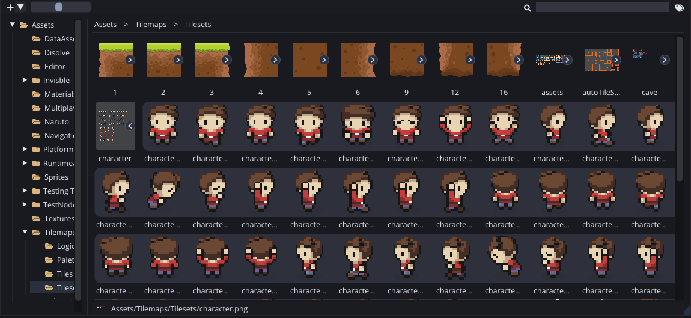
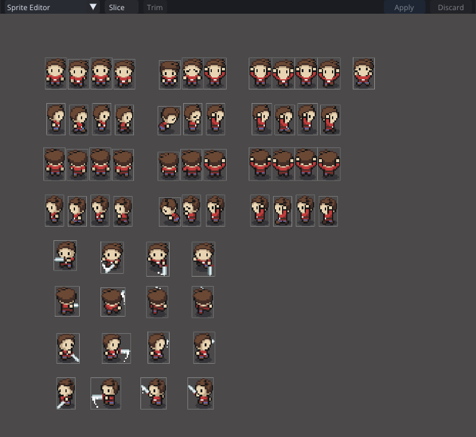
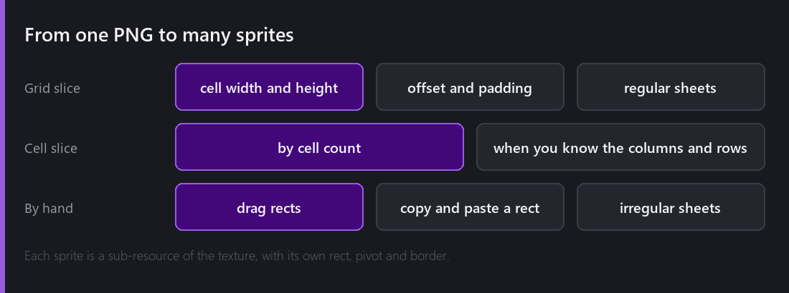
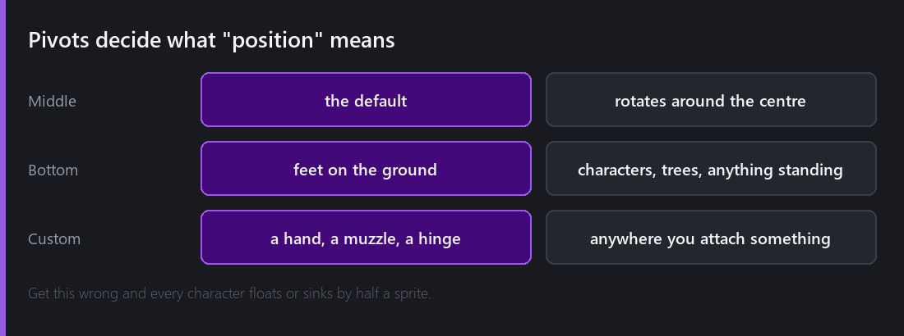
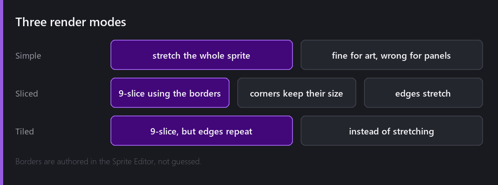
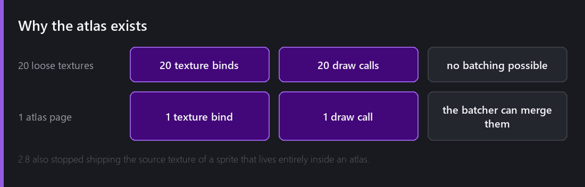
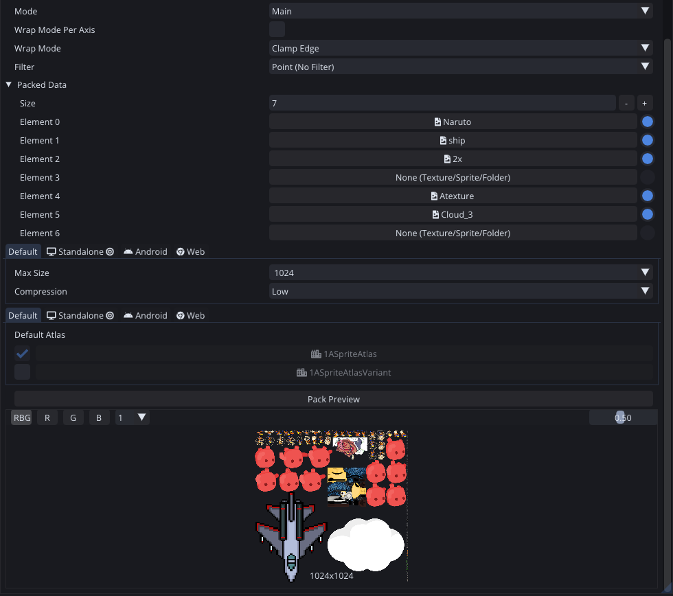

A PNG on disk is a rectangle of pixels and nothing more. It might hold forty sprites, or one sprite with a lot of empty space around it, or a nine-slice panel whose corners must never stretch. Telling the engine which of those it is is the Sprite Editor's job, and it ends up mattering for your frame rate, which I will get to at the end.

Every texture in the Project panel has an arrow that expands it into the sprites sliced out of it. Those sprites are **sub-resources**. They have their own IDs, so a Sprite Renderer points at "sprite 4 of this texture" rather than at a rectangle it remembers separately.

## Slicing

That is a 61-frame character sheet with its slices drawn over it. Every rectangle is a sprite the rest of the engine can reference by id.

There are three ways in. **Grid slice** by cell size, with offset and padding for sheets that have margins. **Cell slice** by column and row count, for when you know the layout rather than the pixel size. Or you drag the rects by hand for irregular sheets.

2.2 added copy and paste of a sprite rect. It sounds trivial, but it is the difference between slicing an irregular sheet in two minutes and slicing it in twenty.

The Sprite Editor also has proper undo and redo, it prompts you if you close the editor with unsaved slicing, and `Ctrl+S` saves. All of that arrived in 2.0. You do not notice any of it until it is missing.

## Pivots

A sprite's pivot is what "position" means for that sprite.

Middle is the default and it is right for most things. **Bottom** is right for anything standing on the ground, so characters, trees and buildings, because then setting `y` puts its feet there and a taller sprite does not sink into the floor.

I got this wrong on the character sheet while preparing these posts. The sprites were sliced with a middle pivot, so the character stood with its ankles buried. Nothing about the scene looked broken enough to point at, it just looked slightly off. That is what a pivot mistake looks like, and it is why I think it is worth setting deliberately at slice time.

Custom pivots matter for attachment points like a hand, a muzzle or a hinge, because rotating a sprite rotates it around the pivot.

## 9-slice

A Sprite Renderer or Image has three render modes.

**Simple** stretches the whole sprite. That is correct for artwork and wrong for anything with a border, because stretching a 200-pixel panel to 600 pixels stretches its rounded corners into ovals.

**Sliced** uses the sprite's borders, four values you set in the Sprite Editor, to divide it into nine regions. Corners keep their exact pixel size, edges stretch along one axis, and the middle stretches both ways. One button graphic then works at any size.

**Tiled** does the same but repeats the edges and the centre instead of stretching them, which is what you want for textures with visible detail.

The borders are authored and not guessed. That is deliberate, because the engine cannot know which part of your panel is the corner, and a wrong guess would be worse than asking.

2.8 fixed a real bug here. Images set to sliced or tiled were sampling incorrect atlas regions, so a 9-sliced button drawn from an atlas could pull in a neighbouring sprite's pixels along its edges.

## Atlases and draw calls

This is where sprites connect to [how a frame gets drawn]().

The batcher merges consecutive renderers that share a material and a texture. Twenty sprites coming from twenty separate PNGs is twenty texture binds and twenty draw calls, and nothing can be merged. Pack those twenty onto one atlas page and they all share a texture, so the batcher collapses them into one. Atlases exist for the draw calls, not for the disk size.

**Pack Preview** runs the packer and shows you the page it produced. It is the only reliable way to check that everything fit and that the max size you picked was big enough. That one is 1024×1024 holding six source textures.

A `SpriteAtlas` asset takes a set of sprites or folders and packs them into pages. From 2.8 it exposes `pageCount` and `isReadable`, and sprites expose `isPacked` and `spriteAtlas`, so a script can ask where a sprite actually lives.

There are two fixes worth knowing about, both of them from generating uninitialised or duplicated data. Atlas generation used to fill empty space with garbage instead of transparent pixels, and 2.8 stopped shipping the source texture of a sprite that lives entirely inside an atlas, which was pure wasted download.

## What I would tell someone starting

**Atlas by locality, not by type.** Everything drawn in the same scene at the same time should share a page. An atlas holding "all UI icons" is less useful than one holding "everything on the main menu", because the batcher merges what is drawn together.

**Watch the stats panel and not your instincts.** Turn on `Stats` in the Game panel and look at the draw call count before and after. It is an exact number, and it is the only way to know whether the atlas you just built actually helped.

**Do not atlas things that are never on screen together.** You pay memory for the whole page whenever any sprite on it is used.

---

Next Wednesday I will make those sprites move. The Animation Timeline: recording, keyframes, curves, events that call your code, and animating your own script fields.

*Comments and questions welcome ;)*
