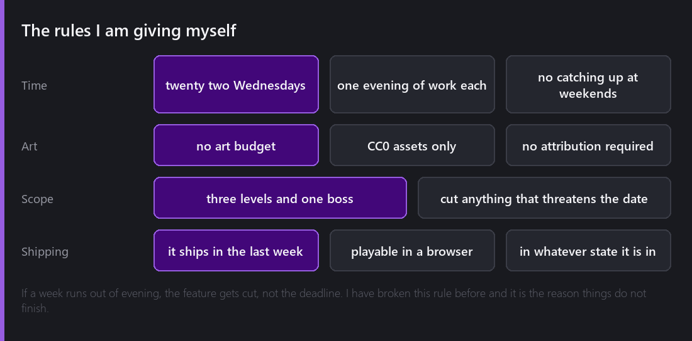
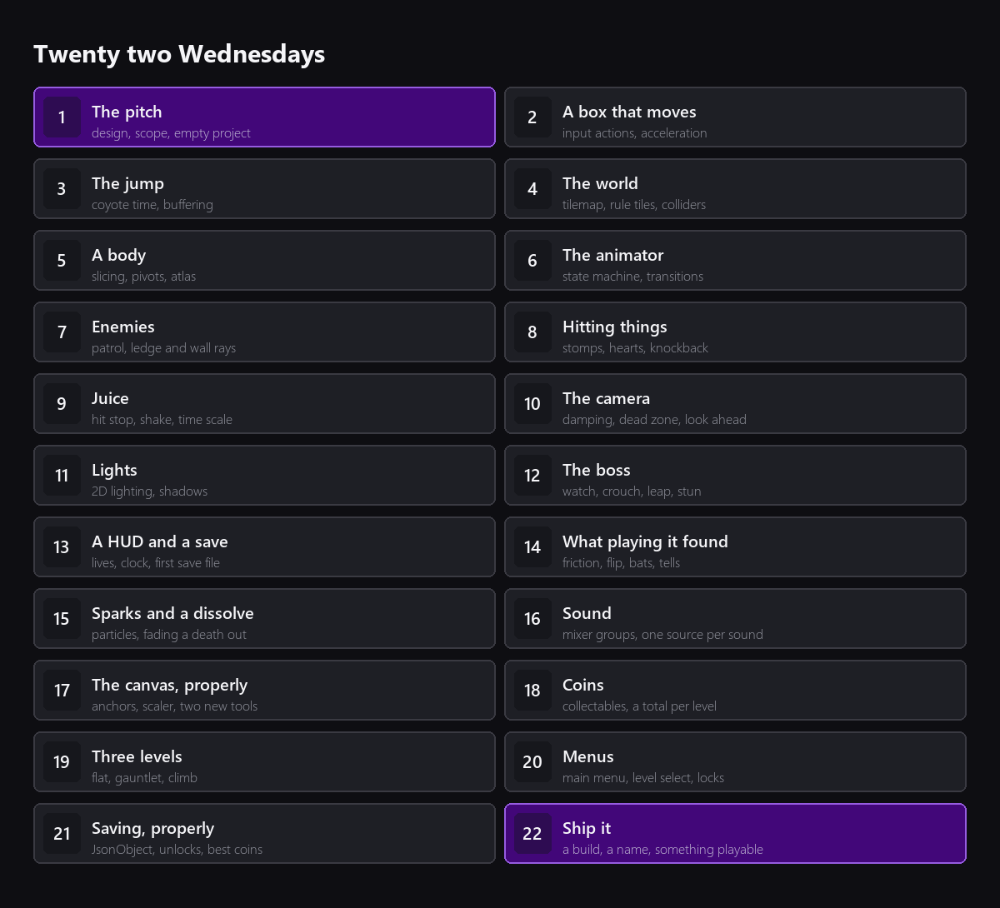
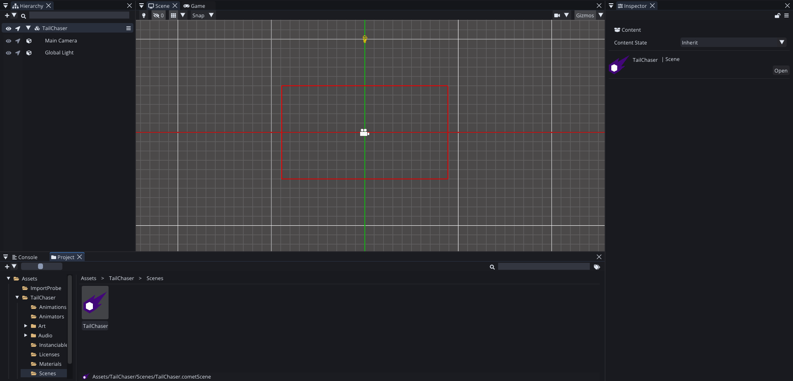
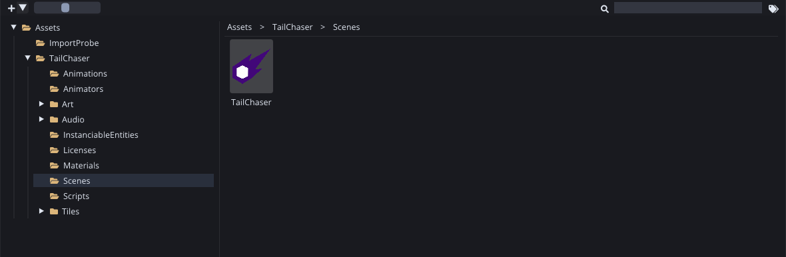

For a year I wrote about Comet Engine one system at a time. Fifty-two posts, and every one of them was me pointing at a feature and explaining it. That was useful, and I learned a lot from writing it, but there is a question I never answered: is any of this actually pleasant to make a game with?

So this year I am going to find out in public. Twenty two Wednesdays, one small game, built from an empty scene to something you can play.

The game is called **Tail Chaser**. You play a fragment that broke off a comet and is trying to catch up with the rest of it. You run, you jump, you get in the way of things that do not want you to pass, and the tail keeps moving.

## Why this idea

It is on brand, which I like. But mostly I picked it because it is small.

A comet fragment gives me a character who is allowed to be a simple shape, a reason for the levels to move left to right, and a reason for the fragment to be the brightest thing on screen. That last part is the one piece of art direction I actually care about, and it is a light and a handful of particles rather than a drawing, which matters because I cannot draw.

It also happens to exercise most of the engine. Tilemaps for the levels, animation for the character, physics for the movement, raycasts for the enemy brains, lighting for the mood, particles for the impacts, the UI module for the menus and the HUD, JSON for the progress, and a build at the end. That is not a coincidence. I chose a shape of game that would make me use my own tools properly.

## The rules

I have started small games before and not finished them, so this time I am writing the constraints down where people can see them.

**Twenty two Wednesdays.** One post a week, and the game is whatever it is on that day. No catching up at the weekend, because I want to find out what one evening a week actually buys.

**No art budget.** Everything is CC0, which means public domain: free for commercial use, no attribution required, no permission required. All of it is from [Kenney](https://kenney.nl), who has been quietly making this kind of thing possible for a decade. I am keeping every licence file next to the game so it is obvious what is what.

**Three levels and one boss.** Not a world map, not five biomes. If a feature threatens the date, the feature gets cut.

**It ships in the last week.** Playable, embedded in the last post, in whatever state it is in. If that state is embarrassing then that is the honest result and I will say so.

The rule I expect to break is the third one. Scope is the thing I am worst at, and further down this post there is proof.

## What "finished" means

I want to be precise about this now, while it is still cheap to be honest.

Finished means: a main menu, a level select that remembers which levels you have opened, three levels you can complete, coins to find in each of them, two kinds of enemy, one boss fight, a HUD, a screen when you die and a screen when you win, progress that survives closing the game, sound, and a build.

The list stops there. It does not include a pause menu or an options screen, and it does not include a second boss. You will probably play the whole thing in fifteen minutes.

## The twenty two weeks

The order is deliberate. Movement first, because if the character does not feel good then nothing built on top of it will. Then the world to move through, then the body to look at, then the things that want to stop you. Juice and the camera come late on purpose, because they are the parts that make a prototype look like a game and I want them to arrive when there is a game to apply them to.

The boss is week twelve, which is late, and that worries me a little.

Week fourteen is the one I would not have put on a plan. It is the week I sat down and played the whole thing instead of testing one system, and it is where most of the second half of this list came from.

## What this post used to say

This post went up with a plan for fourteen weeks and one level, and I have rewritten it, so it is only fair to say exactly what changed.

The original plan said one level and one boss, and the game has three levels with coins in each and a level select in front of them. It said navigation for the enemies and visual scripting for one of the brains, and both enemies ended up as small scripts firing raycasts, because that turned out to be the right tool and I would rather report what I used than what I meant to use. It said a pause menu and an options screen, and neither exists. It promised a glowing trail behind the player, and what the fragment actually has is a light that follows it and a burst of sparks when it lands on something.

I would rather have a first post that describes the game than a first post that describes a game I did not make.

## The project

Here is where it starts. One folder, one empty scene, one camera and one light.

I set the folders up properly before writing a line, because I have learned that a project which starts messy stays messy:

`Art`, `Audio`, `Scenes`, `Scripts`, `InstanciableEntities`, `Animations`, `Animators`, `Tiles`, `Materials` and `Licenses`. Nothing in there yet except the imported art and the sound effects, but every future asset has an obvious home.

The one decision I did make today is the camera. Comet's Camera behaviour has a **pixel perfect** mode, and for a game made of 18 pixel tiles it is not optional. I set the reference resolution to 320 by 180, the pixels per unit to 18, and turned on snapping and the upscale render target. That means one tile is exactly one world unit, the whole view is about eighteen tiles across, and no sprite will ever land on half a pixel and go blurry.

That sounds like a detail. It is the difference between pixel art and pixel art that looks broken, and it is much easier to set now than to retrofit in week nine.

I also sliced the sheets. The terrain is 18 by 18 and the characters are 24 by 24, which I got wrong on the first attempt and only noticed because the grid was visibly cutting the characters in half. Worth checking rather than assuming, since every sheet in a pack does not have to agree.

---

Next Wednesday there will be something on screen. It will be a rectangle. It will move left and right, and I will spend a surprising amount of a post explaining why making it reach full speed instantly feels wrong.

*Comments and questions welcome ;)*
