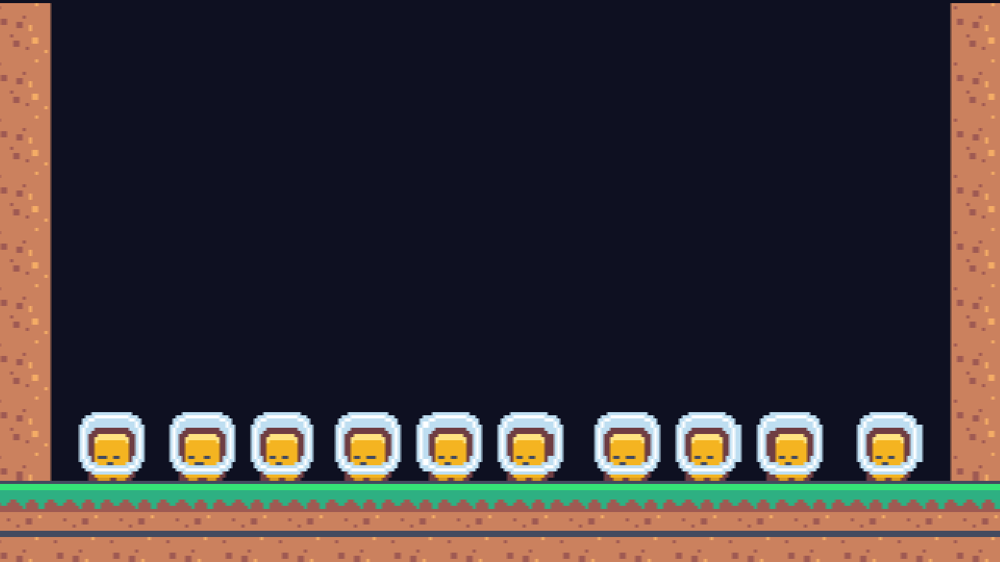
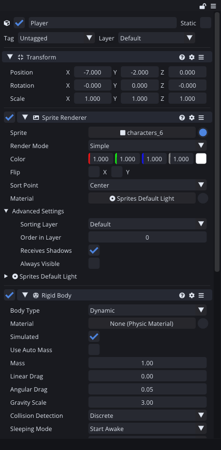
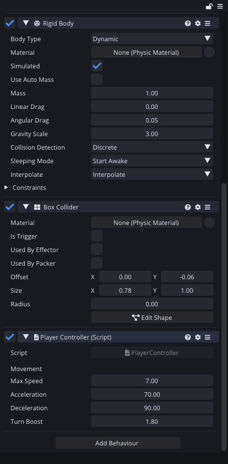
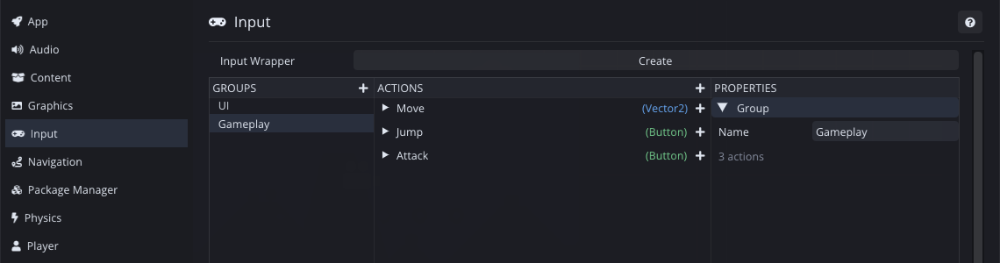
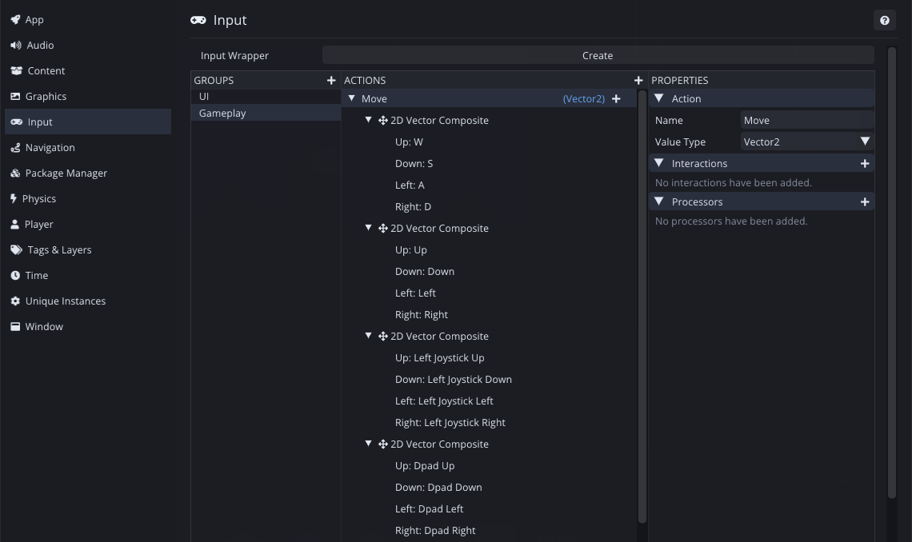
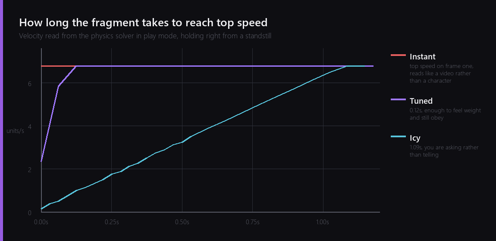

Last week I had an empty scene, a camera and a plan. This week the plan had to survive contact with an actual character.

The goal for the evening was small and specific: something on screen that runs left and right and feels good doing it. No jumping, no animation, no level. Just horizontal movement, done properly, because everything I build in the next twelve weeks sits on top of it.



The fragment at full speed there, photographed the way you would photograph anything moving: ten frames of a single run stacked on top of each other. The even spacing is not a happy accident, and getting to it took most of the evening.

## The first entity

The player is one Entity with four Behaviours on it, and I want to go through them in order because the order matters.



The Sprite Renderer points at `characters_6`, one cell of the Kenney sheet I sliced last week, and uses the Sprites Default Light material so the fragment will react to lighting when I get to that in week eleven.

The Rigid Body is where the decisions start. Body Type is Dynamic, because I want the physics solver to move this thing rather than moving it myself. Gravity Scale is 3, which is much higher than reality and completely normal for a platformer: real gravity makes a jump feel like a moon landing. Interpolate is on so the sprite is smoothed between physics steps instead of stepping at the fixed rate.



## Not reading keys

The last Behaviour is the movement script, and the first thing it does is not read the keyboard.

Comet has an input action system, which sits between the physical thing the player presses and the thing the game asks for. The script asks for an action called Move and gets a Vector2 back. It has no idea what produced it.



Three actions, which is the whole game: Move, Jump and Attack. Jump and Attack do nothing yet.

Move is where the work is.



Four binding schemes on one action. WASD, the arrow keys, the left stick and the D-pad. Every one of them produces the same Vector2, so the script gets exactly one number no matter which the player picked, and I never write a line of code that mentions a key.

This is the part I would have skipped five years ago and regretted. Retrofitting gamepad support into a codebase that reads keys directly is a miserable afternoon. Doing it here cost about four minutes.

There is one detail in the composite bindings that took me longer than four minutes to find. The joystick directions are not gamepad buttons, they live after every SDL gamepad button in the control enum, so the left stick starts at index 26 rather than somewhere sensible. I bound the D-pad by accident first and only noticed because the screenshot said Dpad Up where I expected Left Joystick Up. Reading the picture rather than trusting the code is a habit that keeps paying.

## Three numbers and a feeling

Here is the whole of the movement, in the physics step so it stays in sync with the solver:

```angelscript
float input = moveAction.GetVector2().x;

Vector2 v = body.velocity;
float target = input * maxSpeed;

float rate = deceleration;
if (input != 0.0F)
{
    bool turning = (v.x > 0.0F && input < 0.0F) || (v.x < 0.0F && input > 0.0F);
    rate = turning ? acceleration * turnBoost : acceleration;
}

v.x = MoveTowards(v.x, target, rate * Time::GetFixedDeltaTime());
body.velocity = v;
```

It sets a target speed and walks the current speed towards it, and nothing else. Only horizontal speed is touched, so gravity keeps doing its job underneath.

The interesting line is the one that picks `rate`. Speeding up, slowing down and turning around are three different sensations, and if you use one number for all three the character feels wrong in a way that is hard to put a finger on. Separating them costs nothing:

- **Acceleration**, 70 units per second squared, for getting going.
- **Deceleration**, 90, for stopping. Higher than acceleration, because a character that stops slower than it starts feels like it is on ice.
- **Turn boost**, 1.8, multiplied into acceleration when the player is pressing against the current direction. Turning around is the moment a platformer feels most responsive or most sluggish, and giving it its own multiplier is the cheapest game feel win I know.

All four are `[Serialize]` with `[Tooltip]` text, which is why they show up in the inspector in that last screenshot. That is deliberate. These numbers are found by playing, not by thinking, and anything I have to recompile to change is a number I will not tune.

## Measuring it instead of guessing

I wanted to know how long the fragment actually takes to reach top speed, and I did not want to answer with "feels about right".

My first attempt was to sample the Transform over time and differentiate it. That measured my own sampling jitter more than it measured the character. So I added a small tool to the editor that reports the solver's own linear velocity stamped with the fixed game time, and another that holds an input action at a value as though someone were pressing it. Together they let me run the game with nobody at the keyboard and record what the physics actually did.

Then I ran the same test three times with three different accelerations.



Instant is `acceleration` set high enough that the character is at full speed on the first physics step. It looks correct on paper and feels like driving a video rather than a character. There is no weight to it at all.

Icy is the opposite, a full second to get going. Playing it is like asking the fragment to move and waiting to see whether it agrees.

Tuned is 0.12 seconds, and it is the one that feels like a character. Long enough that starting to run is an event you can perceive, short enough that it never feels like a delay. The window between those two is narrower than I expected, and that narrowness is why I wanted a graph instead of an opinion.

The honest caveat: 0.12 seconds is right for this character at this speed on flat ground. When I add jumping next week the same number will need checking again, because air control and ground control almost never want the same value.

---

Next Wednesday: jumping. Which sounds like one line of code and is famously not, because coyote time, jump buffering and variable jump height are three separate lies you have to tell the player to make a jump feel fair.

*Comments and questions welcome ;)*
