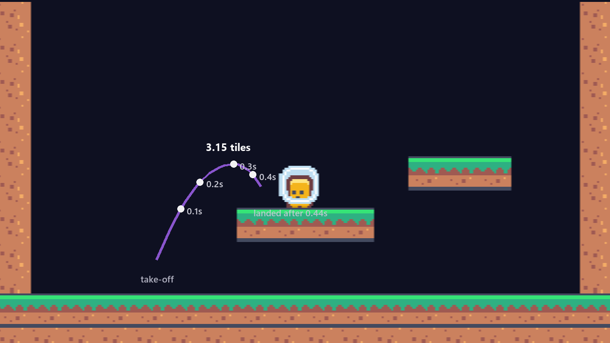
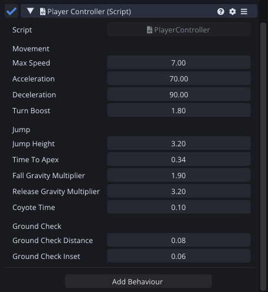
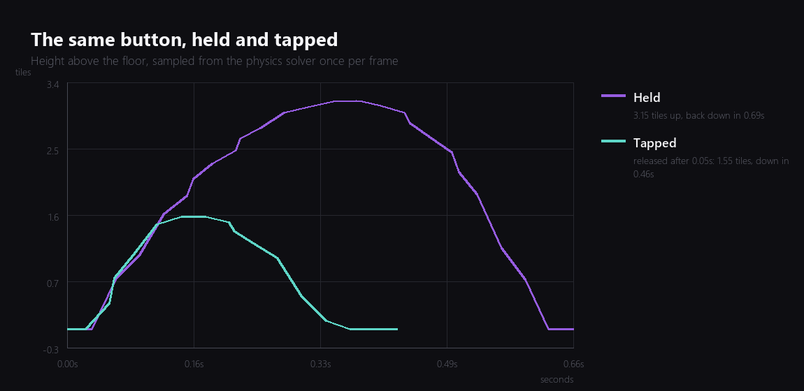
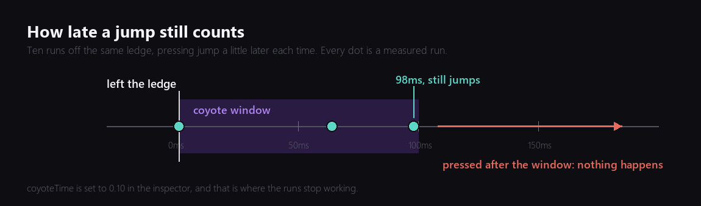
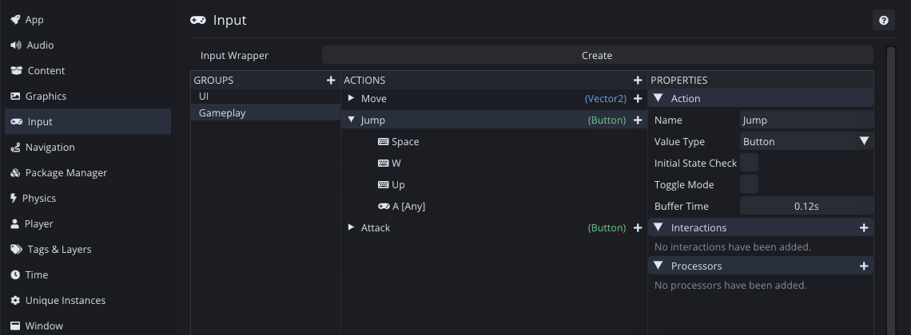

Jumping looks like one line of code. Set the vertical velocity and let gravity do the rest. I wrote that line in about a minute, played it, and spent the rest of the evening on everything the line does not cover.

This is the week where I put two platforms in the room, because a jump with nothing to jump onto tells you nothing.



Nothing about that curve is drawn by hand: it is the fragment's position sampled once per physics frame and painted back over the screenshot. I picked the habit up last week and have no intention of dropping it.

## Two numbers instead of four

The obvious way to expose a jump is a jump velocity and a gravity value. I have never once been able to guess good numbers for either.

So the inspector asks for the two things I can actually picture: how high the jump goes, in tiles, and how long the rise takes, in seconds. Everything else follows.

```angelscript
// Height and time to apex are the two numbers a person can actually feel, so they are
// what the inspector exposes. Gravity follows from them: g = 2h / t^2.
body.gravityScale = RiseGravity() / WorldGravity();
```

`RiseGravity()` is `2 * jumpHeight / (timeToApex * timeToApex)` and the launch velocity is `2 * jumpHeight / timeToApex`. Those two formulas are the whole of the maths, and I keep having to look them up, so now they live in the script.

3.2 tiles in 0.34 seconds turns out to want a gravity scale of about 5.6. If I had been asked to guess that number cold I would have said 2.



Measured back out of the running game, that setting gives 3.15 tiles at 0.375 seconds. The small gap between asked for and delivered is the fixed timestep quantising the arc, and it does not bother me.

## Gravity that is heavier on the way down

A jump with symmetric gravity feels floaty in a way that is hard to name until you fix it. The fragment hangs at the top, and the fall reads as slow even when the numbers say it is not.

The fix is old and slightly dishonest: fall faster than you rose. `fallGravityMultiplier` is 1.9, so the way down is nearly twice as heavy as the way up.

The second multiplier is the one that matters more. If the player lets go of the button while still rising, gravity gets 3.2 times heavier immediately:

```angelscript
private float ExtraGravity(float verticalVelocity) const
{
    if (verticalVelocity < 0.0F)
    {
        return -RiseGravity() * (fallGravityMultiplier - 1.0F);
    }
    if (verticalVelocity > 0.0F && !jumpAction.isPressed)
    {
        return -RiseGravity() * (releaseGravityMultiplier - 1.0F);
    }
    return 0.0F;
}
```

The solver is already applying the rising gravity, so the script only ever adds the difference. That keeps the physics doing the physics.



Same button, same launch velocity, two different jumps: 3.15 tiles if you hold it, 1.55 if you let go after a twentieth of a second. The two curves are identical until the moment of release, and that is the property that lets a player aim a jump without ever thinking about it.

## Two lies that make it fair

Everything above is about how the jump moves. The next two are about when the game agrees to jump at all, and they exist because the player is a person with reaction time.

**Coyote time.** For a tenth of a second after walking off a ledge, the jump still works. Without it, a jump pressed at the exact moment you leave a platform silently does nothing, and it feels like the game dropped your input rather than like you were late.

Rather than take my own word for whether it worked, I ran the same ledge ten times, pressing a little later each run, and recorded what the solver did:



Pressed 98 milliseconds after leaving the ledge, the fragment still jumps. Past the window, nothing happens. That is `coyoteTime = 0.10` doing precisely what it says, and now I know rather than assume.

**A press buffer.** The other half of the same problem: a jump pressed slightly before landing should fire on touchdown rather than be thrown away.

This one I got for free, which was a nice surprise in my own engine.



Comet's input actions have a **Buffer Time**. Set it to 0.12 and the action remembers a press for that long, then the script asks for a buffered press instead of a raw one:

```angelscript
if (jumpAction.GetBufferedPress() && coyoteLeft > 0.0F)
{
    jumpAction.ConsumeBufferedPress();
    coyoteLeft = 0.0F;
    v.y = JumpVelocity();
}
```

Consuming it matters. Without the consume, one press keeps satisfying the check for its whole window and the fragment jumps repeatedly on the way up.

## Finding the ground

None of this works without knowing whether the fragment is standing on something. I use two short rays, one under each side of the collider, pointed down and filtered to a **Ground** layer:

```angelscript
for (int side = -1; side <= 1; side += 2)
{
    Vector2 origin(centre.x + halfWidth * side, feet);
    RaycastHit@ hit = Physics::RaycastClosest(origin, Vector2(0.0F, -1.0F),
                                              groundCheckDistance, groundMask);
    if (hit !is null)
    {
        return true;
    }
}
```

Two rays rather than one, because a single ray down the middle can fall between two tiles, and because standing with half the fragment over a ledge should still count as standing.

The layer filter is not optional. Without it the ray hits the fragment's own collider and reports that it is permanently standing on itself, which produces an infinite jump and about ten minutes of confusion.

## Things that bit me

The fragment kept bonking its head on the underside of the first platform, which I initially read as the jump being too weak. It was not: the platform was sitting in the runway with barely a tile of clearance under it. Moving it three tiles right fixed a bug that did not exist.

I also had to fix my own test rig twice. Driving the jump from outside the game turned out to be re-pressing the button every frame rather than holding it, which meant the fragment jumped again the instant it landed, and then the opposite problem, where releasing never registered and the next press had no edge to fire on. Both were in the tooling rather than the game, but both produced graphs I would have believed.

## Where it is

Movement and jumping are done, and the room has two platforms and a route through it. That is a character you can steer, and it is the last week where the game is only a rectangle in a box.

Total so far: two evenings.

---

Next Wednesday the room becomes a level. Tilemaps, a tile palette, and the moment I find out whether painting a world in my own editor is pleasant or a chore.

*Comments and questions welcome ;)*
