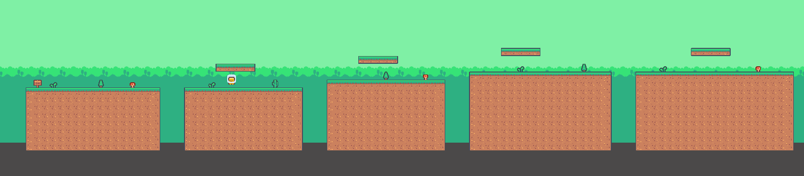
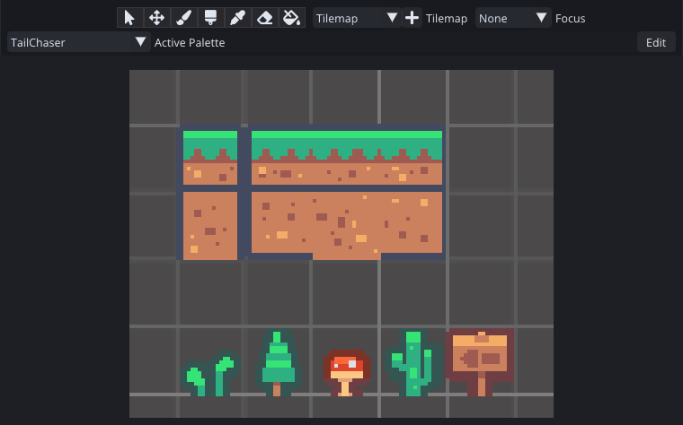
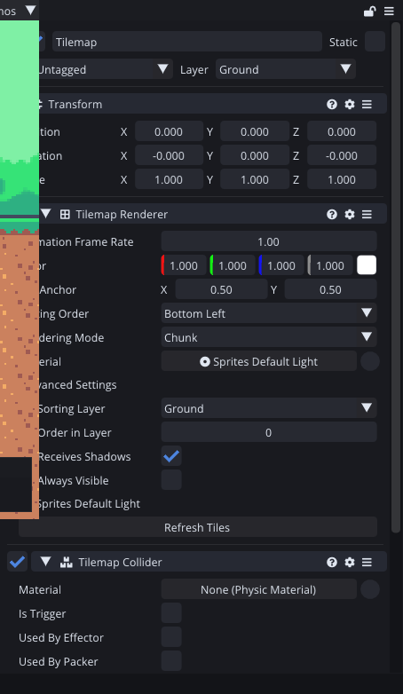
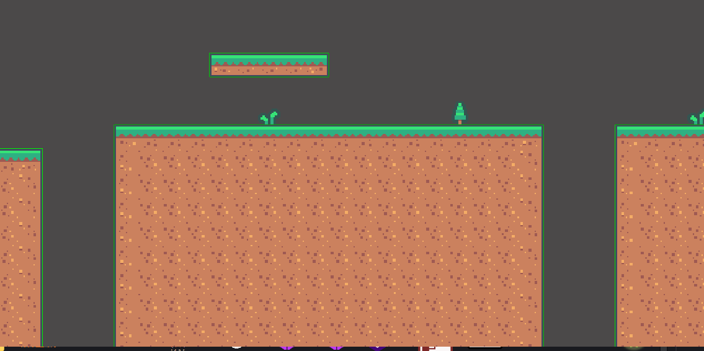
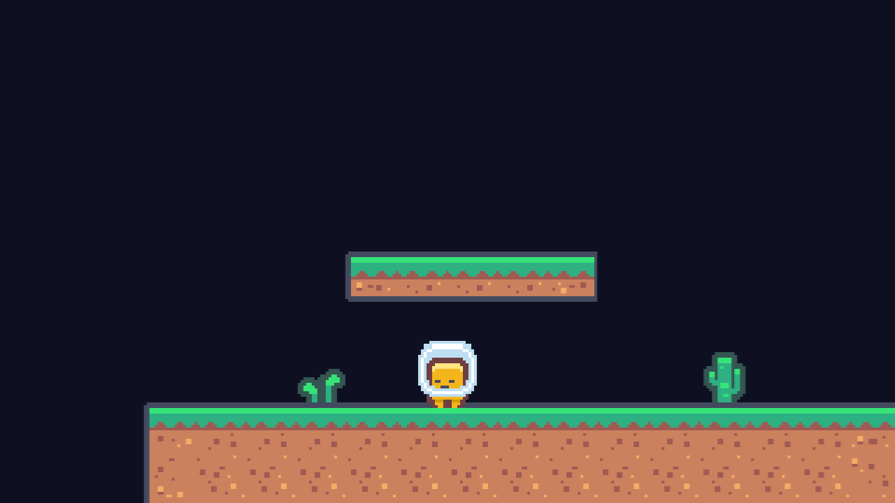

For three weeks the game has been a rectangle in a box made of stretched sprites. This week it becomes a level: 803 tiles, 97 columns wide, with gaps to jump and platforms to land on.



The whole game world fits in that one strip. It takes about six screens to walk across, which is roughly the right size for something you finish in ten minutes.

## A tile is an asset

The first thing to get straight is what a tile actually is in Comet, because I got it wrong in my head before I started.

A tile is a small asset that answers a question rather than a sprite you paint. Given this cell and its neighbours, what sprite should be drawn here, what colour, and what shape should the collider be? The simplest kind answers "this sprite, always", and the same interface is what lets rule tiles and auto tiles pick their sprite from what surrounds them.

There are ten built-in kinds. I am using the plainest one for now and saving the clever ones for when the level needs corners that resolve themselves.

Dragging a sliced sheet onto the Tile Palette generates one tile asset per sprite, wires each one to its sprite, and lays them out for you.



Eight terrain tiles and five bits of decoration is all this level needs. Four grass tiles because a run of ground needs a left end, a right end, a middle and a lone block, and four dirt tiles for the same reason underneath.

The toolbar across the top is the part that matters day to day: select, move, brush, box brush, picker, rubber, fill. It is the set every tile editor has, and having written it myself I can report that the box brush is the one that does ninety percent of the work.

## Grid on the parent, tilemap on the child

The entity layout caught me out for about five minutes, so it is worth saying plainly.

A **Grid** goes on the parent entity, and the **Tilemap Renderer** goes on a child. The renderer finds its grid by looking at its own parent when it is created. Put both on the same entity and nothing draws, with no error, because there is no grid above it to ask.



The Grid holds one number that matters: the cell size. And here is the trap.

Cell size and pixels per unit are completely independent. The grid uses the cell size only to decide where a tile goes. The size a tile is drawn at comes from the sprite instead: its pixel rectangle divided by the texture's pixels per unit. Nothing in the engine checks that the two agree.

For Tail Chaser the tiles are 18 pixels and the texture is imported at 18 pixels per unit, so a tile is exactly one world unit and the cell size is 1. Get that wrong and you get either gaps between every tile or tiles overlapping their neighbours, and the cause is not obvious from looking at it.

I should probably make the engine warn about this. Adding it to the list.

## The collider is the good part

This is the part I was most curious to see hold up, because it decides whether a tilemap is usable or a performance problem.

Every tile asset says what kind of collider it wants. Set it to **Grid** and the Tilemap Collider does not make one box per tile. It walks the tiles, finds the outline of each connected region, and builds a single closed chain for each one.



That green line is the collider. One loop around each block of ground, one around each platform, and nothing at all around the bushes and the cactus, which are set to no collider because you should be able to walk through a shrub.

This matters for more than the shape count. A row of separate boxes has seams between them, and a character running along the top can catch on an internal corner that is not really there. One continuous chain has no internal corners to catch on.

Nine outlines for 803 tiles, and you can count them in that screenshot.

## Painting it

The level is five blocks of ground at four different heights, with a floating platform over each one and a gap between each pair.



Every gap is three tiles wide. That is not a guess. Last week I measured the jump at 0.69 seconds of air time, and top speed is 6.76 units per second, which is 4.6 units of travel with the button held. Three tiles leaves a tile and a half of margin, which is enough that the jump is not a precision test but not so much that it is free.

Then I checked it rather than trusting the arithmetic. Each gap got a running jump from the same distance back, with the physics recorded:

```
gap 17-19    from x=14.0 -> landed at (26.6, -3.44)
gap 35-37    from x=32.0 -> landed at (44.5, -2.44)
gap 53-55    from x=50.0 -> landed at (62.6, -1.44)
gap 74-76    from x=71.0 -> landed at (83.7, -1.44)
```

Four gaps, four clean landings, and the lowest point of each arc never dropped below the height it took off from. The level is crossable end to end.

## The part where I found a bug in my own engine

The Tilemap Renderer has two rendering modes. **Chunk** bakes each 16 by 16 block of tiles into one retained batch and culls whole chunks at a time, which is what you want for a real level. **Individual** draws them one at a time.

In Chunk mode, this level drew nine tiles. Not nine wrong tiles: exactly one per chunk, at the first cell I had painted in each one. The tile data was all there, the same tilemap in Individual mode drew all 803 correctly, and no amount of refreshing, reloading the scene or toggling the mode changed anything.

The cause was two floors below the tilemap, in the OpenGL backend.

A retained batch owns a buffer of per-instance data. Drawing it needs a vertex array object that points at two buffers, and those objects are cached and reused. The cache remembered which mesh buffer an entry was built against so it could be thrown away when that buffer died, but it never recorded the instance buffer, because when the cache was written the instance data always came from a streaming ring buffer that is never destroyed.

Retained batches broke that assumption. Every rebake destroys the batch's instance buffer and makes a new one. The cache entry survived, `glGenBuffers` handed the freed name straight back, the key matched the stale entry, and because a retained batch always binds at offset zero there was nothing to trigger a re-specification. So the draw kept reading a buffer that had been deleted, which still held the very first bake of that chunk: one tile.

Teaching the cache to also track its instance buffer, and to drop the entry when either buffer is destroyed, fixes it. It was also leaking a vertex array object on every rebake, which nobody had noticed.

This is the single best argument I have for making a game with your own engine. That bug would break every tilemap in every shipped game, and it needed a real level in front of me to show up at all.

I also added two things to the editor's automation while building this: painting a rectangle of tiles in one batch, and painting a list of cells in one batch. Setting one tile at a time rebuilds the spatial index on every call, which is fine for a brush stroke and hopeless for eight hundred tiles.

## Where it is

There is a world, it has shape, and the fragment can get from one end of it to the other. It is also completely empty of anything that wants to stop you.

Total so far: three evenings.

---

Next Wednesday the fragment stops being a single frame. Sprite sheets, an atlas, sorting layers, and the small horror of discovering which of your sprites is drawn behind the ground.

*Comments and questions welcome ;)*
