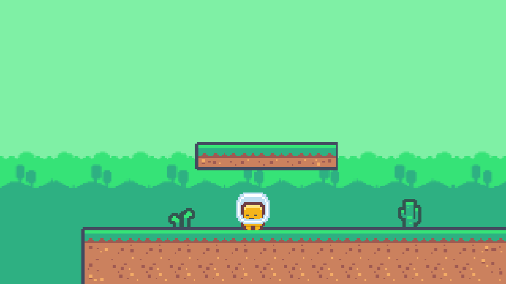
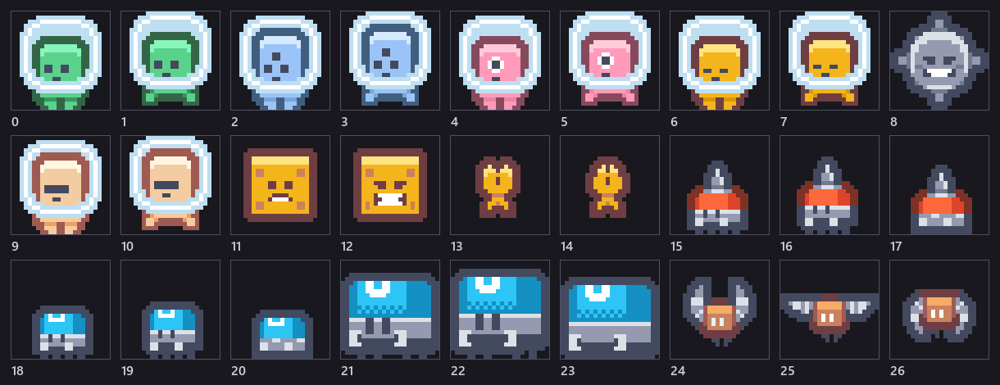
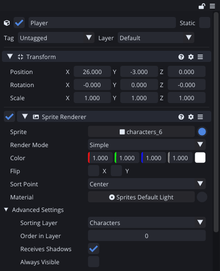
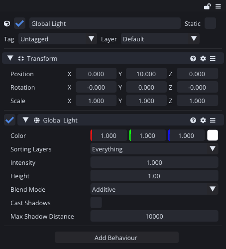

Four weeks in, the game reads as a diagram. There is a character, there is ground, and both of them float on a flat navy void. This week is about the layer of work that turns a diagram into a picture: what draws in front of what, and what is behind everything.



Same level as last week. The difference is one entity and four sorting layers.

## What is actually on the sheet

First I went and looked properly at the art I have been using, because I had been picking sprite numbers out of a contact sheet without reading them.



Twenty-seven cells, and the pattern is obvious once you see it: most characters come in **pairs**. Two frames each. Frame six is the fragment standing, frame seven is the same fragment with its feet apart. That is a walk cycle, and it is next week's problem.

The rest of the sheet is my enemy roster whether I like it or not. A red walker, a blue one, a large blue one that is going to be the boss, and a bat. Four silhouettes, three of which I need.

Worth saying: every one of these faces the camera. There is no left-facing and right-facing art, because these characters do not have a side. I wired up sprite flipping anyway:

```angelscript
if (input > 0.001F || input < -0.001F)
{
    facing = input > 0.0F ? 1.0F : -1.0F;
    // One sprite, mirrored, rather than a second set of art for the other direction.
    if (renderer !is null)
    {
        renderer.flipX = facing < 0.0F;
    }
}
```

And then took two screenshots to prove it worked and could not tell them apart, because a symmetrical sprite mirrored is the same sprite. It costs nothing and it will matter the moment the walk frames go in, so it stays.

## Four layers

Comet sorts renderers by sorting layer first and by order within the layer second. Until now everything in Tail Chaser has been on **Default**, and it worked by accident: the ground happened to draw before the fragment.

I added four layers, in draw order:

**Background** for the sky, **Ground** for the tilemap, **Characters** for the fragment and everything that will eventually try to kill it, and **Foreground** for anything that should pass in front of the player later.



That is a two minute job and it means I will never again have to think about whether a new enemy draws in front of the floor.

## The backdrop

The sky is one entity: a Sprite Renderer on the Background layer, holding a single wide image.

I tried it first as a small tiling sprite stretched across the level, which is the obvious approach, and got a vertical orange stripe every three and a half tiles. That took a while to understand and the answer was not the tiling.

The background sheet is 192 pixels wide with three panels in it. I had assumed three equal panels of 64 and sliced it that way. The panels are actually 96, 48 and 48, so the "forest" sprite I had been using was the right-hand slice of the desert panel plus most of the forest one. Every repeat was faithfully drawing the strip of desert I had included.

Two lessons, both mine: measure the sheet rather than dividing its width by the number of things you can see in it, and when something repeats wrongly, suspect the source before the renderer.

The fix was to cut the real panel out, tile it once into a wide image, and use that. The backdrop is now a single 2304 by 212 sprite, 128 world units across, which comfortably covers a 97 unit level.

## The evening everything went black

Then I moved the tilemap onto Ground and the fragment onto Characters, and this happened.


There was no crash and nothing in the console. Every sprite was still in the right place and still the right shape, and completely black.

The cause is a thing I built and then walked straight into. A 2D light does not light everything: it lights a **set of sorting layers**, and the set is stored on the light. The Global Light in this scene was created when Default was the only layer that existed, so its set was exactly `["Default"]`. Moving every renderer onto new layers moved them all out of the light.



Adding a sorting layer to the project does not add it to the lights that already exist. That is defensible, since a light that silently grows to cover new layers has its own surprises, but it is a bad first experience, and the failure mode is that the game looks broken rather than dim.

I do not have a good answer yet. Warning when a renderer is on a layer that no light covers is probably the right shape.

While I was in there I fixed a real bug next door: the layer set was being loaded on top of whatever was already selected rather than replacing it, so a behaviour that got re-loaded ended up with duplicated entries in its list. Nothing user visible until you count them, but wrong.

## Where it is

There is a sky, the layers are named, and nothing draws in the wrong order. The fragment is still one frame of animation, standing perfectly still while it moves at seven units a second, which is the single most obviously unfinished thing about the game right now.

Total so far: four evenings.

---

Next Wednesday that gets fixed. An animation clip, an animator controller with two states and a condition between them, and the fragment finally moves its feet.

*Comments and questions welcome ;)*
